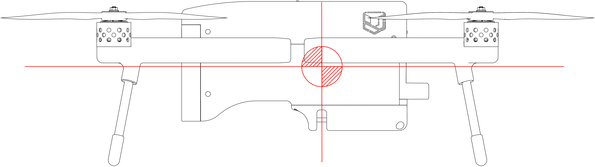
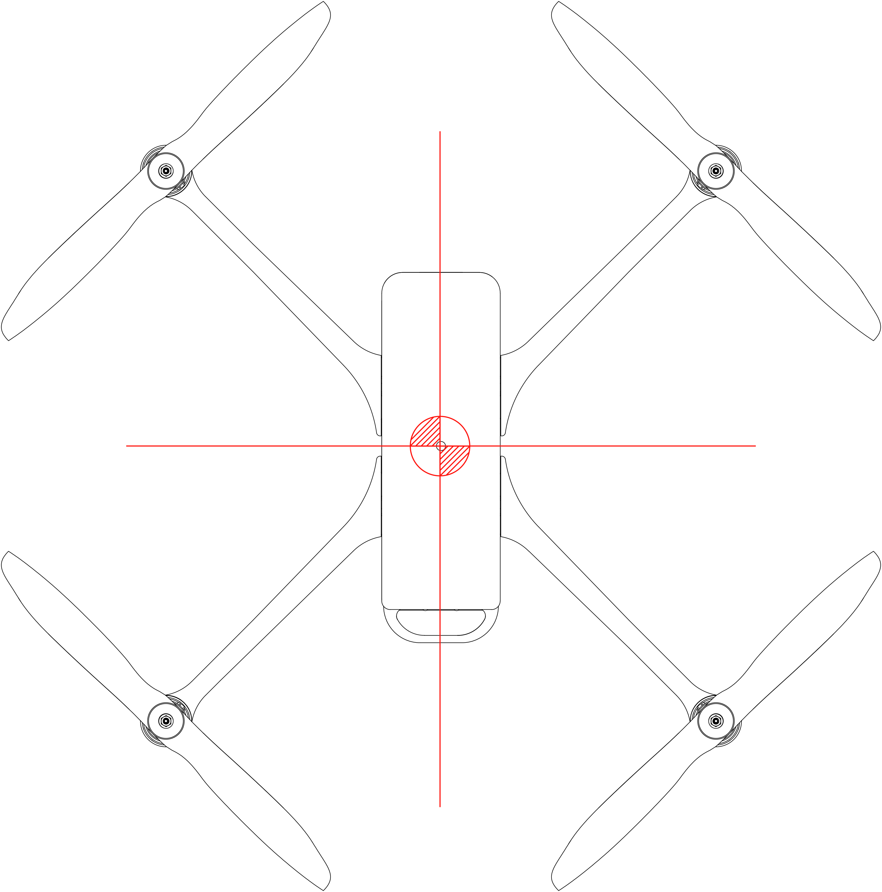
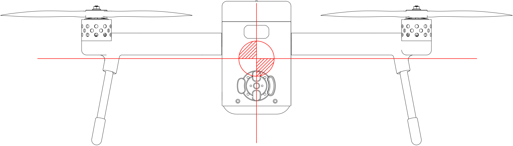
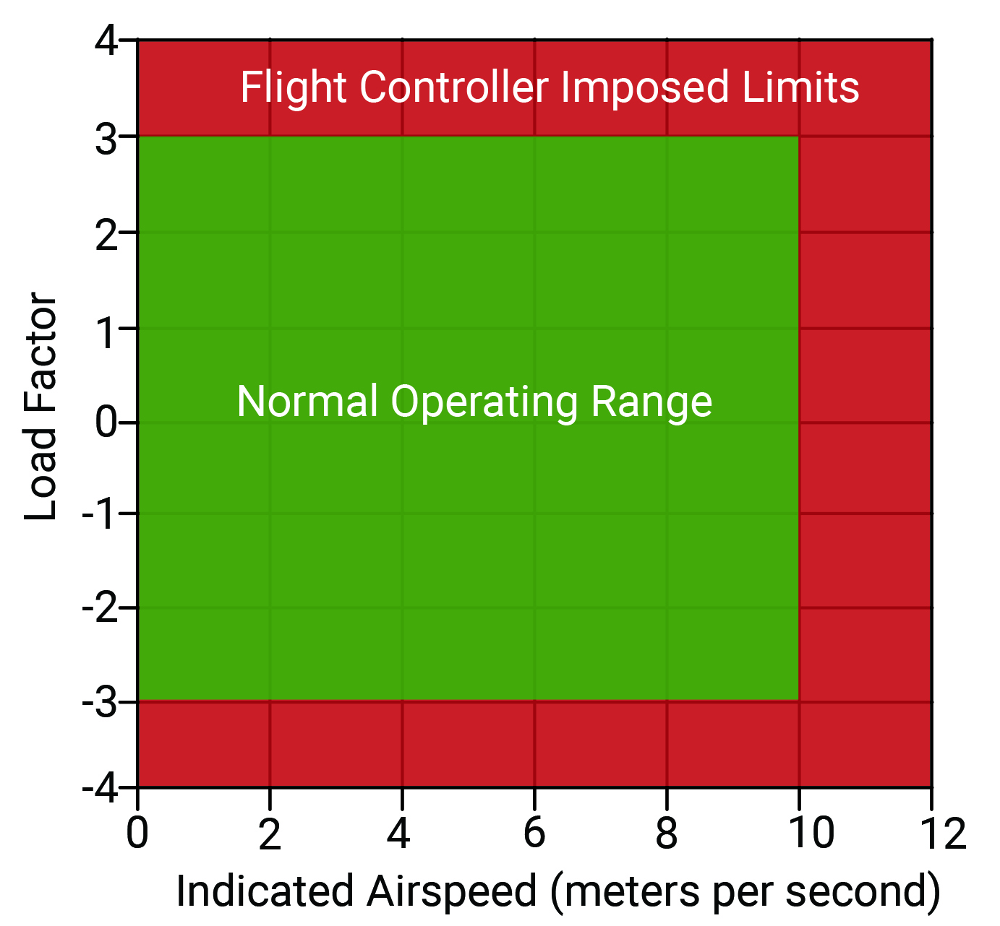

# 2. OPERATING LIMITATIONS

## **2.1 Introduction**

This Section includes operating limitations which are necessary for the safe operation of the Meadowhawk, motors, standard equipment and standard payload.

**WARNING**

All limitations given in this Section must be complied for all operations.

**NOTE**

Refer to the Supplements, Section 9 of this Remote Vehicle Flight Manual for amended Operating Limitations, Operating Procedures, Performance Data and other necessary information for the Meadowhawk equipped with specific equipment or payload.

## **2.2 Airspeed Limitations**

|                                   |        |
| --------------------------------- | ------ |
| Stall Speed                       | N/A    |
| Operating Maneuvering Speed       | 22 MPH |
| Maximum Structural Cruising Speed | 30 MPH |
| Never Exceed Speed                | 38 MPH |

**NOTE**

Flight speeds and flight envelope are limited by flight controller factory settings. Wind speeds may affect these values.

## **2.3 Mass | Centre of Gravity Limits**

|                                                                          |                 |
| ------------------------------------------------------------------------ | --------------- |
| Empty Weight - Without Flight Battery or Payload                         | 4 lbs / 1.8 KG  |
| Nominal Take-Off Weight - with Standard Flight Battery, Standard Payload | 7 lbs / 3.1 KG  |
| Maximum Take-Off Weight                                                  | 10 lbs / 4.5 KG |

**WARNING**

Exceeding weight limitations may lead to overloading of the Meadowhawk structure and cause loss of control of the Meadowhawk and/or structural damage.

The reference datum for determining the longitudinal Centre of Gravity is located below; given the lateral symmetry of the Meadowhawk, the reference line for the lateral Centre of Gravity is located on the symmetry axis.

**WARNING **

Exceeding the centre of gravity limitations reduces the maneuverability and stability of the Meadowhawk.

**NOTE**

The values are based on simulations and are verified during D\&R

## **2.3.1 Longitudinal Centre of Gravity Limits**

**Forward/Aft**

## **2.3.2 Lateral Centre of Gravity Limits**

**Left/Right**

## **2.4 Flight and Maneuver Limitations**

## **2.5 Flight Battery Limitations**

|                                 |                              |
| ------------------------------- | ---------------------------- |
| Approved Types of Batteries     | Union Robotics® Li-ion 14 Ah |
| Minimum Operation Voltage       | 17V                          |
| Recommended Operation Voltage   | 25.2V                        |
| Maximum Number of Charge Cycles | 200                          |

## **2.6 Weather Limitations**

|                                         |                                                         |
| --------------------------------------- | ------------------------------------------------------- |
| Do not fly Meadowhawk in temperatures   | 
Exceeding 45°C(113°F)

or Below -20°C(-4°F)
 |
| Do not fly Meadowhawk in wind exceeding | 20 MPH                                                  |
| Do not fly Meadowhawk in weather        | Snow, Rain, Fog                                         |

**NOTE**

The values are based standard flight conditions and will be updated upon our D\&R

## **2.7 Range and Endurance Limitations**

## **2.7.1 Flight Battery**

|                                     |       |
| ----------------------------------- | ----- |
| Total  Capacity                     | 25.2V |
| Do Not Fly Meadowhawk Battery Below | 17V   |

## **2.7.2 Command and Control Link**

|            |                                                                     |
| ---------- | ------------------------------------------------------------------- |
| Max. Range | 
10 km / 6.2 mile

 (unobstructed, free of interference)
 |

## **2.8 Kinds of Operation**

As governed by the U.S. Federal Aviation Administration, sUAS flights are limited to Visual Line-Of-Sight (VLOS) flights, under Day Visual Flight Rules (VFR) conditions.
