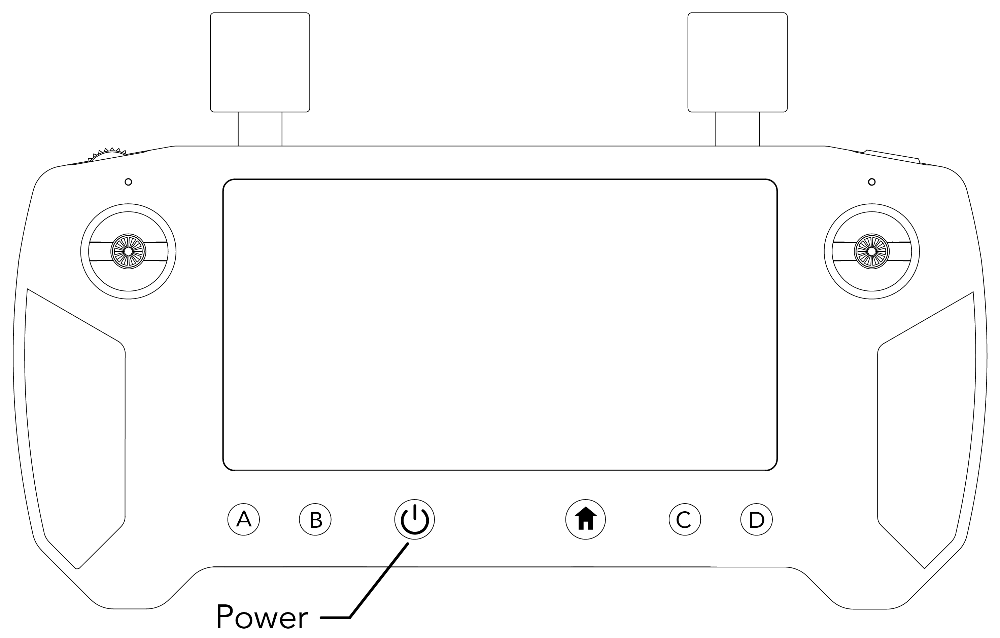
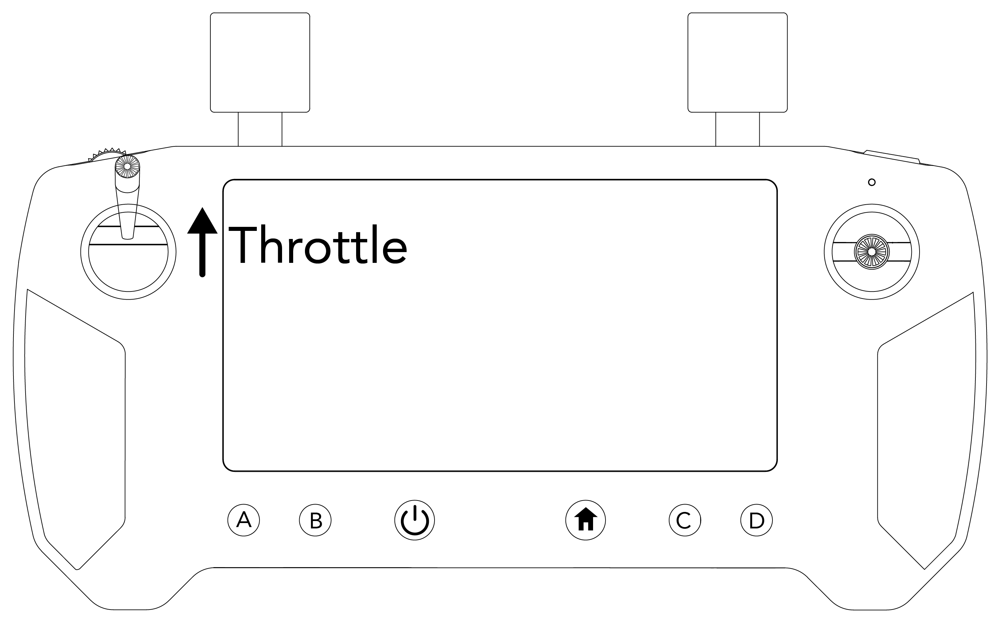
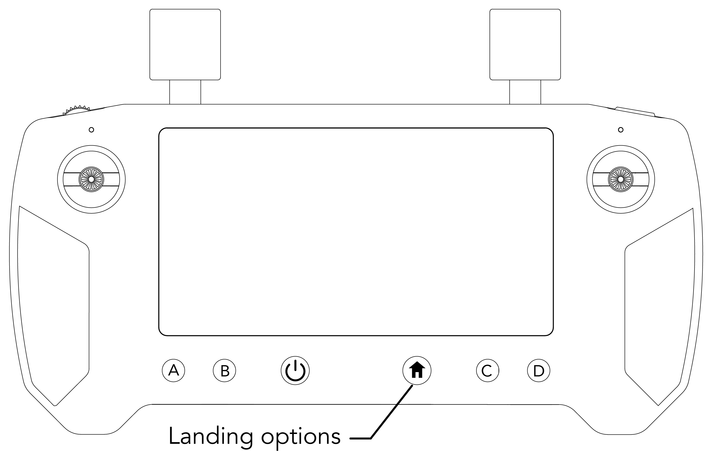
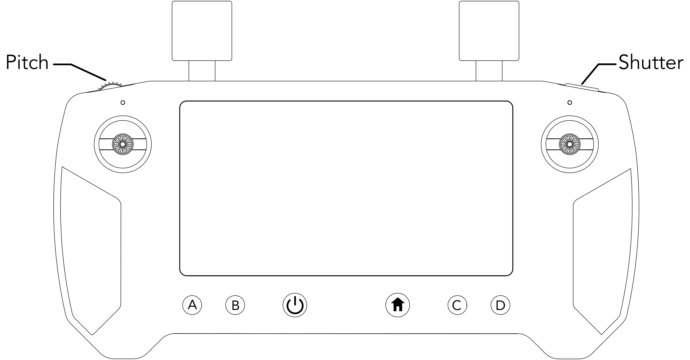

# 4. NORMAL OPERATING PROCEDURES

## **4.1 Introduction**

This Section contains checklists and describes extended procedures for the normal operation of the Meadowhawk, using standard equipment and standard payload.

## **4.2 Normal Operation Checklists**

|                              |                                         |
| ---------------------------- | --------------------------------------- |
| 1) Payload                   | Secured                                 |
| 2) SD Card                   | Verify Installed                        |
| 3) Propellers                | Check Condition, Verify Tight           |
| 4) Propeller Hubs            | Verify Secure                           |
| 5) Motors                    | Check Condition                         |
| 6) Clean Aircraft            | Using Union Corp. SHIELD Cleaning Wipes |
| 7) Control Station           | Powered On, Verify Battery              |
| 8) Aircraft Placement        | Away From People and Obstacles          |
| 9) Battery Leads             | Check Condition                         |
| 10) Battery Pack Voltage     | Verify at 25.2V                         |
| 11) Battery Packs            | Secure                                  |
| 12) Aircraft                 | Keep Stationary                         |
| 13) Flight Controller        | Allow to Initialize                     |
| 14) Orientation Lights       | Verify On                               |
| 15) Control Station Signal   | Verify Bound                            |
| 16) Control Station Warnings | Verify No Warnings                      |
| 17) Compass Calibration      | Calibrate As Required                   |
| 18) Control Station Range    | As Required                             |

## **4.2.1 Pre-Flight Planning**

Do not use the Meadowhawk in adverse weather conditions including rain, snow, fog, and wind speeds exceeding 20 MPH.&#x20;

Only fly in open areas, tall buildings and steel structures may affect the accuracy of the compass and the GPS signal.

Avoid flying near obstacles, crowds, high voltage power lines, trees and bodies of water.

Aircraft and battery performance is subject to environmental factors such as air density and temperature. Be very careful when flying over 8,202 feet (2,500 meters) above sea level as the battery and aircraft performance may be reduced.

Check your surroundings and warn anyone in the immediate area of your operation.&#x20;

Create a NOTAM and alert the nearest airport, if applicable.

Create a flight plan and inform anyone else participating in the mission of your plan.

## **4.2.2 System Assembly and Pre-Flight Inspection**

To set up the Meadowhawk for flight, remove the aircraft from the case and set it on a flat, non-obstructive surface.

### **Pre-Flight Inspection**

|                       |                                         |
| --------------------- | --------------------------------------- |
| 1) Clean Aircraft     | Using Union Corp. SHIELD Cleaning Wipes |
| 2) Prop Area          | Verify Clear                            |
| 3) Flight Mode Switch | Verify Loiter                           |
| 4) Telemetry          | Check Operational                       |
| 5) Orientation Lights | Verify Correct Orientation              |
| 6) Video              | Verify Reception                        |
| 7) Meadowhawk         | Arm                                     |
| 8) Motors             | Start and Verify Operation              |
| 9) Flight Controls    | Verify Correct                          |

**WARNING **

Propellers must be checked before each flight for nicks or cracks and installed securely.

**WARNING **

Ensure the propellers are installed in the correct orientation and are spinning the correct direction. Failure to install the correct propeller in the correct position and orientation will result in an aircraft crash.

## **4.2.3 Systems Start**

### **Powering On the Aircraft**

Place the aircraft in an open area with clear visibility of the sky and a level service. Insert the battery pack into the rear of the Meadowhawk below the antennas. Push in firmly, pulling down on the locking tab if needed. Make sure the battery is fully inserted by attempting to remove the battery without using the battery locking latch. It should remain firmly in place. Leave the aircraft powered on for two to three minutes before launching. This will give the GPS ample time to lock position on multiple GPS satellites.

### **Powering On the Radio Controller**

Press and hold the Power button on the radio controller, the radio controller system will boot up.

### **Connecting the Radio Controller to the Aircraft**

If the Radio Controller and Aircraft link does not automatically connect, press the CONNECT button on the left hand side of the display screen.

### **Flight Screen**

To view the flight screen, click on the Union Robotics logo at the bottom left side of the screen.

### **Pre-Flight Checklist Screen**

This will take you to the “Pre-Flight Checklist” screen, where you are required to check each item.

**WARNING**

Physically inspect the aircraft for each item on the Pre-Flight Checklist before checking the box on the screen. Failure to do so could result in aircraft failure or injury.

### **Verify Controls Screen**

Once all items have been checked on the Pre-Flight Checklist screen, you will be automatically directed to the Verify Controls screen. This screen reminds the pilot to verify all the aircraft controls properly function upon take off before starting the mission. Click “GO” to be directed to the flight screen.

### **Arming the Meadowhawk**

Hold down the left Throttle stick while pressing the Arm button on the ground station display screen on the left hand side, located in the Controls menu.

## **4.2.4 Take-Off | Launch Systems**

To take off, move the throttle vertically in the upward direction. Be sure to provide ample throttle to get the Meadowhawk off the ground.

## **4.2.5 Flight Modes**

### **Loiter**

In Loiter, the Meadowhawk will maintain its position over a given point on the ground and correct for disturbances. Loiter Mode requires a strong GPS signal and communication with a minimum of 6 satellites. If a weak signal is present, the Meadowhawk will not enter Loiter Mode.

### **Return-to-Launch (RTL)**

Return-to-Launch Mode will command the Meadowhawk to fly back to the defined launch point. When the Meadowhawk first acquires a GPS position, it sets this as the launch point of the flight. Return-to-launch Mode enables the aircraft to follow a straight path when returning to the initial launch point.

During an LOS event, RTL followed by auto-land will be initiated automatically. The Meadowhawk will first check its current altitude against the configured RTL altitude. The Meadowhawk will climb to Safe-Height. Next, the Meadowhawk will fly back to the launch position set at the initial GPS position.  If the Meadowhawk is below 45ft. then it will climb to 45ft. if above 45 ft. then it will return to launch at its current altitude.&#x20;

### **Smart Return-to-Launch (SmartRTL)**

When switched into Smart RTL, like regular RTL, the vehicle will attempt to return home. The “Smart” part of this mode is that it will retrace a safe path home instead of returning directly home. This can be useful if there are obstacles between the vehicle and the home position.

### **Land Now**

Land Now will initiate the auto-land function, which will land the aircraft in the current place. The vertical speed at which the Meadowhawk will descend during an auto-land varies as the Meadowhawk approaches the ground. By default, the aircraft will descend at 1m/s until 10 Ft above the ground and then it will slow its descent considerably until touchdown.

## **4.2.6 In-Flight Monitoring**

### **Ground Station Software Overview and Telemetry Display**

The telemetry display is located on the ground station radio controller. The pilot should always be aware of all information on the display.

.png>)

|                       |                                                            |
| --------------------- | ---------------------------------------------------------- |
| **Feature**           | Description                                                |
| Distance              | Distance the aircraft is in relation to the ground station |
| Control Panel         | Displays control panel                                     |
| Gimbal Angle          | The current pitch angle of camera gimbal                   |
| Radio Signal          | Received signal strength indicator                         |
| Batt                  | Aircraft battery remaining voltage                         |
| Telemetry Panel       | Displays telemetry panel                                   |
| Camera Exposure Value | Displays camera’s current exposure value                   |
| Camera Exposure       | Controls camera’s Exposure value                           |
| Camera Zoom           | Controls camera’s optical and digital zoom                 |
| Shutter/Record        | Controls camera’s shutter and record function              |
| Photo/Video           | Controls camera’s photo and video mode                     |
| HUD                   | Displays Heads-Up-Display                                  |
| Map View              | Displays map screen                                        |
| Flight Mode           | Current flight mode setting                                |
| Alt                   | Altitude from ground level at ground station               |

### **Alert Indications**

The Meadowhawk has many alert, warning, and failure indicators. All alert, warning, failure indicators will be displayed in a red bar across the top of the ground station screen.

|                                           |                                                                                                               |
| ----------------------------------------- | ------------------------------------------------------------------------------------------------------------- |
| _Alert_                                   | Description                                                                                                   |
| Low Battery                               | Battery failsafe has triggered, should land immediately                                                       |
| No GPS Fix                                | Warns pilot that the GPS can not get a satellite fix                                                          |
| Telemetry Lost                            | Warns pilot that the telemetry signal has been lost                                                           |
| High GPS hdop                             | GPS signal quality is insufficient                                                                            |
| Throttle Below Failsafe                   | Ground controller has lost connection to the vehicle                                                          |
| Gyro Calibration Failed                   | Failed to calibrate the IMUs on the vehicle                                                                   |
| Mode Not Armable                          | Operator is attempting to arm the vehicle in a mode which does not allow arming                               |
| Rotor Not Spinning                        | Autopilot has detected an error attempting to run one or more motors                                          |
| Vehicle is Leaning                        | Vehicle orientation is not suitable for takeoff                                                               |
| Throttle Too High                         | Current throttle setting is too high to arm safely (could result in spontaneous takeoff)                      |
| Safety Switch                             | Operator attempted to arm, but hardware arm-safety switch is engaged                                          |
| Compass Calibration Running               | Cannot arm, currently calibrating the compass                                                                 |
| RC Not Calibrated                         | Ground control radio has not been calibrated for use with the vehicle                                         |
| Barometer Not Healthy                     | Barometer is experiencing an error                                                                            |
| Compass Not Healthy                       | Compass is experiencing an error                                                                              |
| Compass Not Calibrated                    | Compass requires calibration                                                                                  |
| Compass Offsets Too High                  | Compass calibration has resulted in unusable offsets                                                          |
| Check Magnetic Field                      | Vehicle is near a metallic or magnetic object which is interfering with compass operation                     |
| Inconsistent Compass                      | Compass readings are determined to be erroneous                                                               |
| Check Geo Fence                           | Vehicle is outside of a defined fence area, not allowed to fly                                                |
| Inertial Navigation System Not Calibrated | IMU calibration is needed                                                                                     |
| Accelerometers Not Healthy                | IMU calibration is needed                                                                                     |
| Inconsistent Accelerometers               | IMU calibration is needed                                                                                     |
| Gyros Not Healthy                         | IMU calibration is needed, or vehicle needs to be moved to an orientation matching the powered-up orientation |
| Check Board Voltage                       | Problem detected with power supplied to the autopilot                                                         |
| Inconsistent Gyros                        | IMU calibration is needed, or vehicle needs to be moved to an orientation matching the powered-up orientation |
| Check Max Angle                           | ANGLE\_MAX parameter set to an in appropriate value                                                           |
| RC Failsafe                               | Ground controller has lost connection with the vehicle                                                        |
| Need GPS Lock                             | Operator is trying to arm vehicle in a mode where GPS lock is needed, and there is no GPS lock                |
| EKF Home Variance                         | EKF has detected a difference between expected and actual home points                                         |
| GPS Glitch                                | GPS readings indicate an error (e.g. multipathing) - GPS signal cannot be trusted                             |
| Waiting for Navigation Alignment          | AP is initializing and not ready to launch                                                                    |
| Altitude Disparity                        | GPS and barometer altitudes are reported to be substantially different, indicating a possible error           |
| Vehicle Crash                             | AP has detected that the vehicle has collided with terrain or some other solid object                         |
| EKF Variance                              | EKF has detected uncertainty in GPS location, compass heading, IMU readings. Should not launch                |
| Need Position Estimate                    | GPS needs to calculate an estimated position for the vehicle                                                  |

### **Control Panel**

|                  |                                                                      |
| ---------------- | -------------------------------------------------------------------- |
| Feature          | Description                                                          |
| Arm/Disarm       | Arm and Disarm the aircraft for flight                               |
| Mavlink Viewer   | View Mavlink messages from the flight controller on the aircraft     |
| Blackbox Logging | Turn on and off the redundant blackbox logging to the ground station |
| Reboot Aircraft  | Reboots the aircraft flight controller                               |

### Camera Controls

|         |                                           |
| ------- | ----------------------------------------- |
| Feature | Description                               |
| Pitch   | Controls the vertical angle of the camera |
| Shutter | Capture a photo                           |

|                     |             |
| ------------------- | ----------- |
| Feature             | Description |
| **Photo/Video**     |             |
| **Shutter/Record**  |             |
| **Adjust Zoom**     |             |
| **Adjust Exposure** |             |
| **Exposure Value**  |             |
| **Gimbal Angle**    |             |

**NOTE**

For best camera control, ensure the camera mode dial, located on top of the camera, is set to “P” mode. This will allow the camera to auto adjust the aperture and shutter speed, and allow the user to adjust the exposure.

### **Map View**

Displays an overhead map view. This view can be used for mapping autonomous missions.

.png>)

### **Layers**

When clicking on the layers button on the Map View, the layers option menu will display. The options will overlay on the map.

**Updating......**
