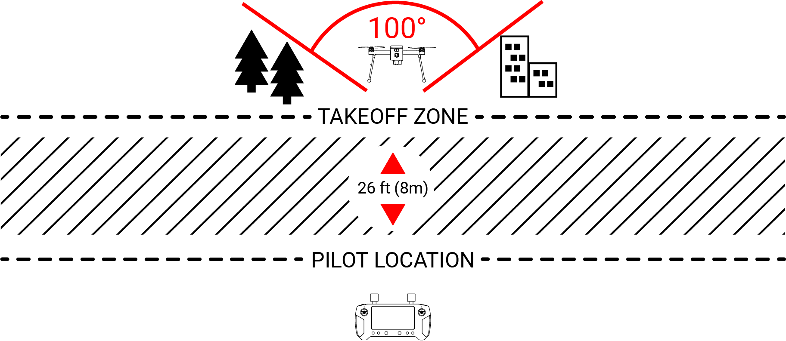

# 5. PERFORMANCE

## **5.1 Introduction**

The performance data in this section has been prepared to illustrate the performance you may expect from the Meadowhawk under various conditions and to facilitate the planning of flights in detail and with reasonable accuracy.

The performance data do not take into account the expertise of the sUAS pilot or the maintenance condition of the sUAS. The performance described can be achieved if the indicated procedures are followed and the sUAS is maintained in good condition.

## **5.2 Performance Table**

|                                              |                                                              |
| -------------------------------------------- | ------------------------------------------------------------ |
| Maximum Speed                                | 22 mph / 1.10 mps                                            |
| Maximum Operating Altitude (ASL)             | 400 ft                                                       |
| Maximum Autonomy                             | 6 mile radius                                                |
| Maximum Range                                | 
1.6 km / 1 mile

(unobstructed, no interference)
 |
| Maximum Endurance                            | 35 Minutes                                                   |
| Maximum Recommended Operating Altitude (AGL) | 400 ft                                                       |

## **5.2.1 Take-Off Area (Distance)**

**WARNING**

Use caution when operating the Meadowhawk around people, vehicles, trees and other obstructions. Only fly near or above crowds, airports or buildings with appropriate authorization.

Never attempt to operate the Meadowhawk nearby tall buildings/obstructions that do not offer a clear view of the sky (a minimum clearance of 100°).

Be sure to place the Meadowhawk on a level and stable surface before powering ON the Ground Station and the aircraft.

**NOTICE**

&#x20;Step back approximately 26 feet (8 meters) behind the Meadowhawk.

## **5.2.2 Climb Performance**

|               |                      |
| ------------- | -------------------- |
| Cruise Speeds | 10 meters per second |
| Range Profile | 6 miles / 10 km      |

**NOTICE**

&#x20;All charts are based on simulations and will update upon D\&R

## **5.2.3 Cruise Performance**

|               |                      |
| ------------- | -------------------- |
| Cruise Speeds | 10 meters per second |
| Range Profile | 6 miles / 10 km      |

## **5.2.4 Landing Area**

|                              |                      |
| ---------------------------- | -------------------- |
| Maximum Rate of Descent      | 1 meter per second   |
| Time and Distance to Descent | 60 meters per minute |
