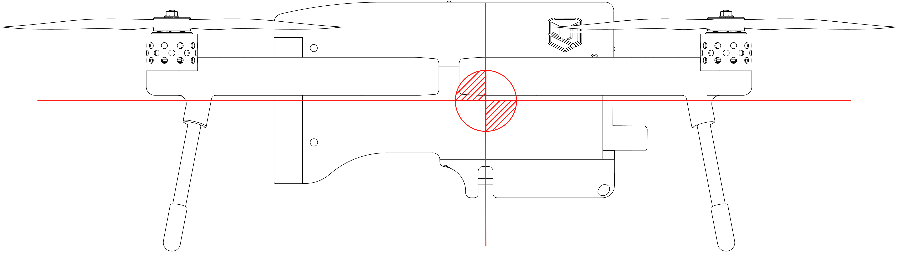
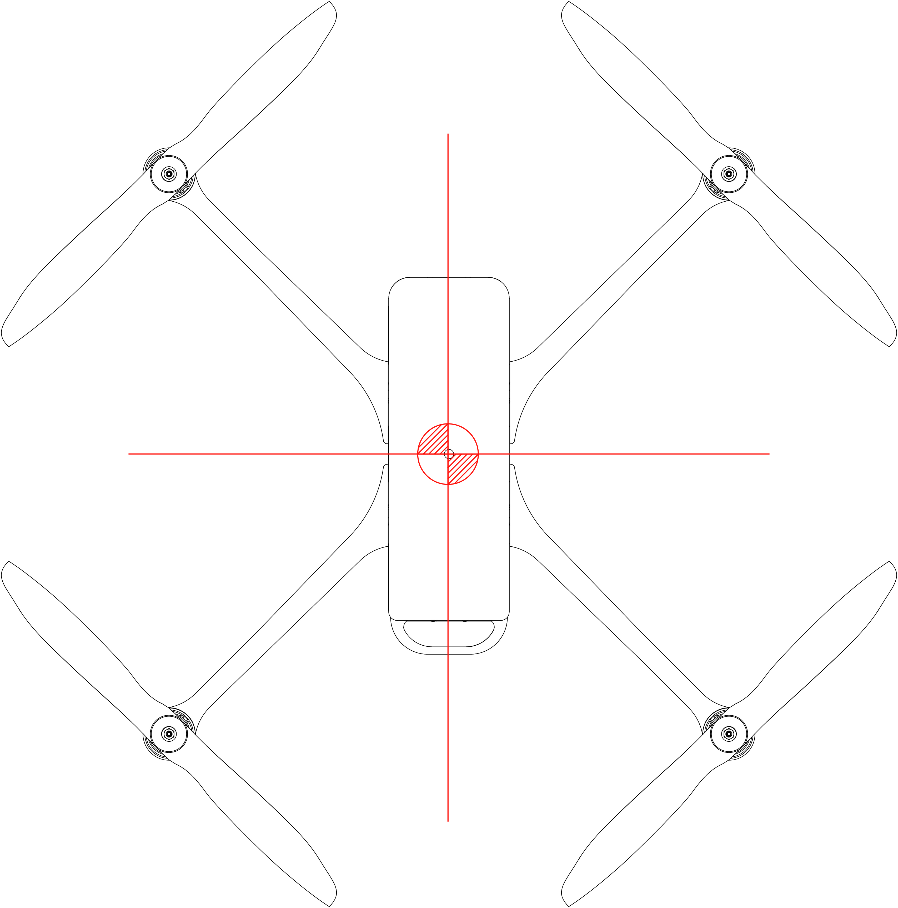

# 6. WEIGHT AND BALANCE EQUIPMENT LIST

## **6.1 Introduction**

To obtain the performance, flight characteristics and safe operation described in this Remote Vehicle Flight Manual, the Meadowhawk must be operated within the permissible weight and centre of gravity limitations specified in Section 2.

The procedure for weighing the Meadowhawk and calculating the centre of gravity position are given in this Section.

## **6.2 Weighing Procedures**

Operating weights and loading (batteries | payloads)

|                                                                          |                 |
| ------------------------------------------------------------------------ | --------------- |
| Operating weights and loading** **(batteries \| payloads) ​              |                 |
| ​ Empty Weight - Without Flight Battery or Payload                       | 4 lbs / 1.8 kg  |
| Nominal Take-Off Weight - with Standard Flight Battery, Standard Payload | 7 lbs / 3.1 kg  |
| Maximum Take-Off Weight                                                  | 10 lbs / 4.5 kg |

### **Centre of Gravity range and determination**

**Forward/Aft**

**Left/Right**

For weighing, the Meadowhawk should be placed in the normal ground position (indicated reference lines should be kept horizontal).

6\. WEIGHT AND BALANCE EQUIPMENT LIST

## **6.1 Introduction** 

To obtain the performance, flight characteristics and safe operation described in this Remote Vehicle Flight Manual, the Meadowhawk must be operated within the permissible weight and centre of gravity limitations specified in Section 2.The procedure for weighing the Meadowhawk and calculating the centre of gravity position are given in this Section.

## **6.2 Weighing Procedures**

|                                                                          |                 |
| ------------------------------------------------------------------------ | --------------- |
| Operating weights and loading (batteries \| payloads)                    |                 |
| Empty Weight - Without Flight Battery or Payload                         | 4 lbs / 1.8 kg  |
| Nominal Take-Off Weight - with Standard Flight Battery, Standard Payload | 7 lbs / 3.1 kg  |
| Maximum Take-Off Weight                                                  | 10 lbs / 4.5 kg |

### **Centre of Gravity range and determination**

**Forward/Aft**

**Left/Right**

## **6.3 Equipment List**

|            |                         |
| ---------- | ----------------------- |
| **Sensor** | Location                |
| Sony RX0   | Section 9, Supplement 1 |
| Sony RX100 | Section 9, Supplement 2 |
