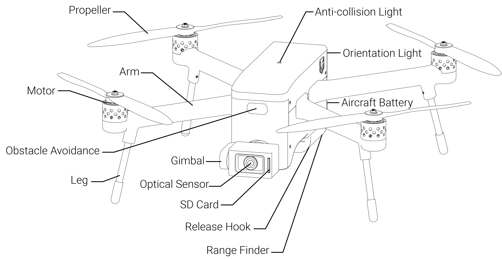
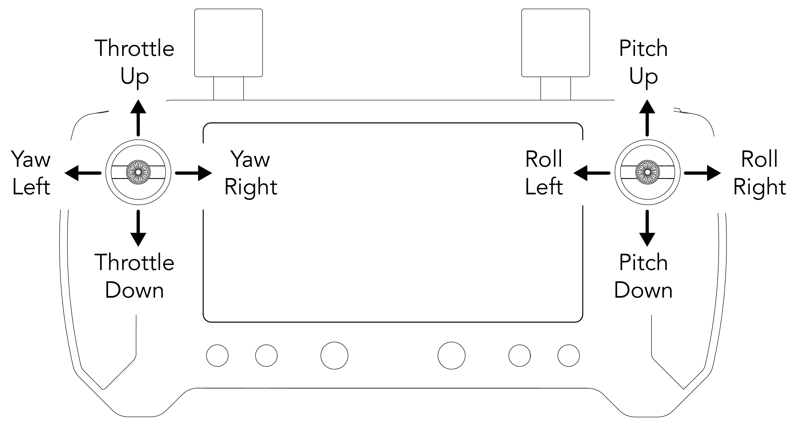
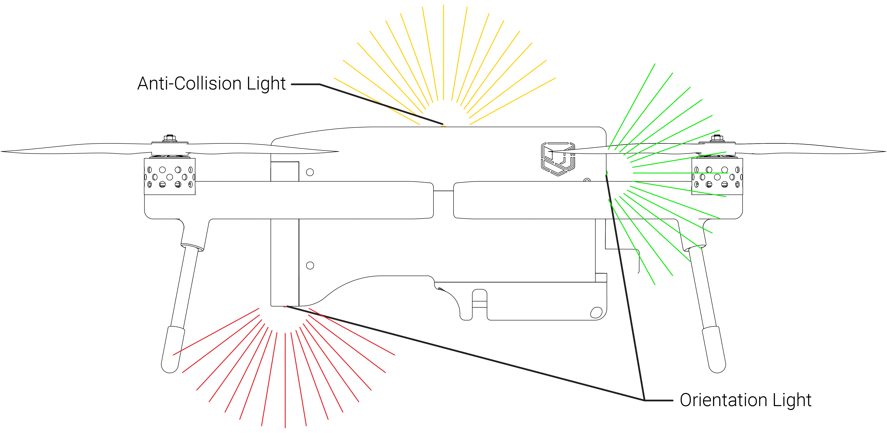
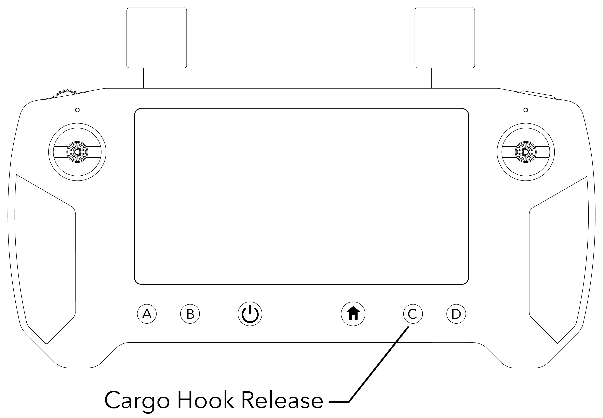
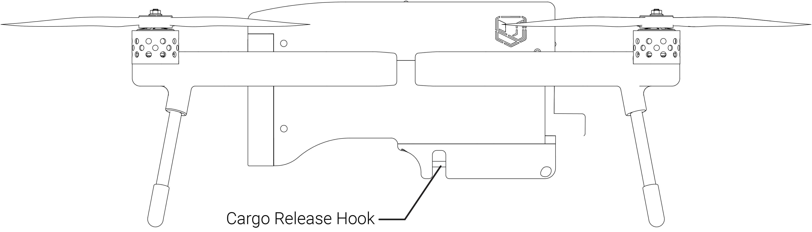
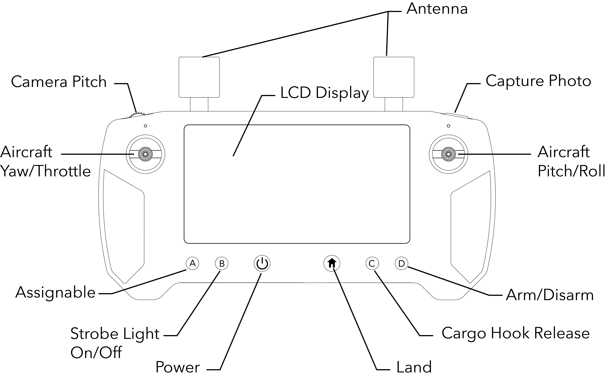

# 7. DESCRIPTION OF THE sUAS AND SYSTEMS

## **7.1 Introduction**

This Section provides a detailed description and operation of the Meadowhawk and its Systems. Some equipment or payload described may be optional and as such not installed in the Meadowhawk. Refer to the Supplements in Section 9 for details of other optional equipment or payload.

## **7.2 Airframe**

## **7.3 Flight Controls**

|                |                                 |
| -------------- | ------------------------------- |
| Stick Controls |                                 |
| Throttle       | Left stick vertical movements   |
| Yaw            | Left stick horizontal movements |
| Pitch          | Right stick vertical movements  |
| Roll           | Left stick horizontal movements |

### **Throttle**

Moving the _left stick_ vertically controls the throttle, and changes the altitude of the  Meadowhawk.

### **Yaw**

Moving the _left stick_ horizontally will osculate the meadowhawk on the vertical axis.

### **Pitch**

Moving the _right stick_ vertically will move the nose of the Meadowhawk in the vertical axis, which makes the aircraft move forwards or backwards.

### **Roll**

Moving the _right stick_ horizontally will tilt the left or right side of the Meadowhawk on the vertical axis. The roll movement will not change the altitude, but will veer the aircraft to one side without turning.

### **Anti-Collision Light / Orientation Lights**

The anti-collision light and orientation lights are omnidirectional strobe lights that meet FAA requirements. With a night visibility of over 3 nautical miles and a day visibility of up-to 1 nautical mile, the anti-collision light and orientation lights should remain on at all times when the aircraft is in the air. The anti-collision light helps with the Meadowhawks visibility to warn other aircrafts of its presence. The orientation lights help the pilot and visual observer maintain awareness of the vehicle's orientation.&#x20;

The pilot radio controller is equipped with an ON/OFF switch for the anti-collision light and orientation lights. This is so the operator can turn off the lights when the Meadowhawk is grounded and turned on.

### **Cargo Release Hook**

The cargo release hook allows the ability to carry a small load and release the load remotely and can be actuated at any time during flight or when landed.&#x20;

The pilot radio controller is equipped with an open/close button for the cargo release hook. This is so the operator can load the hook when Meadowhawk is grounded and release the load when the aircraft is remote.

**CAUTION**

Do not actuate the cargo release above people or vehicles.

#### **Loading the Hook**

To load an item on the hook, open the hook using the Cargor Release Hook button located on the pilot radio controller, place the item in the hook loading area, then press the button to close the hook. Check to make sure the load is secure.

## **7.4 Propulsion System**

|            |                                                                     |
| ---------- | ------------------------------------------------------------------- |
| Propulsion | (2) clockwise (MR/CW) and (2) counterclockwise (MRP/CCW) propellers |

## **7.4.1 Motor | Propeller | Electronic Speed Control**

|                             |                                     |
| --------------------------- | ----------------------------------- |
| Motors                      |                                     |
| Number of Motors            | 4                                   |
| Motor Manufacturer          | Union Robotics®                     |
| Motor Model Number          | URBH -1001                          |
| Motor Type                  | Direct Drive 3-Phase PMAC Outrunner |
| Motor Power Rating \| Speed | Max Watts 1562.81 \| Max RPM 15033  |

|                        |                                    |
| ---------------------- | ---------------------------------- |
| Propellers             |                                    |
| Number of Propellers   | 4                                  |
| Propeller Manufacturer | Union Robotics®                    |
| Propeller Model Number | URAP-1011                          |
| Number of Blades       | 2                                  |
| Propeller Type         | (2) 15x5.4CW and** **(2) 15x5.4CCW |

|                             |                 |   |
| --------------------------- | --------------- | - |
| Electronic Speed Controller |                 |   |
| Number of ESCs              | 1               |   |
| ESC Manufacturer            | Union Robotics® |   |
| ESC Model Number            | URAE-1002       |   |
| ESC Type                    | 4-in-1          |   |
| ESC Power Rating            | 50A             |   |

## **7.4.2 Flight Battery**

|                                             |                        |
| ------------------------------------------- | ---------------------- |
| ​ Battery Manufacturer                      | Union Robotics®        |
| Battery Type                                | Sanyo NCR18650GA, 6S4P |
| Battery Capacity                            | 14000 mAh              |
| Battery min. Charge Rate                    | 8.0A                   |
| Battery max. Charge Rate                    | 14.0A                  |
| Number of Batteries Required for Flight     | 1                      |
| Number of Spare Batteries Available On-site | 2                      |

## **7.5 Electrical System**

## **7.6 Avionics System**

## **7.6.1 Navigation**

|              |                        |
| ------------ | ---------------------- |
| Autopilot    |                        |
| Type         | Firmware               |
| Manufacturer | URAP-1005              |
| Interface    | Union Robotics / Solex |

|              |                            |
| ------------ | -------------------------- |
| Navigation   |                            |
| Type         | GNSS GPS UBlock M9N        |
| Manufacturer | Union Robotics®            |
| Accuracy     | 0.5 m3 (depending on HDOP) |

## **7.6.2 Communication**

|                              |                 |
| ---------------------------- | --------------- |
| Radio Controller             |                 |
| Radio Controller Manufacture | Union Robotics® |
| Radio Controller Model       | URHX-1004       |
| Radio Controller Frequency   | 2.4 GHz         |

|                               |                 |
| ----------------------------- | --------------- |
| Video                         |                 |
| Video Transmitter Manufacture | Union Robotics® |
| Video Transmitter Model       | URHX-1004       |
| Number of Video Transmitters  | 1               |
| Video Transmitter Format      | WIFI            |
| Video Transmitter Frequency   | 2.4GHz          |

## **7.6.3 Telemetry**

|                       |                 |
| --------------------- | --------------- |
| Telemetry             |                 |
| Telemetry Manufacture | Union Robotics® |
| Telemetry Model       | URHX-1004       |
| Telemetry Frequency   | 2.4 GHz         |
| Telemetry Range       | 10 km           |

## **7.7 Launch | Flight Recovery System**

### **Launch**

**WARNING**

Always operate the Meadowhawk in open areas (approximately 10000 square feet/930 square meters or more) that are free from people, vehicles, trees and other obstructions. Never fly near or above crowds, airports or buildings.

.png>)

Never attempt to operate the Meadowhawk nearby tall buildings/obstructions that do not offer a clear view of the sky (a minimum clearance of 100°).

Be sure to place the Meadowhawk on a level and stable surface before powering ON the Ground Station and the aircraft.

**NOTICE**

&#x20;Step back approximately 26 feet (8 meters) behind the Meadowhawk.

### **Arming the Meadowhawk**

Hold down the _left Throttle stick_ while pressing the _Arm button_ on the ground station display screen on the left hand side, located in the Controls menu.

.png>)

.png>)

To take off, move the throttle vertically in the upward direction. Be sure to provide ample throttle to get the Meadowhawk off the ground.

.png>)

### **Return-to-Launch (RTL)**

Return-to-Launch Mode will command the Meadowhawk to fly back to the defined launch point. When the Meadowhawk first acquires a GPS position, it sets this as the launch point of the flight. Return-to-launch Mode enables the aircraft to follow a straight path when returning to the initial launch point.

During an LOS event, RTL followed by auto-land will be initiated automatically. The Meadowhawk will first check its current altitude against the configured RTL altitude. The Meadowhawk will climb to safe-height. Next, the Meadowhawk will fly back to the launch position set at the initial GPS position.

### **Smart Return-to-Launch (SmartRTL)**

When switched into Smart RTL, like regular RTL, the vehicle will attempt to return home. The “Smart” part of this mode is that it will retrace a safe path home instead of returning directly home. This can be useful if there are obstacles between the vehicle and the home position.

### **Land Now**

Land Now will initiate the auto-land function, which will land the aircraft in the current place. The vertical speed at which the Meadowhawk will descend during an auto-land varies as the Meadowhawk approaches the ground. By default, the aircraft will descend at 1m/s until 10 ft above the ground and then it will slow its descent considerably until touchdown.

.png>)

.png>)

## **7.8 Payloads**

|                      |                 |
| -------------------- | --------------- |
| Max. take-Off Weight | 10 lbs / 4.5 KG |

## **7.9 Remote Pilot Station**

### **Radio**

The pilot controls of the aircraft remotely with a radio controller. The radio controller operates the aircraft and the payload attached to the aircraft.

|                          |                                                      |
| ------------------------ | ---------------------------------------------------- |
| Aircraft Pitch/Roll      | Controls the pitch and roll of the aircraft          |
| Aircraft Throttle/Yaw    | Controls the throttle and yaw of the aircraft        |
| Power                    | Powers on/off the radio controller                   |
| Camera Pitch             | Will change the pitch of the camera payload          |
| Camera Zoom              | Operates the focal zoom for the payload camera       |
| Photo/Video Mode         | Changes the payload camera mode                      |
| Capture Photo/Video      | Captures a photo or records video                    |
| Toggle Camera Zoom/Pitch | Switches the wheel function                          |
| Assignable               | User assignable button (advanced feature)            |
| LCD Display              | Display for aircraft telemetry information           |
| Antenna                  | Communication link between aircraft and radio        |
| Anti-collision Light     | Turns the anti-collision light on and off            |
| Hook Release             | Open and close the payload hook release              |
| Return-to-Launch         | Aircraft automatically returns and lands at take off |

## **7.10 Ground Support | Surveillance**

### **Share Video Stream**

Ground support and surveillance can view video feed from the aircraft with a tablet, laptop, or smartphone.

### **Enable the video stream on the radio controller**

Slide down the Notification Drawer and tap the Radio Status tab

Scroll down in Radio Settings and Enable the Video Sharing

### **Connect over Wifi Tethering**

Pull down the Notification Drawer and enable Hotspot

To configure press and hold hotspot logo, and you should see following screen

Then under Set up Wifi hotspot configure name and password for the hotspot

The video stream will be available at rtsp://192.168.43.1:8554/fpv\_stream to connected devices

### **Display the video stream**

In this example VLC media player in used

* Open VLC and go to File >> Open network
* Type the url address provided on the radio controller stream menu and click "Open"

The video stream window will automatically open, if not, you can force it open by right clicking on the video stream link >> Play

