# 8. HANDLING, CARE, AND MAINTENANCE

## **8.1 Introduction**

This Section contains the recommended procedures for proper handling of the sUAS. It also identifies certain inspection and maintenance requirements which should be followed if the sUAS is to retain its original performance and dependability.

## **8.2 Transport | Storage**

Store the Meadowhawk and all of the systems components in the waterproof hard case when not in use or transporting. There is no disassembly required for the Meadowhawk when storing in the case.

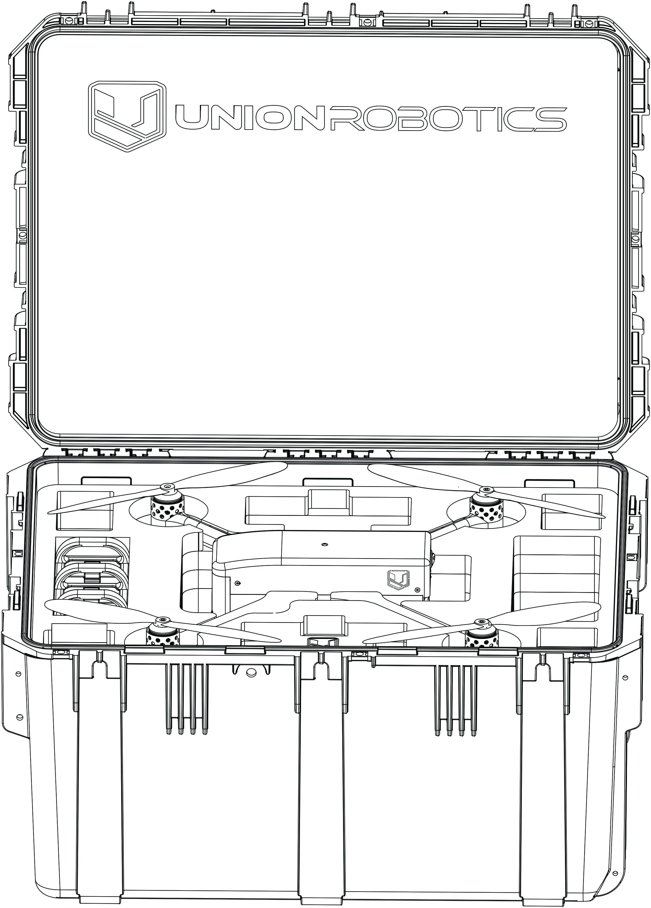

## **8.3 Assembly | Disassembly**

## **8.3.1 Propeller Care**

**WARNING**&#x20;

Propellers must be checked before each flight for nicks or cracks and installed securely.

**CAUTION**

Ensure the propeller shaft washer is inserted into the propeller hub when installing

To replace a propeller, remove the propeller nut with a 8mm driver. When the propeller nut has been removed, remove the propeller washer and propeller from the motor shaft. Replace the new propeller, add the propeller washer on top of the propeller, then screw the propeller nut back on. Make sure the propeller nut is tight and the propeller does not move around freely. Make sure the propeller shaft washer is installed in the propeller hub.

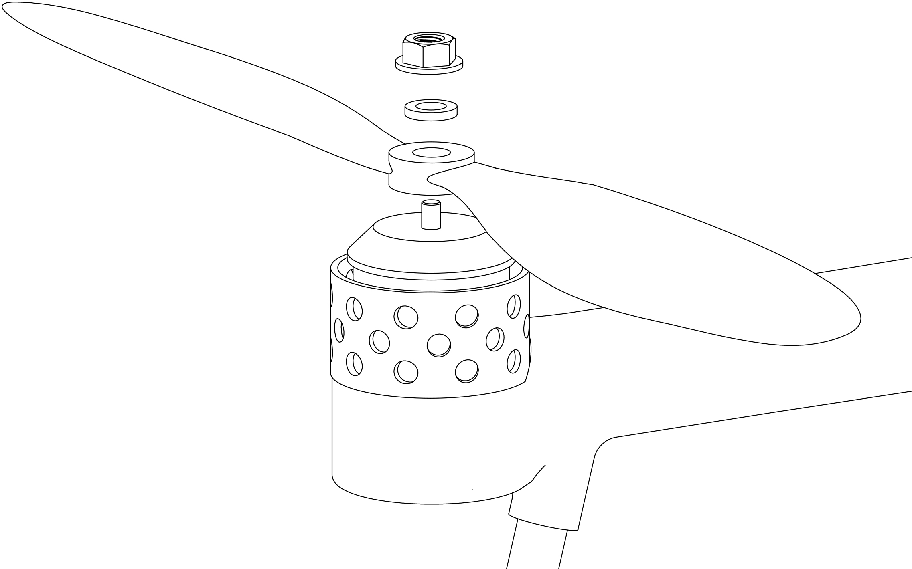

**WARNING**&#x20;

Ensure the propellers are installed in the correct orientation and are spinning the correct direction. Failure to install the correct propeller in the correct position and orientation will result in an aircraft crash.

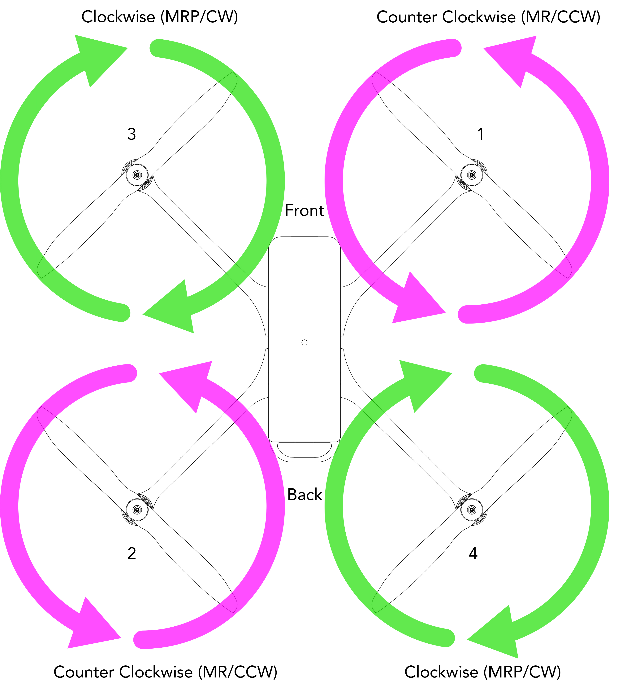

## **8.3.2 Aircraft Components**

**CAUTION**

It is advised that all four propellers are removed before performing any maintenance on the aircraft.

### **Top Canopy**

To remove the top canopy, unscrew the four M3 screws indicated in the illustration below. Once the four screws are removed, lift up on the top canopy.

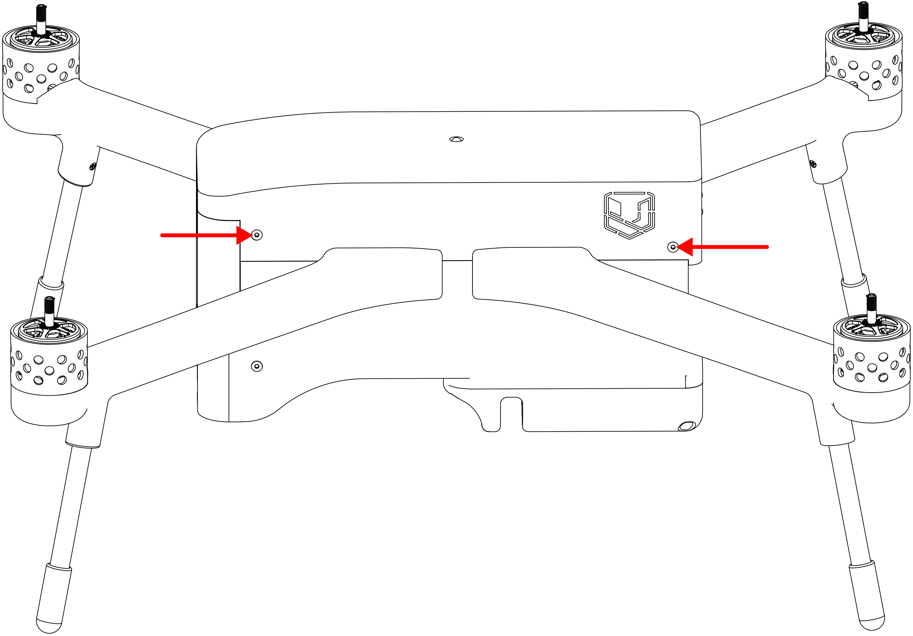

To completely separate the top canopy from the aircraft, carefully unplug the CAN 1.1 connector from the front GPS and the LED connector from the top LED.

### **Font Canopy**

To remove the front canopy, unscrew the six M3 screws indicated in the illustration below. Once removed, pull the front canopy out and set aside.

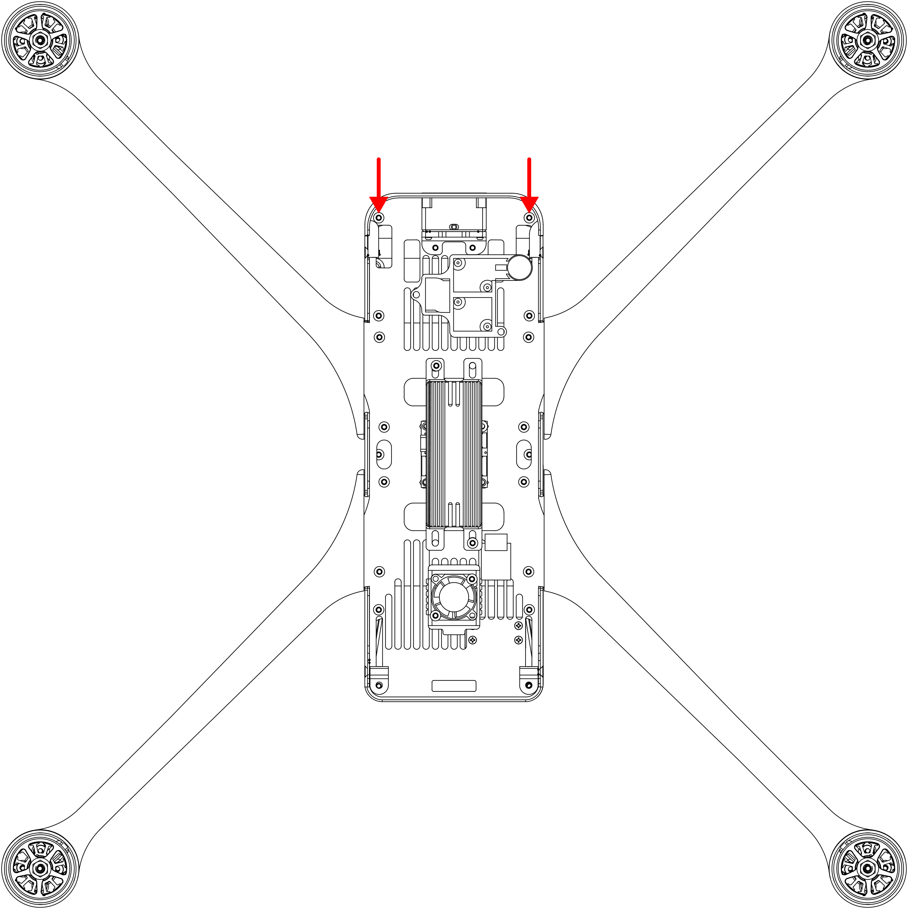

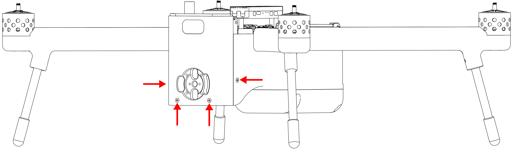

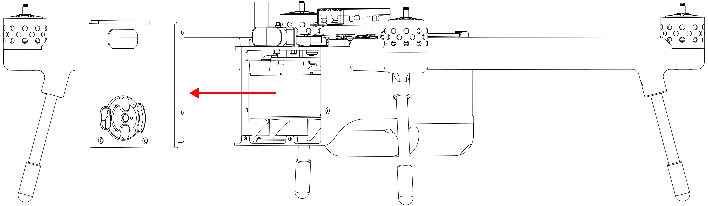

### **Bottom Canopy**

To remove the bottom canopy, you will need to remove the top canopy, front canopy and bottom compartment first. To remove the bottom compartment, unscrew the four M3 screws on the bottom or the aircraft in the image located bellow. Unplug the connectors of the components that are located in the bottom compartment, such as the release hook, antennas, bottom LiDAR, and optical flow sensor. Next unscrew the six M3 screws that hold the bottom canopy on to the aircraft indicated in the illustration below. Once screws are removed, gently pull down on the bottom canopy and remove.

### **Motor**

To remove a motor, first remove the propeller located on the motor. Then unsolder the associated wires on the ESC. Once wires are free, unscrew the four M3 screws located on the bottom of the arm using a 2mm driver. Once unscrewed, pull the motor away.&#x20;

**NOTICE**

The three wires are labeled with color: white, grey, and black. When reinstalling the motor wires, plug the wires into the matching color: white with white, black with black, grey with grey.

**WARNING**

When reinstalling the motor, failure to plug the motor wires with the matching colors will cause the motor to spin the opposite direction and lead to an aircraft crash.

### **Arm**

To remove an arm first remove the top canopy, the front canopy, the bottom canopy, and the motor located on the arm you would like to remove.

**NOTICE**

The three wires are labeled with color: white, grey, and black. When reinstalling the motor wires, plug the wires into the matching color: white with white, black with black, grey with grey.

**WARNING**

When reinstalling the motor, failure to solder the motor wires in the correct order will cause the motor to spin the opposite direction and lead to an aircraft crash.

To remove the arm, unscrew the two M3 screws and M3 nuts that attach the arm to the frame using a 2mm driver and a 5.5mm nut driver. Once unscrewed, pull the arm away from the frame.

### **Leg**

To remove a leg, unscrew the phillips head screw from the leg mount located on the arm at the base of the leg. Remove the screw and pull the leg out of the arm.

## **8.4 Cleaning and Care**

## **8.4.1 Aircraft Cleaning**

**WARNING**

To optimally keep the Meadowhawk dielectric, use Union Corp. SHIELD Professional Cleaning Wipes with Anti-Static Formula.

Open sealed Union Corp. SHIELD Professional Cleaning Wipes with Anti-Static Formula packet. Use to remove dust and debris on the air frame and canopy or ground station and control equipment. Use additional towelettes as needed to ensure all surfaces are cleaned and covered. Properly dispose of towelette(s).

&#x20;**NOTICE**

Union Robotics® recommends the use of disposable gloves when using the cleaning wipes.

**WARNING**

Ensure the bottom and front rangefinder lenses are clean at all times of operation.

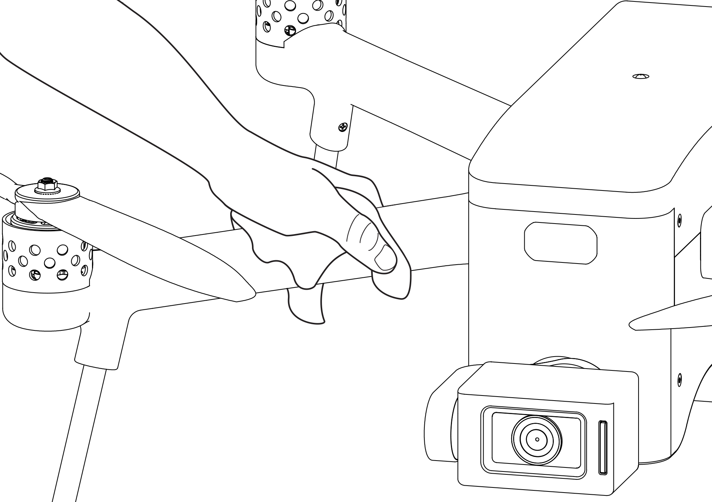

## **8.4.2 Battery Care, Storage, and Use**

### **Aircraft  Battery Storage**

When a battery will not be in use for 15 days or more, it should be charged in storage mode. This will take each cell to 3.8v (compared to 4.2v at full charge) which will prolong the life of the battery.

**WARNING**

When charging a battery make sure the individual cell voltages are about equal to each other. If one cell has a significant voltage difference (more than 10%) discontinue use of the battery and contact support.&#x20;

The Meadowhawk flight batteries should be stored in the waterproof storage case that is included in the Meadowhawk package. If the user has more than three batteries, the extra batteries should be stored in the optional Union Robotics® Battery Case.

### **Aircraft Battery Use**

Insert the battery pack into the rear of the Meadowhawk below the antennas. Push in firmly, pulling down on the locking tab if needed. Make sure the battery is fully inserted by attempting to remove the battery without using the battery locking latch. It should remain firmly in place.

**WARNING**

Do not deplete the battery below 17 volts.

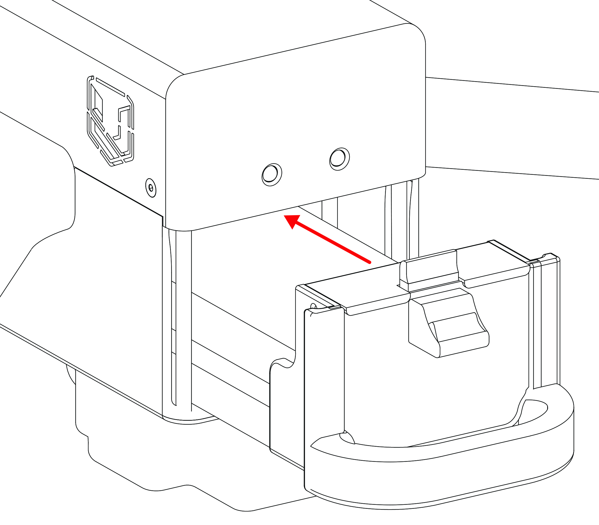

### **Aircraft Battery Charging**

|                                                                |                            |
| -------------------------------------------------------------- | -------------------------- |
| **The flight battery charger consists of the following items** |                            |
| Battery Charger                                                | ISDT D2                    |
| Battery Charger Power Cable                                    | American Standard          |
| Power Extender Cables                                          | XT60 Extender Cables       |
| Balance Extender Cables                                        | 6S Balance Extender Cables |

To charge a flight battery, connect the XT60 extender cables and balance lead extender cable to one of the chargers channels and battery.

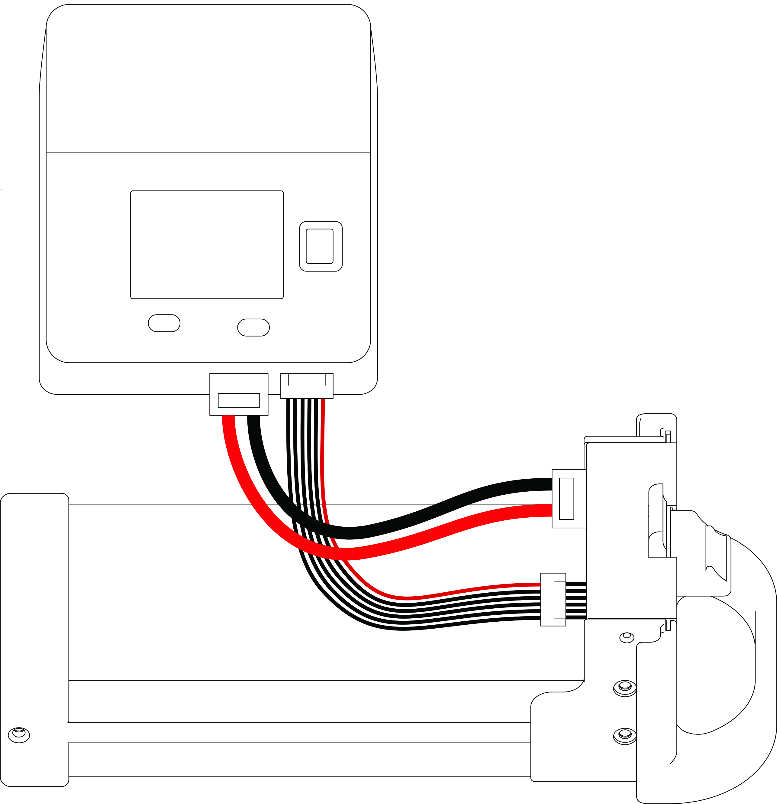

Power on the battery charger and ensure all settings on the battery charger are set correct for the flight battery. Press the channel button (1 or 2) depending on which channel you plugged into and check the settings.

|                  |        |
| ---------------- | ------ |
| Select Task      | Charge |
| Battery Type     | LiPo   |
| Cell Voltage     | 4.20V  |
| Cell Count       | 6S     |
| Current Settings | 12.0A  |

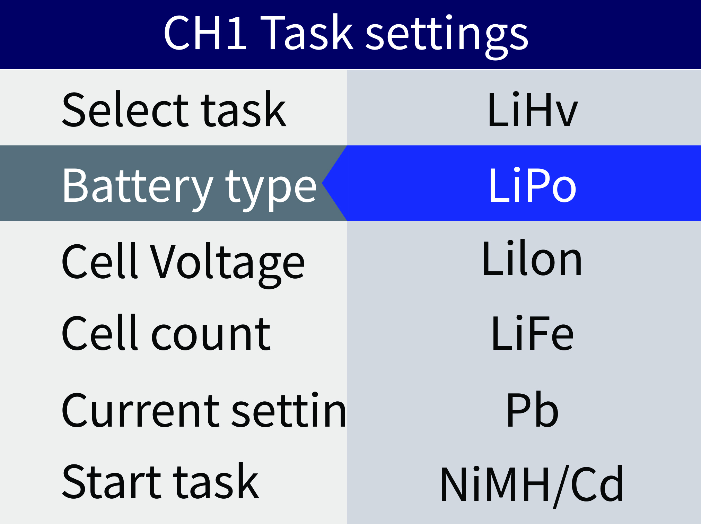

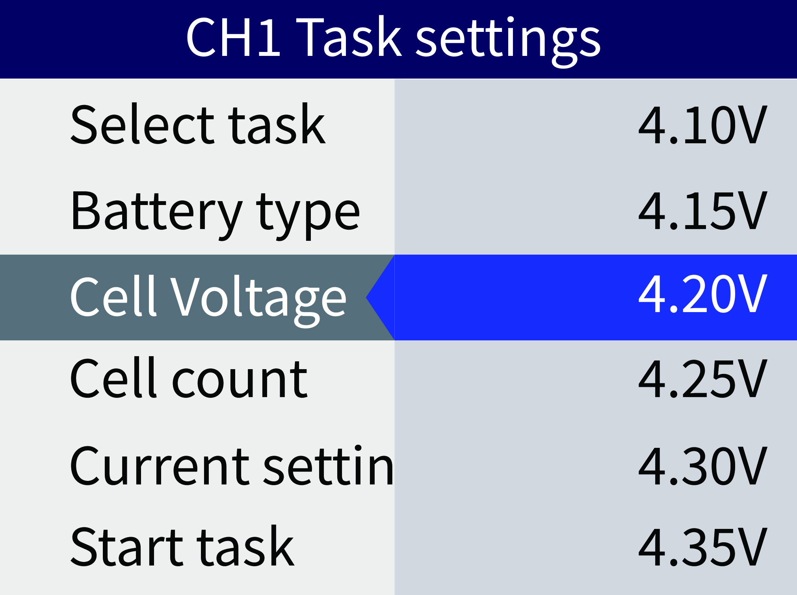

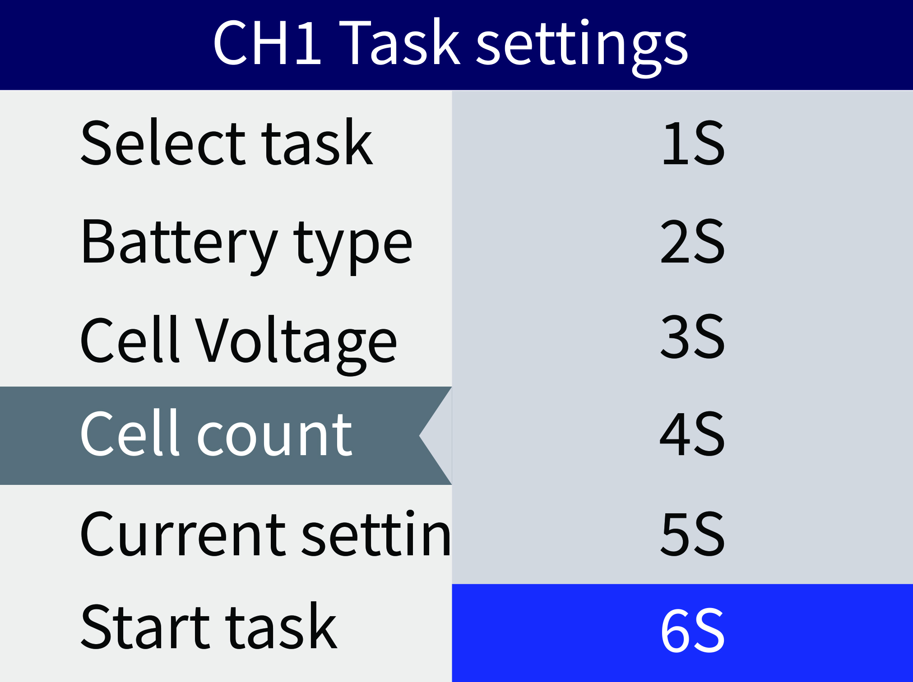

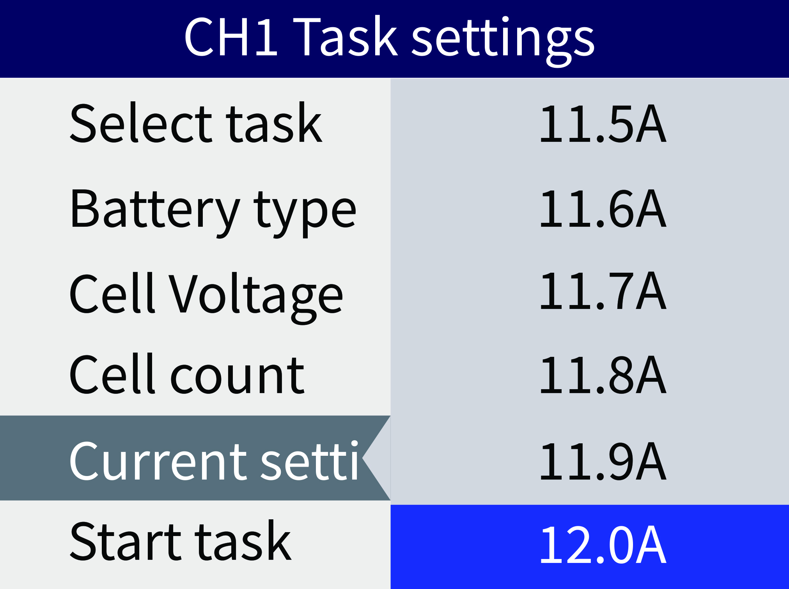

**NOTICE**

The extender cables can be plugged into either channel one or two, both channels will charge the battery equally. However, each battery needs both extender cables plugged into the same channel. It is possible to charge two batteries at the same time.

Once all settings are correct, select the Start Task option, and the charger will start charging the flight battery.

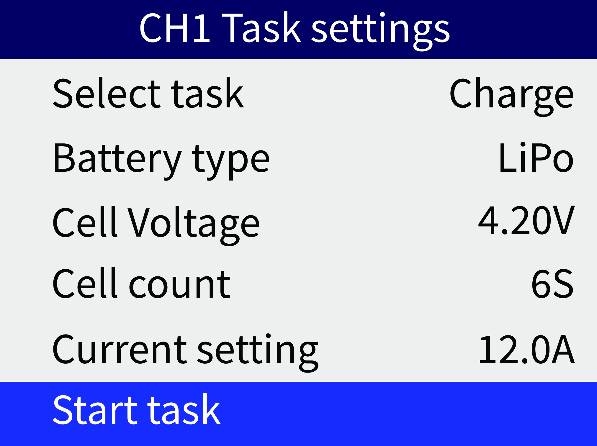

When the battery charging is complete, the top portion of the battery charger display will turn blue and will have a read out of how many milliamp-hours (mAh) were placed into the battery.

**NOTICE**

Be aware of how many volts are in each cell at the end of each charge. If any of the cells fall below 4.20V contact Union Robotics® support.

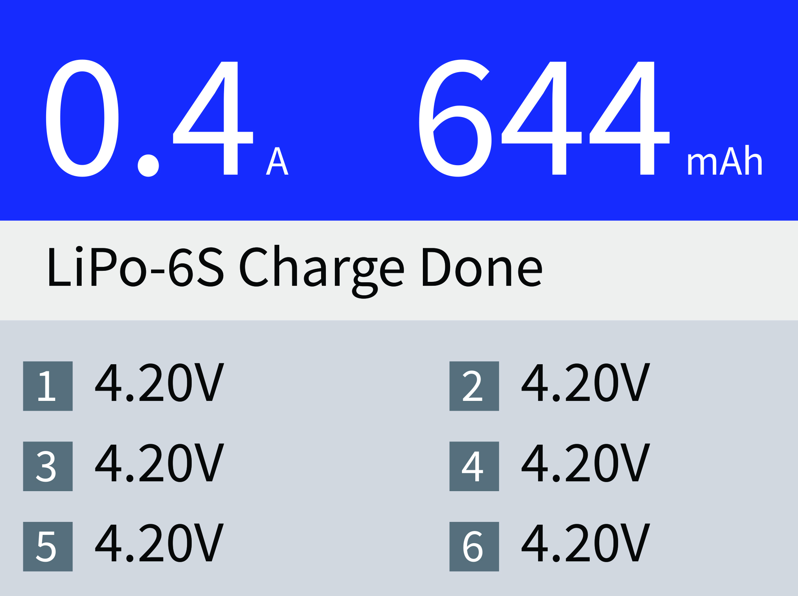

### **Radio Controller Charging**

Charge the radio controller, connect a USB to micro USB cable to the USB port on the side of the charge and to the micro USB port located on the bottom of the radio controller. When charging, the charging indicator LED will turn red, and when charging is complete, the indicator will turn green.

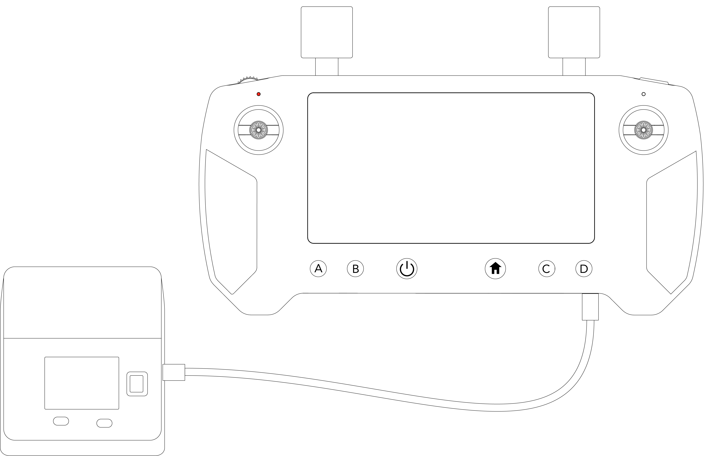

|                                                                      |                   |
| -------------------------------------------------------------------- | ----------------- |
| The radio controller battery charger consists of the following items |                   |
| Battery Charger                                                      | ISDT D2           |
| Battery Charger Power Cable                                          | American Standard |
| Radio Controller Battery Charging Cable                              | USB to Micro USB  |

## **8.5 Scheduled Maintenance**

## **8.5.1 Annual Inspection**

Upgrade firmware and software to latest revisions as needed.

Test all batteries for capacity.

**WARNING**

If any of the cells fall below 4.20V contact Union Robotics® Support.

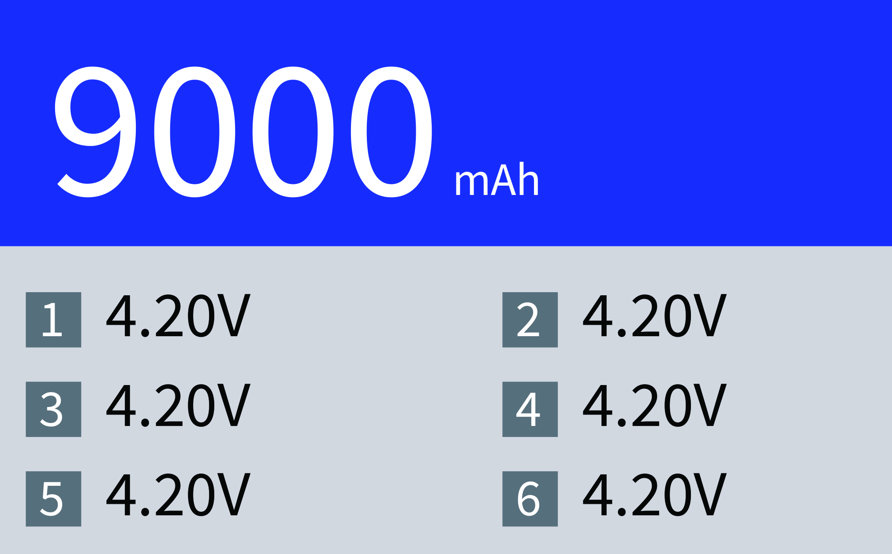

## **8.5.2 500 Hour Preventive Maintenance**

Disassembly, inspection of components for wear, replace any components as required by manufacturer certified technicians.

​Replace all motors

Test all batteries for capacity by manufacturer certified technicians.

Upgrade firmware and software to latest revisions.

