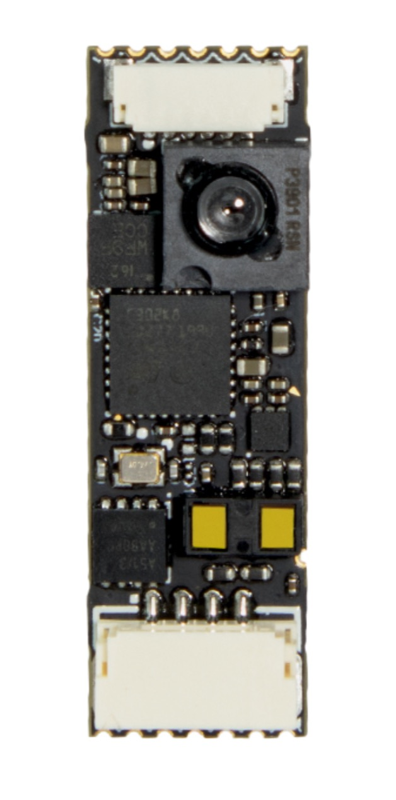
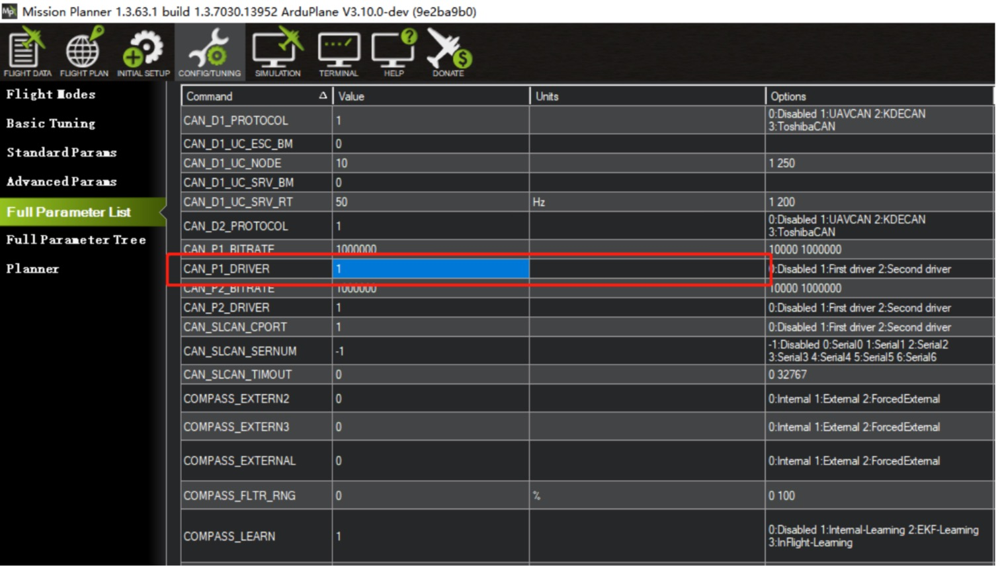
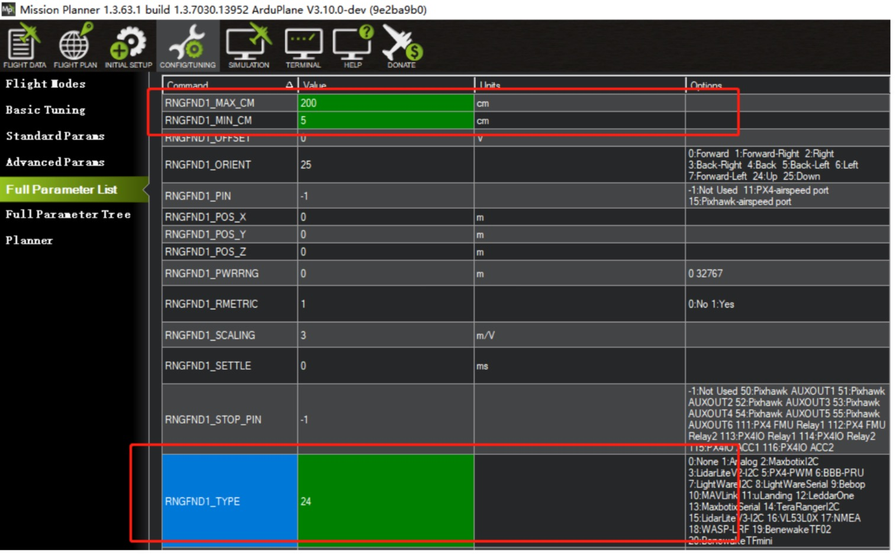
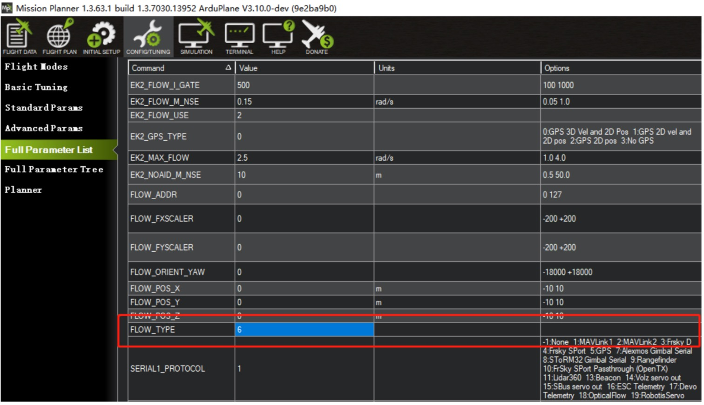
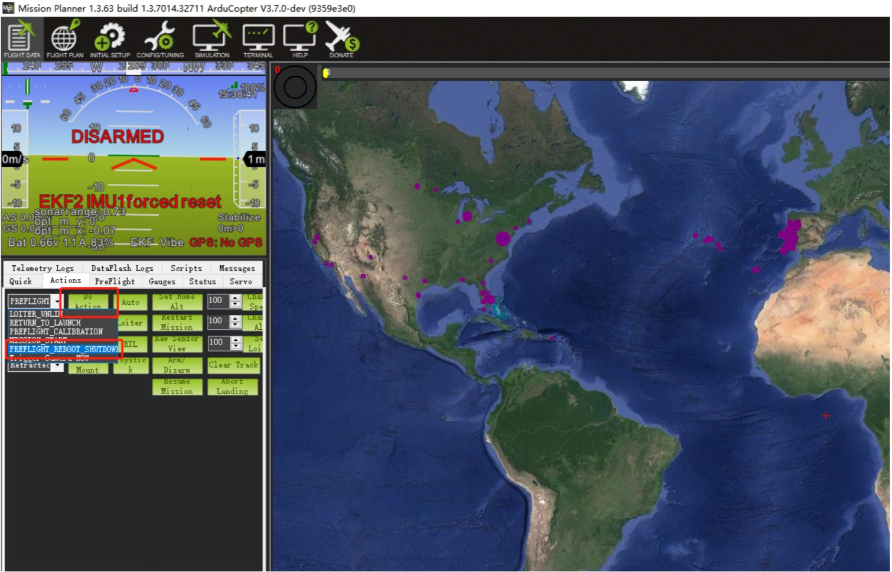
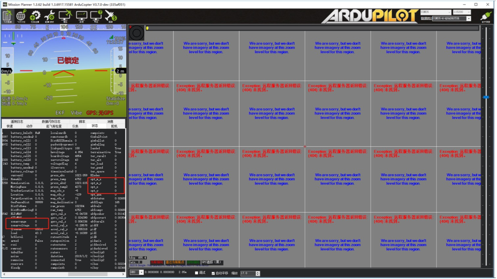

# Here Flow



## Overview

Here Flow is a finger size optical flow sensor. Compared with other optical flow sensors, it is even smaller. It can be installed easily at any position without taking much space.

A LiDAR component, an optical flow camera and a 6D IMU (ICM20602) are integrated in the Here FLOW.

The LiDAR component is a power efficient high speed TOF range finder, which embeds the latest ST FlightSenseTM technology. In range of 2 m, it can acquire the distance within 5 ms. The accuracy is not affected by colour or reflection rate of the target surface.

The Here Flow can be setup at any node in the CAN bus without noise problem.

## Specification

Size: 28.8mm\*9.5mm


## Performance

### Hardware Specification

1. Built-in ultra small lidar module
2. CAN Protocol, which provide more reliable communication
3. Built-in IMU Module
4. PAW3903 Optical Flow Sensor. Effective ranges from 80 mm to infinity.

### Optical Flow Sensor Specification

| Type                   | Parameter                                |
| ---------------------- | ---------------------------------------- |
| Range                  | 80 mm to infinity                        |
| Field of view          | 42 degree                                |
| Maximum movement speed | 7.4 rad/s                                |
| Minimum illumination   | >60 lux                                  |
| Infrared emitter       | 940 nm invisible light emission (Class1) |
| Operating temperature  | -20 to +70 °C                            |
| Interface              | CAN                                      |
| Power supply           | 5V                                       |

### Lidar Specification

| Type                  | Parameter                                |
| --------------------- | ---------------------------------------- |
| Measuring frequency   | Up to 50 Hz                              |
| Field of view         | 27 degree                                |
| Longest distance      | 2m                                       |
| Accuracy              | ±3 %                                     |
| Infrared emitter      | 940 nm invisible light emission (Class1) |
| Operating temperature | -20 to +70 °C                            |
| Interface             | CAN                                      |
| Power supply          | 5V                                       |

## Installation


Connect the CAN port on module and flight controller with the 4 Pin CAN cable. Point the Y axis of Here Flow to the nose of the aircraft. Face the camera to ground and stick the module to the bottom of aircraft by 3M sticker or soft sticker (with slightly vibration isolation).

\*DO NOT touch the electronic components on the PCB. Touch the edge of the PCB if possible during the installation.\*

\*The bottom of module must be clear, otherwise the measured data will be affected.\*

## Settings

Firmware update instructions: [https://discuss.cubepilot.org/t/can-flow-setup-instructions-alpha-batch/341](https://discuss.cubepilot.org/t/can-flow-setup-instructions-alpha-batch/341)

1.Connect the flight controller to computer via USB cable. Open Mission Planner. Install the master firmware by "Load custom firmware". Go to "Full Parameter List" and find "CAN\_P1\_DRIVER". Change it to "1" to enable CAN.



2.Find "RNGFND\_TYPE" and set it to "24" to enable range finder. Set "RNGFND\_MAX\_CM" (maximum distance) to 200 cm; "RNGFND\_MIN\_CM" (minimum distance) to 5 cm.

\*Please note: We have integrated the TOF sensor in this component due to it being VERY useful for precision landing detection. However, it is NOT suitable for height detection in outdoor conditions above 0.5 m, nor is it suitable for indoor height estimations higher than 2 m.\*

\*For accurate flow navigation, we still recommend installing the SF11B lidar from Lightware, or a similar Lidar that you trust.\*

\*Users may also opt to use Arducopter Mode FLOWHOLD for optical flow based position hold without rangefinder.\*



3.To turn on optical flow function: Set "FLOW\_TYPE" to "6" in order to enable optical flow camera.



4.After setting the parameters, click "Write Params". Go to the "Actions" tag in "flight Data" page. Select "PREFLIGHT\_REBOOT\_SHUTDOW" then click "Do Action" to reboot the flight controller.



5.After rebooting the flight controller, reconnect to Mission Planner and go to "status" tag. Change the altitude of the aircraft to see whether "sonarrange" is changing correspondingly. If the value does not change, please check if the parameters are properly set or reboot the flight controller. Change the position of the aircraft and see whether the data of "opt\_m\_x", "opt\_m\_y", "opt\_x", "opt\_y" are changing. If the value do not change, please check if the parameters are properly set or reboot the flight controller.



For more optical flow settings, you may check in CubePilot:



```
Last modify: 9th April 2019
```
