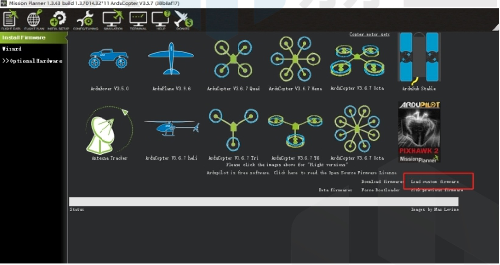
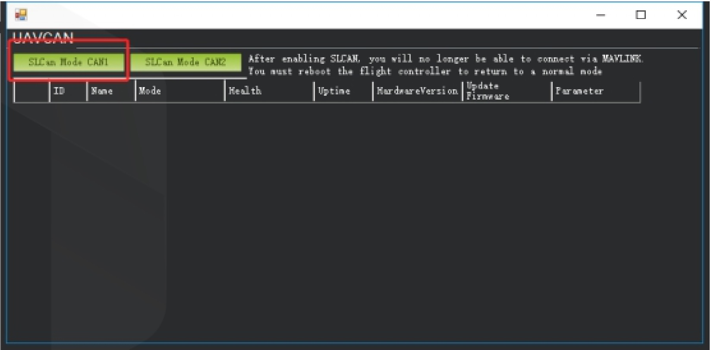
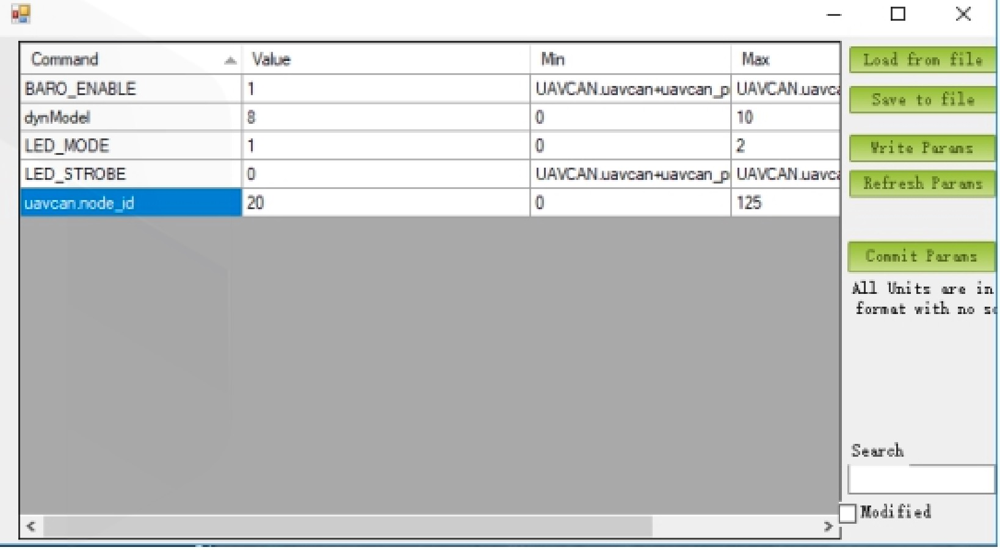

# Here 2 CAN Mode Instruction

Here2 Default factory setting is CAN mode with DroneCAN Protocol. Default Here2 CAN mode has three devices on CAN bus: GPS, magnetic compass, and barometer. The safety switch is not workable under CAN mode and the barometer is disabled in CAN mode by default. The barometer can be enabled by DroneCAN parameters setting.

## How to use CAN mode:

### Using Ardupilot Firmware:

Current official Ardupilot firmware (Copter3.6.7, Plane3.9.6 as well as previous versions) does not support Dynamic Node Allocator, hence user needs to allocate node ID to Here2 manually. The later released Copter3.7 firmware will support Dynamic Node Allocator, user only needs to set the parameters of their flight controller to use CAN mode.

### Allocating node ID method：

For allocating node ID to Here2, user needs to use Cube as SLCAN (Serial port to CAN) device, and use the latest version of Mission Planner. At first, upgrade the MissionPlanner to 1.3.63 version, please go to the link: [http://firmware.ardupilot.org/Tools/MissionPlanner/](http://firmware.ardupilot.org/Tools/MissionPlanner/) for downloading. Meanwhile the Cube which would be the SLCAN connector needs to be uploaded with copter3.7master firmware, firmware downloading link: [http://firmware.ardupilot.org/Copter/latest/CubeBlack/](http://firmware.ardupilot.org/Copter/latest/CubeBlack/) . Connect the 4p CAN cable in Here2 with the CAN2 port in the Cube controller. Connect the cube to MissionPlanner 1.3.63version and select firmware upload, click on ‘upload custom firmware’ to upload the previously downloaded arducopter firmware.

After uploading successfully, click on ‘Connect’. Press Ctrl+L keys to enter into DRONECAN interface.

Click on ‘SLCan Mode CAN1’, then the information of Here2 device will show up. Click on ‘Parameters’ on the right side.

 (1) (1).jpg>)

Pop up the parameters setting interface shown as the screenshot below, set the value of dronecan.node\_id between 0 and 125. Click on ‘Writing parameters’, then click on ‘Commit Params’ to save the setting. With the above mentioned steps, manual Node allocation is completed. If the user would like to enable the barometer, it can be done by setting the value of BARO\_ENABLE as 1.

After modifying the Node ID, the firmware and MissionPlanner can be changed into stable version.

Boot Cube controller and connect with MissionPlanner, enter into the MissionPlanner to change the parameters with corresponding values as follows:

CAN\_D1\_PROTOCOL：1\
CAN\_D2\_PROTOCOL：1\
CAN\_P1\_DRIVER：1\
CAN\_P2\_DRIVER：1\
GPS\_TYPE：9\
NTF\_LED\_TYPES：231

Writing the modified parameters, reboot the cube therefore the CAN mode can work properly.

CANBUS external compass will show up as the third compass with current Ardupilot firmware. Future firmware update will allow CANBUS external compass to be primary. Safety switch on the Here2 will not work under CAN mode. Modify the parameter BRD\_SAFETYENABLE to 0 to disable the safety switch, or connect an external safety switch to GPS1 port.

Note: The later released Copter3.7 firmware will support Dynamic Node Allocator. To use the CAN mode user only needs to modify the parameters.

## Using PX4 firmware:

Connect with CAN1 or CAN2 port. Connect with the controller to set the DRONECAN\_ENABLE parameter as Sensors Automatic Config. The sensors should work properly.

## How to use I2C mode:

Here2 also supports the traditional serial port + I2C communication. To use this mode, please disassemble the Here2 housing, Put the lever switch for CAN and Serial+I2C to Serial+I2C position shown as below.

Connect the here2 with GPS1 port of the Cube flight controller.
