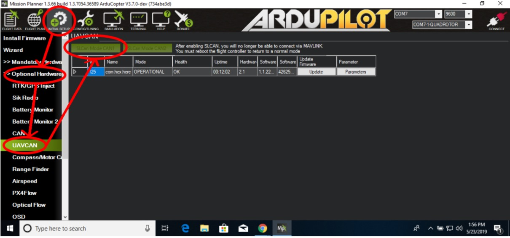
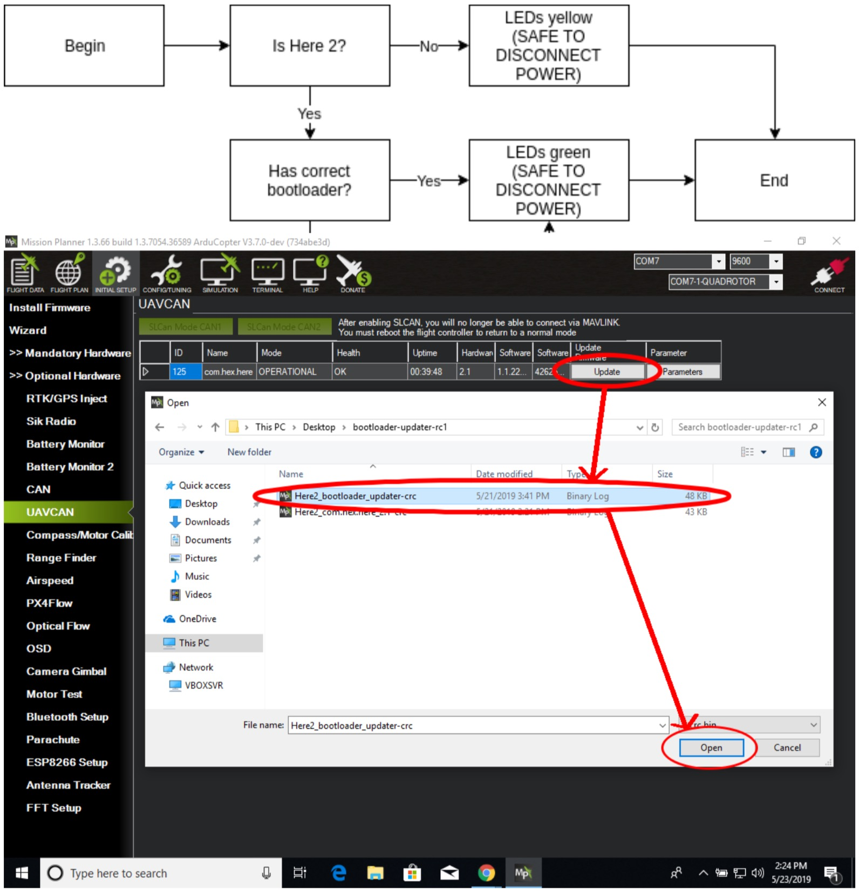

# Here 2 Instruction

## **Step 1: Switching the Here 2 to CAN mode**

Remove the case from the Here 2. Unplug the 8-wire cable and replace it with the included 4-wire CAN cable. Move the switch from the I2C position to the CAN position.

Note: This step is only required if your Here 2 has the 8-wire Serial/I2C cable which plugs in to the GPS 2 connector on the carrier board. If your Here 2 already has the 4-wire CAN cable attached, you can skip this step.

## Step 2: Connect to the Cube

Connect the CAN cable to the CAN 1 connector on the carrier board, as shown in the image to the left.

Note: On standard carrier boards manufactured before June 2019, this connector is mislabeled as CAN 2. Connect as shown in the image to the left.

## Step 3: Connect USB

Using the supplied USB cable, connect the Cube to your computer.

## Step 4: Install or update Mission Planner

The required version of mission planner is 1.3.66 or later. Mission planner can be retrieved from



## Step 5: Download ArduCopter master

Released versions of ArduCopter do not have support for SLCAN as of this writing. Download the latest master from firmware.ardupilot.org. The file that you need is called arducopter.apj Direct link: [http://firmware.ardupilot.org/Copter/latest/CubeBlack/arducopter.apj](http://firmware.ardupilot.org/Copter/latest/CubeBlack/arducopter.apj)

## Step 6: Flash ArduCopter master

Launch Mission Planner. Click “Initial Setup,” then “Load custom firmware.” Navigate to the arducopter.apj file that you downloaded and select it.

## Step 7: Enable CAN

Click **Config/Tuning** then **Full Parameter List** then search for **CAN\_**, change **CAN\_P1\_DRIVER** to **1** and click **Write Params**.

## Step 8: Reboot the cube

Unplug the USB cable, plug it back in and reconnect Mission Planner.

## Step 9: Using the Mission Planner SLCAN interface

Click **Initial Setup**, then **Optional Hardware**, then UAVCAN, then **SLCan Mode CAN1**. Connected CAN devices \(in this case, a Here 2\) will be listed.

## Step 10: Flash the bootloader updater

The bootloader updater performs the procedure listed to the left, which will start immediately after the firmware update completes.

On the Here 2 entry in the list, select **Update**, navigate to the **bootloader\_updater** file and open it. After this point, **DO NOT DISCONNECT POWER UNTIL THE LEDS ARE EITHER GREEN OR YELLOW, OR 3 MINUTES HAVE ELAPSED.**



## Step 11: Flash the application

Follow the same procedure as in Step 10, but select the Here2\_com.hex.here\_2.1-crc.bin file instead.



