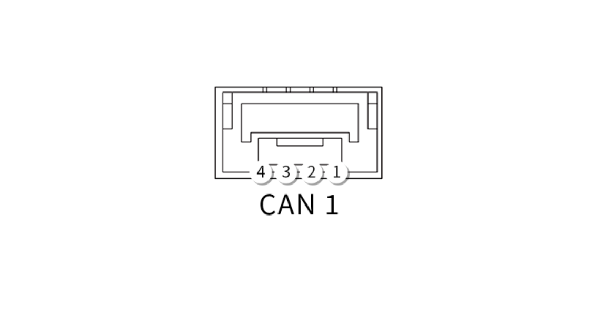
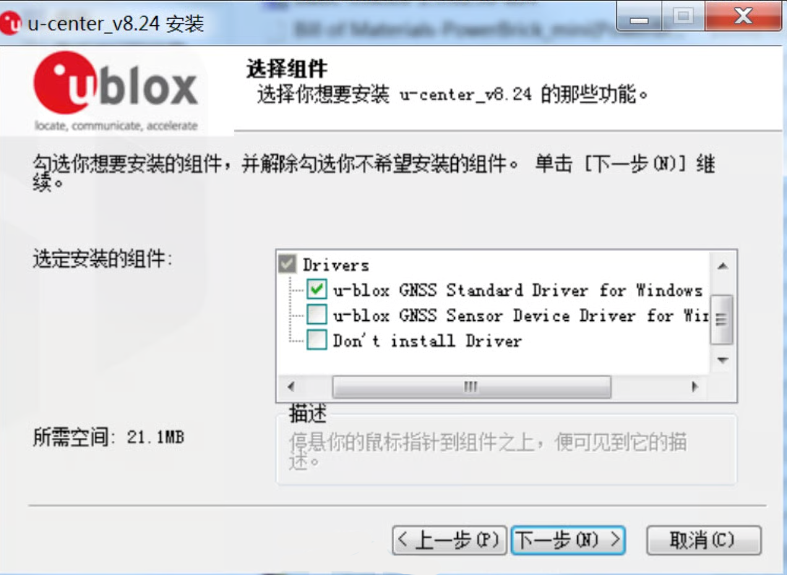
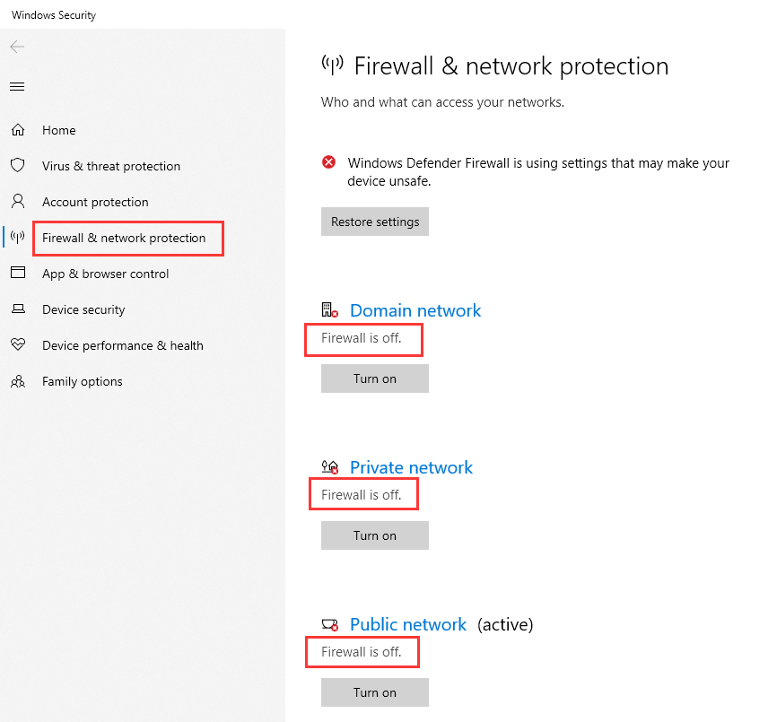
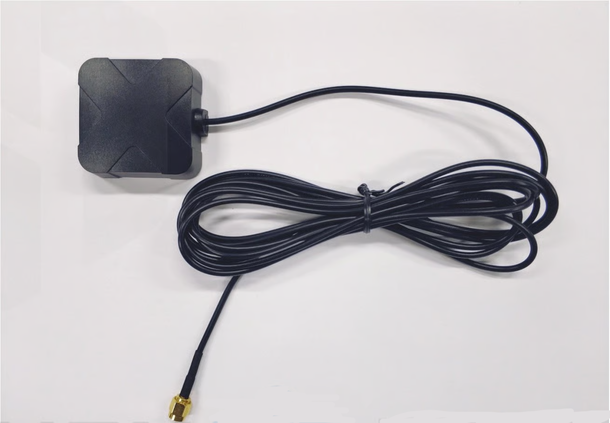

# Here 3 Manual

### Overview

Here 3/3+ GPS is a Cost-efficient GNSS system that supports RTK mode. Positioning accuracy down to centimetre-level in an ideal environment. Improved dust and water resistance over the Here+ (Not guaranteed to be water-proof).High data rate, upgradeability, noise immunity, and real-time features from the DroneCAN protocol, with Here3+ now moving to DroneCAN 8Mbit bus speed. Here 3 is Equipped with the STM32F302 processor while the Here3+ jumps to the Dual core STM32H757 running at 400MHz with 2MByte Flash, and 1MByte RAM. Supports future firmware updates. Support from ground control software. Future updates will be available from Mission Planner. Built-in Inertial Measurement Unit (compass, gyroscope, and accelerometer), for advanced navigation needs.

***

### Here 3 / Here 3+ :

#### Hardware Specification

| **Model**                   |                     Here 3                     |                     Here3+                     |
| --------------------------- | :--------------------------------------------: | :--------------------------------------------: |
| **Receiver Type**           | u-blox **high precision GNSS modules** (M8P-2) | u-blox **high precision GNSS modules** (M8P-2) |
| **Satellite Constellation** |       GPS L1C/A, GLONASS L1OF, BeiDou B1I      |       GPS L1C/A, GLONASS L1OF, BeiDou B1I      |
| **Positioning accuracy**    |          3D FIX: 2.5 m / RTK: 0.025 m          |          3D FIX: 2.5 m / RTK: 0.025 m          |
| **Processor**               |                    STM32F302                   |                    STM32H757                   |
| **IMU sensor**              |                    ICM20948                    |                 ICM42688,RM3100                |
| **Navigation Update Rate**  |                      8 hz                      |                      8 hz                      |
| **Communication Protocol**  |                DroneCAN 1Mbit/s                |                DroneCAN 8Mbit/s                |
| **Operating Temperature**   |                   -40℃ to 85℃                  |                   -40℃ to 85℃                  |
| **Dimension**               |                 68mmx68mmx16mm                 |                 68mmx68mmx16mm                 |
| **Weight**                  |                      48.8g                     |                      51.8g                     |

#### Pinout

| Pin | Definition | Cable color |
| :-: | :--------: | :---------: |
|  1  |   VCC\_5V  |     red     |
|  2  |   CAN\_H   |    brown    |
|  3  |   CAN\_L   |    yellow   |
|  4  |     GND    |    black    |

| Pin | Definition | Cable color |
| :-: | :--------: | :---------: |
|  1  |   VCC\_5V  |     grey    |
|  2  |   CAN\_H   |     blue    |
|  3  |   CAN\_L   |    white    |
|  4  |     GND    |    green    |

**Note: Current firmware only support CAN 1 ,CAN 2 is not supported. Dual CAN will be enabled in a future firmware update.**

### Operation instruction

#### 1. Using Ardupilot Firmware：

**Using one Here 3 / Here 3+：**

Connect the 4 pin CAN cable connector to CAN1 or CAN2 port on the flight controller.

Power the flight controller and connect it to Mission Planner. Go to "Config/Tuning > Full Parameter List" and modify the following parameters:

**CAN\_D1\_PROTOCOL: 1** set virtual driver of CAN1 to DRONECAN

**CAN\_D2\_PROTOCOL: 1** set virtual driver of CAN 2 to DRONECAN

**CAN\_P1\_DRIVER: 1** set this parameter to enable CAN 1 bus

**CAN\_P2\_DRIVER: 1** set this parameter to enable CAN 2 bus

**GPS\_TYPE: 9** set the communication protal type of GPS 1 to DRONECAN

**NTF\_LED\_TYPES: 231** Set to DRONECAN for LED type

There is no external safety switch. Set BRD\_SAFETYENABLE as 0 to disable safety switch, or connect an physical external safety switch

Click "Write Params" when done. CAN functions will be available after rebooting the flight controller.

**Using two Here 3 / Here 3+：**

As the document is written，The firmware used for flight control is ArduCopter 4.1.5, which automatically allocate 2 node ID for Here 3 / Here 3+，you can perform following operation directly.

> Old firmware might not be able to automatically allocate 2 node ID . Need to use latest firmware and perform following operation to manually assigning node ID.

Connect two Here 3 / Here 3+ CAN cable to the CAN1 and CAN 2 port of the flight controller

Power up flight controller and connect to Mission Planner. Go to "Config/Tuning > Full Parameter List" and modify the following parameters:

**CAN\_D1\_PROTOCOL: 1** set virtual driver of CAN1 to DRONECAN

**CAN\_D2\_PROTOCOL: 1** set virtual driver of CAN 2 to DRONECAN

**CAN\_P1\_DRIVER: 1** set this parameter to enable CAN 1 bus

**CAN\_P2\_DRIVER: 1** set this parameter to enable CAN 2 bus

**GPS\_TYPE: 9** set the communication protocol type of GPS 1 to DRONECAN

**GPS\_TYPE2：9** set the communication protocol type of GPS 2 to DRONECAN

**NTF\_LED\_TYPES: 231** Set to DRONECAN for LED type

There is no external safety switch on Here 3 / Here 3+. You can set BRD\_SAFETYENABLE to 0 to disable safety switch, or connect an physical external safety switch

Click "Write Params" when done. CAN functions will be available after rebooting the flight controller.

**Compass Setting(Using the latest version of firmware)：**

> As the document is written，The firmware used for flight control is ArduCopter 4.1.5

When using Cube Black , from top to bottom are compass 1 ,2 and 3 .When using Cube Orange ，from top to bottom are compass 1 and 2. The external compass will be displayed in BusType list as UAVCAN. Usually need to set the external compass to NO 1 compass , if the external compass is not NO 1 compass, please do the following operation.

.png>)

If you want to use CAN external compass as the NO 1 compass ,please move the UAVCAN compass to the top.

Select the compass you want to use (the default is normally ok).Then click "Start" to begin calibrate the compass,follow the process until the calibration is done .

#### 2. Using PX4 firmware：

As the document is written，The firmware used for flight control is PX4 V1.12.3, which automatically allocate 2 node ID ，you can perform following operation directly.

> Old firmware might not be able to automatically allocate CAN node ID . Need to manually assigning node ID Here 3 / Here 3+ with latest firmware and perform following operation

Load PX4 firmware into the autopilot. Connect the 4pin CAN connector from Here3 to CAN1 or CAN2 port on flight control.

Connect to the flight control and set the parameter "UAVCAN\_ENABLE" to "Sensor Automatic Config".

The Here3 will now work.

#### 3. LED defination(with ardupilot firmware)：

Flashing red and blue: Initializing gyroscopes. Hold the vehicle still and level while it initializes the sensors.

Flashing blue: Disarmed, no GPS lock found.

Solid blue: Armed with no GPS lock.

Flashing green: Disarmed (ready to arm), GPS lock acquired.

Fast Flashing green: Same as above but GPS is using SBAS.

Solid green - with single long tone at the time of arming: Armed, GPS lock acquired. Ready to fly.

Double flashing yellow: Failing pre-arm checks (system refuses to arm). Please check the pre-arm error message.

Single Flashing yellow: Radio failsafe activated.

Flashing yellow - with quick beeping tone: Battery failsafe activated.

Flashing yellow and blue - with high-high-high-low tone sequence (dah-dah-dah-doh): GPS glitch or GPS failsafe activated.

Flashing red and yellow - with rising tone: EKF or Inertial Nav failure

Flashing purple and yellow: Barometer glitched

Solid Red: Error. Usually due to cannot detect SD card (please try to re-plug or replace SD card), MTD device, or IMU sensors. Analysis can be found in BOOT.txt in SD card.

Solid Red with SOS tone sequence : SD Card missing (or other SD error like bad format etc.)

Not lighting up: No firmware detected or firmware corrupted.

### RTK Use Operation

#### 1. Base/Rover Survey by Mission Planner

> This part of the tutorial uses Mission Planner ground software and Arducopter-4.1.5 flight firmware for operating instructions. RTK mode requires a base station. The following tutorial Use "Here+" base stations as an example. Users can also use other uBlox M8P/F9P base stations (such as HerePro, etc.), or use the local wireless RTK correction service.

**Prepare Before use：**

To use Here 3 / Here 3+ on a UAV, you need the following hardware： Computer, telemetry modules, \*_Here 3 / Here 3+_ , Base Antenna, Base, Tripod(Stand).

**Before starting to use, please make sure that the hardware connection is correct:**

**Ground side:** Connect base antenna to base station, then connect the base station module to computer through USB port; Telemetry module is connected to another USB port of the same computer. **UAV side**: Connect Here 3 / Here 3+ to CAN interface , telemetry module to the TELEM interface on flight control.

**Antenna Placing**

**Placing the RTK Antenna is very important for getting precise RTK positioning**

Normal GPS positioning,you only have to places the device near a window in your room and it would provide you a GPS location over a period of time. But that's not enough for RTK. For the working environment of RTK, there are special requirements on antenna placement, which are much stricter than GPS.

The best environment forthe base and rover antenna is a clear view of the sky that is 30 degrees above the horizon. RTK antenna can be elevated but make sure that there are no obstacles around, such as buildings, trees, cars, and etc

**Example of a bad environment:** indoors, urban area, forest, near the ground.

**Example of a good environment:** Open spaces, peak of the mountains, roof of the buildings.

Do not place the antenna near electronic devices, as high power electronic devices nearby may affect the radio frequency noise of GPS signal. Examples are mobile phone base stations, high voltage transformers, and etc.

Please place the base station in an outdoor environment with sufficient sky coverage to obtain a good satellite signal.

Place the base station on a stable and elevated platform, such as a tripod.

**Base Module Setting using Mission Planner**

Start with a base module setup first. During the base station setup, the rover and the UAV do not need to be turned on.

Open the Mission Planner ground station software on your computer and go to the "initial setup → Optional Hardware → RTK/GPS Inject". You will see the following page:

.png>)

Select the correct base module com port in the top left corner and click connect. In the SurveyIn Acc section, enter the absolute geographic accuracy that you expect your Here+ base station to achieve. In the Time column, enter the minimum survey time you expect. Click on Restart, the ground station will transfer the data you have entered to the Here3 base module, the base module will start a new round of surveying. You will see the following page:

During the survey process, the right box will show the current survey status:

**The Position is invalid:** The base station has not yet reached a valid location;

**In Progress:** The survey is still in progress；

**Duration:** The number of seconds that the current surveying task has been executed;

**Observation:** the number of observations acquired;

**Current Acc:** Absolute geographic accuracy that the current base station can achieve;

**The Green bar** at the lower part of the Mission Planner page shows the current satellites being detected and the signal strength related to each satellite. At least eight or more satellite signals need to be guaranteed to exceed the red line ( Only when the satellite signal exceeds the red line is the effective number of satellites).

The base station needs a certain amount of time to meet the accuracy requirements of your input. Testing shows that in an open area without shelter, to achieve the absolute accuracy of 2m takes a few minutes; to reach the absolute accuracy of less than 30cm takes around an hour; to reach the accuracy of 10cm takes a few hours.

It should be noted that the absolute geographic accuracy of the base station here will affect the absolute geographic accuracy of the rover module without affecting the relative accuracy between the base station and rover. If your application does not require UAV with high absolute geographic accuracy, you do not need to set the base station's precision too high,which resulting in long survey time.

Even if the accuracy of the base station is 1.5 to 2 m, the position accuracy of the rover module relative to the base station can still reach the centimeter level.

After the survey is complete, the Mission Planner will display the following page:

In the RTCM box it shows that the base status indicator is green and both the GPS and Glonass satellite systems are green (if you want to change the satellite system, refer to the following section). The box on the right says "Position is valid".

To store the current location in the Mission Planner: Click "Save Current Pos", enter a name in the dialogue box, and click "OK". As shown below, you can see your saved location in the list. Click the "Use" button for the location you saved. The base station will enter the fixed mode and the status will show "Using FixedLLA". In the future, if you set the base station in the same location, you do not need to conduct the survey again, just click the "Use" button that corresponds to the location you have saved.

**Rover Module and Flight Controller Setup**

After the base station is set up, you can turn on the UAV. Using the same telemetry module to connect Mission Planner, the base station data will be transmitted through the telemetry module to the Here3 rover module on the UAV. In the Mission Planner main page, you can see the current GPS status displayed as RTK Float / RTK Fixed / 3D RTK, indicating that the positioning of the UAV has entered the RTK mode. RTK Float is a floating-point solution; RTK Fixed is a fixed solution. RTK Fixed mode has higher accuracy and requires better signal strength. 3D RTK is unified saying of RTK Float / RTK in the Mission Planner Chinese version

**2. Single Base to Multiple Rovers \*\***

There are 2 methods to do this: 1) Use 1 telemetry to multiple telemetry broadcasting ;or 2) Use multiple 1 to 1 telemetry modules with USB hub

Ground station configuration: connect all telemetry modules to the computer via USB hub. Open Mission Planner to locate the base then connect it with flight controllers. Select AUTO connecting as shown below. All recognized flight controllers on the ports will be connected. You may select the UAV form the dropdown list below:

If you connected the UAVs with 1 telemetry module, they should share the same COM port:

### Software Configuration

#### 1.CAN ID change

**Use Cube Black to change ID ：**

Connect each Here 3 / Here 3+ 4 Pin CAN cable to the CAN 1 port of the flight controller(one at a time), and conduct the following procedure. Select "install firmware" from Mission Planner and load the latest copter and plane firmware.

After successful installed firmware, change baud to 115200, and click connect. Then go to "Config/Tuning > Full Parameter List" and modify the following parameters:

CAN\_D1\_PROTOCOL：1 set virtual driver of CAN 1 to DRONECAN

CAN\_D2\_PROTOCOL：1 set virtual driver of CAN 2 to DRONECAN

After successful loading, select the autopilot SLCAN COM port with 115200 baud rate and Connect and then Go to "Initial Setup - Optional Hardware - DRONECAN", click "SLCan Mode CAN1".

.png>)

When the device settings of Here3 pop-up, click "Parameters" from the right.

.png>)

In parameter setting page, change uavcan.node\_id to 0-125. Click before entering a value. Then, click "Commit Params" to save the changes and completed manual CAN id allocation.

**Use Cube Orange to change ID:**

Connect each Here 3 / Here 3+ 4Pin CAN cable to the CAN 1 port of the flight controller(one at a time), and conduct the following procedure. Select "install firmware" from Mission Planner and load the latest copter or plane firmware.

After successful loading, select the autopilot SLCAN COM port with 115200 baud rate and Connect and then go to "Config/Tuning > Full Parameter List" and modify the following parameters:

CAN\_D1\_PROTOCOL：1 set virtual driver of CAN 1 to DRONECAN

CAN\_D2\_PROTOCOL：1 set virtual driver of CAN 2 to DRONECAN

After successful loading, select the autopilot SLCAN COM port with 115200 baud rate.

\*\*Do not click connect . \*\*

Then Go to "Initial Setup - Optional Hardware - UAVCAN", click "SLCan Mode CAN1".

When the device settings of Here 3 / Here 3+ pop-up, click "Parameters" from the right.

.png>)

In parameter setting page, change uavcan.node\_id to 0-125. Click before entering a value. Then, click "Commit Params" to save the changes and completed manual CAN id allocation.

.png>)

#### 2. Here 3 / Here 3+ firmware upgrade

Please update Mission Planner to the version indicated below(1.3.74) or higher:

Be aware that the following steps should be done when there is only 1 GPS module connected to autopilot. Connect the HERE3 CAN connector to CAN 1 port on autopilot. Connect to Mission Planner and go to “UAVCAN” tab. Click “SLCan Mode CAN 1” to load CAN GPS status. Click “Menu>Update” to check available updates. Update the HERE3 firmware.

(The following procedure is using Here 3 firmware upgrade as an example. The other Here series GPS can also refer to this procedure.)

.png>)

After clicking “Update”it will ask whether to search update from the Internet. Click “Yes”. (Automatically searches for upgraded to the latest stable version firmware)

.png>)

Check firmware version after upgrade.After the upgrade, check whether the version is successfully upgraded.

If “no available updates” appears when searching updates. Please turn off your firewall in the system setting and try again.

#### 3. Modify Here 3 GNSS constellations

Through the following steps, GNSS constellations being used by HERE 3 can be selected. It requires HERE 3 to be v1.6 or later. Updating instructions are mentioned in “HERE 3 Firmware Update” section above.

Be aware that the following steps should be done when there is only 1 GPS module connected to autopilot. Connect the HERE 3 CAN connector to CAN 1 on autopilot. Connect to Mission Planner and go to “UAVCAN” tab. Click “SLCan Mode CAN 1” to load CAN GPS status.

After verifying the firmware has already updated to latest, click “Menu – Parameters to enter the setting:

gnssConfig = 8 for BeiDou

gnssConfig = 9 for GPS+BeiDou

gnssConfig = 97 for GPS+GLONASS+QZSS

When done, click “Write Params” and “Commit Params” at the righthand side.

#### 4. HERE3 u-blox Chip Firmware Update

> Here is 3 + U-Blox firmware update method will be released when a new firmware comes out for the M8P-2, the here3+ has the latest firmware at launch, and we will update here if a newer version comes out.

The u-blox chip firmware update can be completed only when HERE 3 is updated to latest version. Please follow the instructions in section “HERE 3 Firmware Update” to update your HERE 3 firmware to the latest version.

This instruction uses u-center GUI from u-blox, the correct version should be v20.10 or later:

Download the u-blox chip firmware. (The latest firmware for u-blox M8P chip is v1.4 when this guide is written):

u-blox M8P chip firmware: https://www.u-blox.com/en/product/neo-m8p-series#tab-documentati: https://www.u-blox.com/en/product/neo-m8p-series#tab-documentation-resources

> Parameter definition:
>
> passThrough = 0 Standard mode
>
> passThrough = 1 Connect to u-center for parameter review
>
> passThrough = 2 Connect to u-center for firmware update on u-blox chip

After downloading the firmware, connect to Mission Planner. Go to UAVCAN tab and modify the parameter “passthrough” to “2”. When done, click “Write Params” and “Commit Params” at the righthand side.

Click “Menu > Restart”. After that, uptime should be reset to “00:00:00”.

Click “Menu > CANPassThrough”. Set TCP port to “500” then click “OK”.

Open u-center and connect it (Receiver > Connection > Network connection > New.).

Open “Firmware Update Utility” (Tools > Firmware Update.) and set the following:

Click “GO” at the bottom-left corner to start firmware flashing. Wait until it is finished.

After update completed, connect to Mission Planner. Go to “UAVCAN” tab. Modify the parameter “passThrough” to “0” then write and commit.

HERE 3 will now work normally.

#### 5. Connect HERE 3 to u-center for GNSS-related Parameter Checking

> Here is 3 + details to follow as this feature gets expanded

The u-blox chip Parameter Checking can be completed only when Here 3 / Here 3+ is updated to latest version. Please follow the instructions in section “HERE 3 Firmware Update” to update your HERE 3 firmware to the latest version.

The u-center must be on v20.10 or later:

Connect to Mission Planner and go to “UAVCAN” tab. Modify “passThrough” to “1”.

Click “Menu > CANPassThrough”. Set TCP port to 500 and click “OK”.

Open u-center and connect it (Connect > Network Connection > new).

When connected, parameters and messages can be viewed in u-center.

When finished reviewing, go back to Mission Planner and set “passThrough” to “0”.

.png>)

2022.06.27
