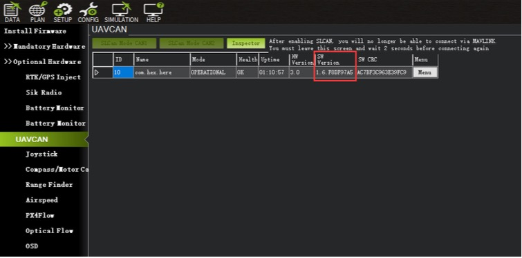
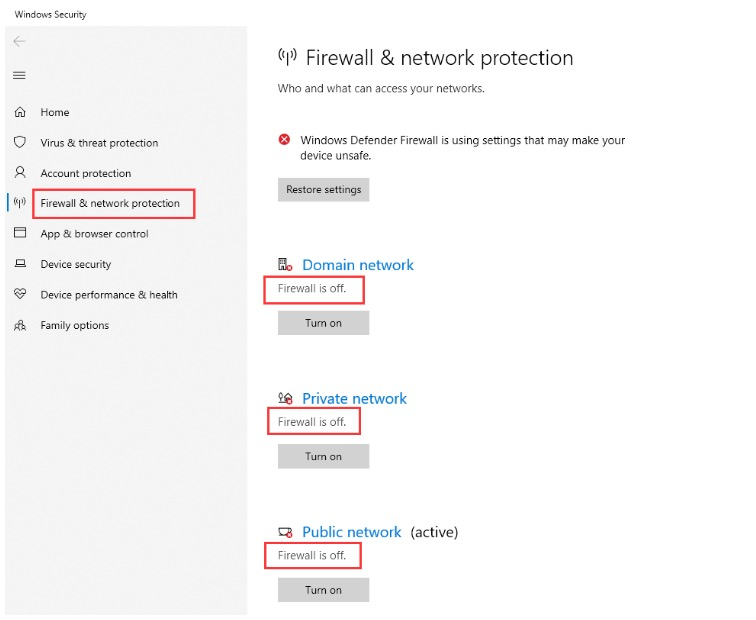

# Here 3 Manual

## Here3 GPS Manual

### Overview

The Here3 GPS is a high precision GNSS system that supports RTK mode, built with CAN protocol. It is also designed to be dust-proof and splash-proof up to a certain limit. Equipped with STM32F302 processor, the Here3 provides faster processing speed and better reliability.

The Here3 has built-in sensors including compass, gyroscope, accelerometer, and status LED. It runs on Chibios real-time operation system. Its open-source structure is ideally suited to developers who need specialized requirements on their navigation system.

### **Feature**

1. Cost-efficient high precision and RTK supported GNSS chip \(base station needed for RTK\). Positioning accuracy down to centimetre-level in an ideal environment.
2. Brand new design with improved visibility on signal LEDs. Better dust and water resistance \(Not guaranteed to be water-proof under any situation due to the complexity of the operating environment\).
3. The high data rate, upgradeability, noise immunity, and real-time features benefited from CAN protocol
4. Equipped with STM32F302 high-performance processor in a real-time operating system. The framework developed by Hex provides additional stabilities. Supports future firmware updates.
5. Support from ground control software. Future updates will be available from Mission Planner.
6. Built-in a complete set of Inertial Measurement Unit \(compass, gyroscope, and accelerometer\), which satisfy advanced navigation needs.

### Specification

| **Receiver Type** | u-blox **M8 high precision GNSS modules** \(M8P\) |
| :---: | :---: |
| **Satellite Constellation** | **GPS L1C/A, GLONASS L1OF, BeiDou B1I** |
| **Positioning accuracy**  | **3D FIX: 2.5 m / RTK: 0.025 m** |
| **Processor** | **STM32F302** |
| **IMU sensor**  | **ICM20948** |
| **Navigation Update Rate**  | **Max: 8Hz** |
| **Communication Protocol** | **CAN** |
| **Operating Temperature** | **-40℃ to 85℃** |
| **Dimension**  | **68mm x 68mm x 16mm** |
| **Weight**  | **48.8g** |

### Pinout

| Pin | Definition | Cable Colour |
| :---: | :---: | :---: |
| 1 | VCC\_5V | Red |
| 2 | CAN\_H | White |
| 3 | CAN\_L | Yellow |
| 4 | GND | Black |

### Configuration

#### **1. Using Ardupilot Firmware：**

**Using one Here3：**

Connect the 4pin CAN cable connector to CAN1 or CAN2 port on the flight controller.

power the flight controller and connect it to Mission Planner. Go to "Config/Tuning &gt; Full Parameter List" and modify the following parameters:

**CAN\_D1\_PROTOCOL: 1**

**CAN\_D2\_PROTOCOL: 1**

**CAN\_P1\_DRIVER: 1**

**CAN\_P2\_DRIVER: 1**

**GPS\_TYPE: 9**

**NTF\_LED\_TYPES: 231**

Click "Write Params" when done. CAN functions will be available after rebooting the flight controller.

**Using two Here3：**

You need the latest Ardupilot firmware to manually assign different node ids to Here3 to work properly \(node ids are 0-125\).

Connect each Here3 4Pin CAN cable to the CAN1 port of the flight controller\(one at a time\), and conduct the following procedure. Select "install firmware" from Mission Planner and load the latest copter and plane firmware.

After successful loading, select the autopilot COM port with 115200 baud rate and click "connect" at the right-top corner. Go to "Initial Setup - Optional Hardware - UAVCAN", click "SLCan Mode CAN1".

When the device settings of Here3 pop-up, click "Parameters" from the right.

In parameter setting page, change uavcan.node\_id to 0-125. Click before entering a value. Then, click "Commit Params" to save the changes and completed manual CAN id allocation.

After manually setting the two Here3 node ids in turn, Connect the two Here3 interfaces to the flight controller CAN 1 and CAN 2, respectively.

Turn on the flight controller and connect it to Mission Planner. Go to "Config/Tuning &gt; Full Parameter List" and modify the following parameters:

**CAN\_D1\_PROTOCOL: 1**

**CAN\_D2\_PROTOCOL: 1**

**CAN\_P1\_DRIVER: 1**

**CAN\_P2\_DRIVER: 1**

**GPS\_TYPE: 9**

**GPS\_TYPE2: 9**

**NTF\_LED\_TYPES: 231**

Click "Write Params" when done. CAN functions will be available after rebooting the flight controller.

#### **Compass Setting（Using the current stable firmware copter4.0.3,plane4.0.5）:**

**When using Cube Black, the CAN GPS external compass is automatically set to compass 3, and when using Cube Orange, the CAN GPS external compass is automatically set to compass 2.**

**The safety switch is not available in Here3. Safety switch check can be disabled by changing parameter "BRD\_SAFETYENABLE" to 0. Connecting an external safety switch to GPS1 connector is also an alternative option.**

If you need to use the external CAN compass as the primary compass, Set the primary compass to Compass2\(CubeOrange\) or Compass3\(CubeBlack\).

#### **Compass Setting（Using the latest version of firmware）：**

> At the time of writing this document, the firmware used for this section is ArduCopter Beta 4.0.4

To use CAN external compass as compass 1, use the up arrow on the right to move the "UAVCAN" compass to the first place.

Select the compasses that need to be used \(or leaving it as default\), and then click "Start" to start the calibration of the compasses. After the calibration is completed, the compass can be normally used.

#### **2.Using PX4 firmware:**

Current PX4 firmware does not support auto allocating CAN node ID. Manually allocating node ID needs to be done on the latest Ardupilot firmware before using it. Connect the 4pin CAN connector from Here3 to CAN2 port on autopilot. Select "install firmware" from Mission Planner and load the latest copter firmware.

After successful loading, select the autopilot COM port with 115200 baud rate and click "connect" at the right-top corner. Go to "Initial Setup - Optional Hardware - UAVCAN", click "SLCan Mode CAN1".

When the device settings of Here3 pop-up, click "Parameters" from the right.

In parameter setting page, change uavcan.node\_id to 0-125. Click before entering a value. Then, click "Commit Params" to save the changes and completed manual CAN id allocation.

Now load PX4 firmware into the autopilot. Connect the 4pin CAN connector from Here3 to CAN1 or CAN2 port on autopilot. Connect to the autopilot and set the parameter "UAVCAN\_ENABLE" to "Sensor Automatic Config". The Here3 will now work.

#### **3. LED Meanings \(with ardupilot firmware\)：**

Flashing red and blue: Initializing gyroscopes. Hold the vehicle still and level while it initializes the sensors.

Flashing blue: Disarmed, no GPS lock found.

Solid blue: Armed with no GPS lock.

Flashing green: Disarmed \(ready to arm\), GPS lock acquired.

Fast Flashing green: Same as above but GPS is using SBAS.

Solid green - with single long tone at the time of arming: Armed, GPS lock acquired. Ready to fly.

Double flashing yellow: Failing pre-arm checks \(system refuses to arm\). Please check the pre-arm error message.

Single Flashing yellow: Radio failsafe activated.

Flashing yellow - with quick beeping tone: Battery failsafe activated.

Flashing yellow and blue - with high-high-high-low tone sequence \(dah-dah-dah-doh\): GPS glitch or GPS failsafe activated.

Flashing red and yellow - with rising tone: EKF or Inertial Nav failure

Flashing purple and yellow: Barometer glitched

Solid Red: Error. Usually due to cannot detect SD card \(please try to re-plug or replace SD card\), MTD device, or IMU sensors. Analysis can be found in BOOT.txt in SD card.

Solid Red with SOS tone sequence : SD Card missing \(or other SD error like bad format etc.\)

Not lighting up: No firmware detected or firmware corrupted.

### RTK Use Operation

#### **Base/Rover Survey by Mission Planner**

> This part of the tutorial uses Mission Planner ground software and Arducopter-4.0.3 flight firmware for operating instructions.
>
> At the time of writing this document, PX4 firmware does not support CAN RTK yet.
>
> RTK mode requires a base station. The following tutorial Use "Here+" base stations as an example. Users can also use other uBlox M8P/F9P base stations \(such as HerePro, etc.\), or use the local wireless RTK correction service.

To use Here3 on a UAV, you need the following hardware： Computer, telemetry modules, _Here3_ , Base Antenna, Base, Tripod\(Stand\)

Before using, make sure the hardware is connected correctly： **Ground side:** The base station module is connected to the computer port through USB port; a telemetry module is connected to another USB port of the same computer. **UAV side:** Here3 is connected to the flight controller CAN connector; telemetry module is connected to the TELEM interface.

#### **Antenna Placing**

**Placing the RTK Antenna is very important for getting precise RTK positioning**

For the working condition of RTK, there are some special requirements that are more demanding than regular GPS.

The best environment requires the base and rover antenna to have a clear view of the sky that is 30 degrees above the horizon. RTK antenna can be elevated but make sure that there are no obstacles around, such as buildings, trees, cars, and etc.

**Example of a bad environment:** indoors, urban area, forest, near the ground.

**Example of a good environment:** Open spaces, peak of the mountains, roof of the buildings.

Do not place the antenna near electronic devices, as high power electronic devices nearby may affect the radio frequency noise of GPS signal. Examples are mobile phone base stations, high voltage transformers, and etc.

Please place the base station in an outdoor environment with sufficient sky coverage to obtain a good satellite signal. Place the base station on a stable and elevated platform, such as a tripod.

#### **Base Module Setting using Mission Planner**

Start with a base module setup first. During the base station setup, the rover and the UAV do not need to be turned on.

Open the Mission Planner ground station software on your computer and go to the "initial setup → Optional Hardware → RTK/GPS Inject". You will see the following page:

Select the correct base module com port in the top left corner and click connect. In the SurveyIn Acc section, enter the absolute geographic accuracy that you expect your Here3 base station to achieve. In the Time column, enter the minimum survey time you expect. Click on Restart, the ground station will transfer the data you have entered to the Here3 base module, the base module will start a new round of surveying. You will see the following page:

During the survey process, the right box will show the current survey status:

**The Position is invalid:** The base station has not yet reached a valid location;

**In Progress:** The survey is still in progress；

**Duration:** The number of seconds that the current surveying task has been executed;

**Observation:** the number of observations acquired;

**Current Acc:** Absolute geographic accuracy that the current base station can achieve;

**The Green bar** at the lower part of the Mission Planner page shows the satellites being detected and the signal strength related to each satellite. At least eight or more satellite signals are guaranteed to exceed the red line \( Only when the satellite signal exceeds the red line is the effective number of satellites\).

The base station needs a certain amount of time to meet the accuracy requirements of your input. Testing shows that in an open area without shelter, to achieve the absolute accuracy of 2m takes a few minutes; to reach the absolute accuracy of less than 30cm takes around an hour; to reach the accuracy of 10cm takes a few hours.

It should be noted that the absolute geographic accuracy of the base station here will affect the absolute geographic accuracy of the rover module without affecting the relative accuracy between the base station and rover. If your application does not require UAV with high absolute geographic accuracy, you do not need to set the base station’s precision too high, resulting in long survey time.

Even if the accuracy of the base station is 1.5 to 2 m, the position accuracy of the rover module relative to the base station can still reach the centimeter level.

After the survey is complete, the Mission Planner will display the following page:

In the RTCM box it shows that the base status indicator is green and both the GPS and Glonass satellite systems are green \(if you want to change the satellite system, refer to the following section\). The box on the right says "Position is valid".

To store the current location in the Mission Planner: Click "Save Current Pos", enter a name in the dialogue box, and click "OK". As shown below, you can see your saved location in the list. Click the "Use" button for the location you saved. The base station will enter the fixed mode and the status will show "Using FixedLLA". In the future, if you set the base station in the same location, you do not need to conduct the survey again, just click the "Use" button that corresponds to the location you have saved.

#### **Rover Module and Flight Controller Setup**

After the base station is set up, you can turn on the UAV. Using the same Mission Planner to connect the telemetry module, the base station data will be transmitted through the telemetry module to the Here3 rover module on the UAV. In the Mission Planner main page, you can see the current GPS status displayed as RTK Float / RTK Fixed / 3D RTK, indicating that the positioning of the UAV has entered the RTK mode. RTK Float is a floating-point solution; RTK Fixed is a fixed solution. RTK Fixed mode has higher accuracy and requires better signal strength. 3D RTK is unified saying of RTK Float / RTK in the Mission Planner Chinese version.

#### **Single Base to Multiple Rovers**

There are 2 methods to do this:  
1\) Use 1 telemetry to multiple telemetry broadcasting or 2\) Use multiple 1 to 1 telemetry modules with the USB hub

Ground station configuration: connect all telemetry modules to the computer via USB hub. Open Mission Planner to locate the base then connect it with flight controllers. Select AUTO connecting as shown below. All recognized flight controllers on the ports will be connected. You may select the UAV from the dropdown list below:

If you connected the UAVs with 1 telemetry module, they should share the same COM port:

## Update Guide for HERE3 Firmware and u-blox Chip

## 1.HERE3 Firmware Update

Please update Mission Planner to the version indicated below or higher:

Note: This is a newer beta version and not the v1.3.74 "latest" release. You can install the current beta by going to *Help* and click the *Check for BETA Updatas* button.

Be aware that the following steps should be done when there is only 1 GPS module connected to autopilot. Connect the HERE3 CAN connector to CAN1 port on autopilot. Connect to Mission Planner and go to “UAVCAN” tab. Click “SLCan Mode CAN1” to load CAN GPS status.

Click “Menu&gt;Update” to check available updates. Update the HERE3 firmware to version 1.6.

After clicking “Update”, 2 prompts will pop up. The first one asks whether to search update from the internet. Click “Yes”.

The second prompt asks whether to search for a beta firmware or not. Click “Yes”. \(This is because the current latest firmware v1.6 is only available from beta.\)

When finished, verify the update is successful by checking the software version.

If “no available updates” appears when searching updates. Please turn off your firewall in the system setting and try again.

## 2. HERE3 u-blox Chip Firmware Update

The u-blox chip firmware update can be completed only when HERE3 is updated to version 1.6 or later. Please follow the instructions in section “HERE3 Firmware Update” to update your HERE3 firmware to the proper version.

This instruction uses u-center GUI from u-blox, the correct version should be v20.10 or later:

Download the u-blox chip firmware. \(The latest firmware for u-blox M8P chip is v1.4 when this guide is written\):

u-blox M8P chip firmware:   
https://www.u-blox.com/en/product/neo-m8p-series\#tab-documentati on-resources

Parameter definition: passThrough = 0 Standard mode

passThrough = 1 Connect to u-center for parameters reviewing passThrough = 2 Connect to u-center for firmware update on u-blox chip

After downloading the firmware, connect to Mission Planner. Go to UAVCAN tab and modify the parameter “passthrough” to “2”. When done, click “Write Params” and “Commit Params” at the righthand side.

Click “Menu &gt; Restart”. After that, uptime should be reset to “00:00:00”.

Click “Menu &gt; CANPassThrough”. Set TCP port to “500” then click “OK”.

Open u-center and connect it \(Connect &gt; Network Connection &gt; new\).

Open “Firmware Update Utility” \(Tools &gt; Firmware Update Utility\) and set the following:

Click “GO” at the bottom-left corner to start firmware flashing. Wait until it is finished.

After update completed, connect to Mission Planner. Go to “UAVCAN” tab. Modify the parameter “passThrough” to “0” then write and commit. HERE3 will now work normally.

## 3. Connect HERE3 to u-center for GNSS-related Parameter Checking

For checking parameters on u-blox chip, HERE3 firmware must be on v1.6 or later. Steps to update HERE3 firmware are mentioned in “HERE3 Firmware Update” section above.

The u-center must be on v20.10 or later:

Connect to Mission Planner and go to “UAVCAN” tab. Modify “passThrough” to “1”.

Click “Menu &gt; CANPassThrough”. Set TCP port to 500 and click “OK”.

Open u-center and connect it \(Connect &gt; Network Connection &gt; new\).

When connected, parameters and messages can be viewed in u-center. 

When finished reviewing, go back to Mission Planner and set “passthrough” to “0”.

## 4. Modify HERE3 GNSS Constellations

Through the following steps, GNSS constellations being used by HERE3 can be selected. It requires HERE3 to be v1.6 or later. Updating instructions are mentioned in “HERE3 Firmware Update” section above.

Be aware that the following steps should be done when there is only 1 GPS module connected to autopilot. Connect the HERE3 CAN connector to CAN1 on autopilot. Connect to Mission Planner and go to “UAVCAN” tab. Click “SLCan Mode CAN1” to load CAN GPS status.

After verifying the firmware has already updated to v1.6 or later, click “Menu – Parameters to enter the setting:

gnssConfig = 8 for BeiDou  
 gnssConfig = 9 for GPS+BeiDou  
 gnssConfig = 97 for GPS+GLONASS+QZSS  
 When done, click “Write Params” and “Commit Params” at the righthand side.

## [Here3 Stand 3D STEP download](https://docs.cubepilot.org/user-guides/3d-printing/here-3-stand)

2020.12.18

