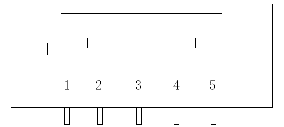
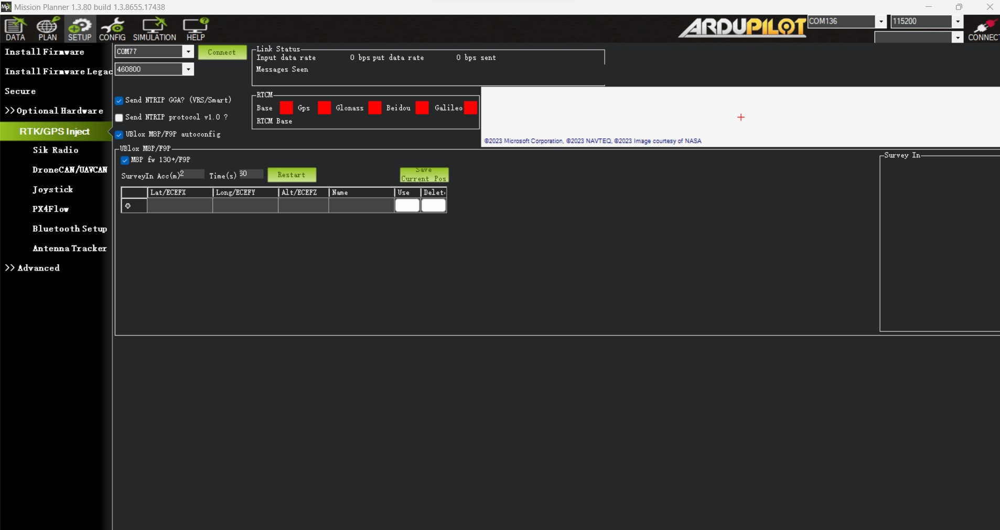
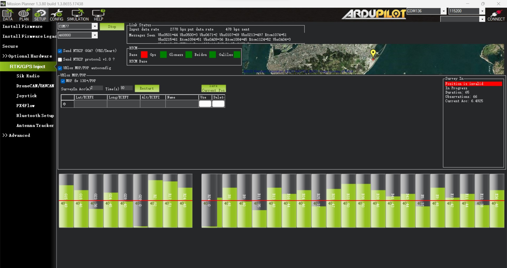
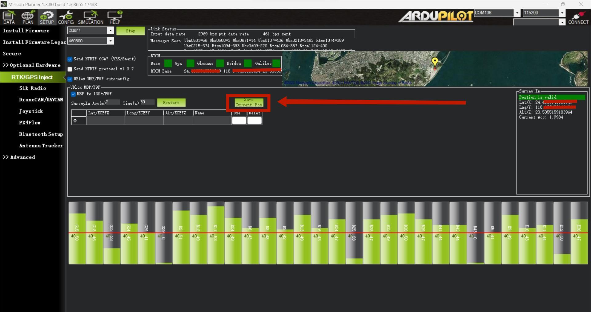
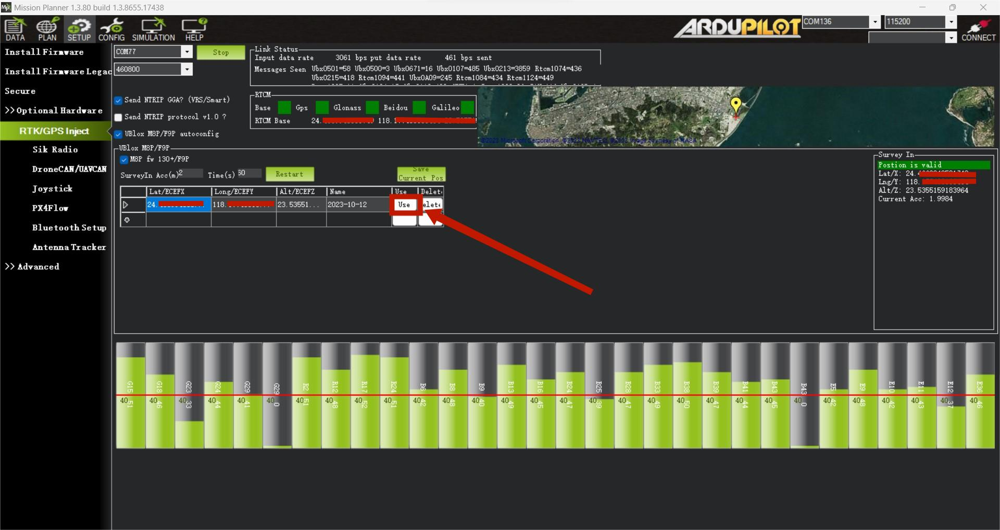
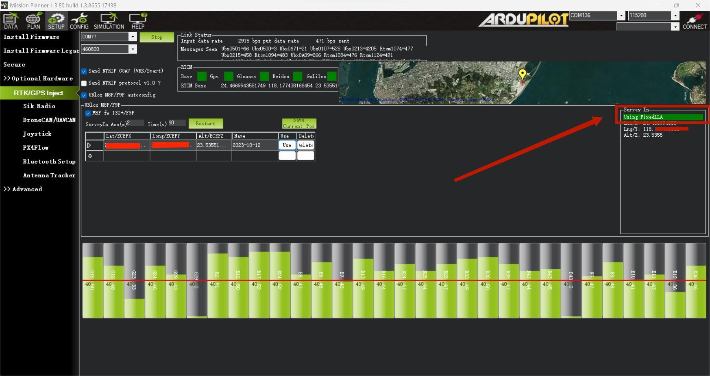

# Here 4 Base

<figure><figcaption></figcaption></figure>

## Overview

The Here 4 Base, a product of CubePilot, compatibile with both Ardupilot and PX4 systems. It also seamlessly interfaces with ground control stations, including Mission Planner and QGroundControl.

Employing RTK (Real-Time Kinematic) technology offers more precise position estimation compared to standard GNSS systems. Its potential for centimeter-level accuracy greatly enhances flight precision.

Furthermore, the Here 4 Base is designed for user-friendliness. Setting it up to work with Mission Planner is a straightforward process, requiring minimal configuration. For data communication between rover and base modules, a pair of telemetry modules is required (please note that these modules are not included in the standard package).

### Pinout

<figure><figcaption></figcaption></figure>

| Pin | Definition |
| :-: | :--------: |
|  1  |   VCC\_5V  |
|  2  |   usb-dp   |
|  3  |   usb-dn   |
|  4  |     GND    |
|  5  |     GND    |

### U-blox Firmware Update

To upgrade the base station module, connect it to your computer's USB interface using a USB cable.

#### Upgrading Process

To initiate the U-center software, click on the connection button (refer to red frame indicated below). Then, choose the COM port that corresponds to your base module. Please remember not to have this port connected to any other software, as it will occupy the port and render it unavailable for use.

<figure><figcaption></figcaption></figure>

<figure><figcaption></figcaption></figure>

**Click Tools>Firmware upgrade.**

<figure><figcaption></figcaption></figure>

<figure><figcaption></figcaption></figure>

\*\*Download firmware from U-blox official website. \*\*

([https://www.u-blox.com/en/product/neo-f9p-module?legacy=Current#Documentation-&-resources](https://www.u-blox.com/en/product/neo-f9p-module?legacy=Current#Documentation-&-resources))

**Please made sure baud rate is 230400**.

<figure><figcaption></figcaption></figure>

Wait for programing.

<figure><figcaption></figcaption></figure>

Done

**(If the upload process is successful, you will see the upgrade interface displayed in green. However, if the upgrade fails, the interface will appear in red. If the process gets interrupted or becomes unresponsive for an extended period, you will need to power cycle the modules and then attempt the uploading process again.)**

## Operation instruction

### 1. Base/Rover Survey by Mission Planner

> This part of the tutorial uses Mission Planner ground software and Arducopter-4.3.5 flight firmware for operating instructions.

To use Here 4 Base on a UXV, you need the following hardware： Computer, telemetry modules, Here4 Base , Base Antenna, Tripod.

<figure><figcaption></figcaption></figure>

**Before starting to use, please make sure that the hardware connection is correct:**

**Ground side:** Connect base antenna to base station, then connect the base station module to computer through USB port; Telemetry module is connected to another USB port of the same computer. **UXV side**: Connect Here 4 Base to CAN interface , telemetry module to the TELEM interface on flight control.

<figure><figcaption></figcaption></figure>

#### **Antenna Placing**

**Placing the RTK Antenna is very important for getting precise RTK positioning**

Normal GPS positioning, only requires you to place the device near a window and it will provide you a GPS location over a period of time. But that's not enough for RTK. For the working environment of RTK, there are special requirements on antenna placement, which are much stricter than GPS.

The best environment for the base and rover antenna is a clear view of the sky that is 30 degrees above the horizon. RTK antenna can be elevated but ensure that there are no obstacles around, such as buildings, trees, cars, and etc

**Example of a bad environment:** indoors, urban areas, forests, or near the ground.

**Example of a good environment:** Open spaces, peak of a mountain, roof of a building.

Do not place the antenna near electronic devices, as high power electronic devices in close proximity may affect the radio frequency noise of the GPS signal. Examples are mobile phone base stations, high voltage transformers, etc.

Please place the base station in an outdoor environment with sufficient sky coverage to obtain a good satellite signal.

Place the base station on a stable and elevated platform, such as a tripod.

<figure><figcaption></figcaption></figure>

#### **Base Module Setting using Mission Planner**

Start with a base module setup first. During the base station setup, the rover and the UXV do not need to be turned on.

Open the Mission Planner ground station software on your computer and go to the "initial setup → Optional Hardware → RTK/GPS Inject". You will see the following page:

<figure><figcaption></figcaption></figure>

Select the correct base module com port in the top left corner and click connect. In the SurveyIn Acc section, enter the absolute geographic accuracy that you expect your Here 4 Base station to achieve. In the Time column, enter the minimum survey time you expect. Click on Restart, the ground station will transfer the data you have entered to the Here 4 base module, the base module will start a new round of surveying. You will see the following page:

<figure><figcaption></figcaption></figure>

During the survey process, the right box will show the current survey status:

**The Position is invalid:** The base station has not yet reached a valid location;

**In Progress:** The survey is still in progress；

**Duration:** The number of seconds that the current surveying task has been executed;

**Observation:** the number of observations acquired;

**Current Acc:** Absolute geographic accuracy that the current base station can achieve;

**The Green bar** at the lower part of the Mission Planner page shows the current satellites being detected and the signal strength related to each satellite. At least eight or more satellite signals need to be guaranteed to exceed the red line ( Only when the satellite signal exceeds the red line is the effective number of satellites).

The base station needs a certain amount of time to meet the accuracy requirements of your input. Testing shows that in an open area without shelter, to achieve the absolute accuracy of 2m takes a few minutes; to reach the absolute accuracy of less than 30cm takes around an hour; to reach the accuracy of 10cm takes a few hours.

It should be noted that the absolute geographic accuracy of the base station here will affect the absolute geographic accuracy of the rover module without affecting the relative accuracy between the base station and rover. If your application does not require UXV with high absolute geographic accuracy, you do not need to set the base station's precision too high, which resulting in long survey time.

Even if the accuracy of the base station is 1.5 to 2 m, the position accuracy of the rover module relative to the base station can still reach the centimeter level.

After the survey is complete, the Mission Planner will display the following page:

<figure><figcaption></figcaption></figure>

In the RTCM box it shows that the base status indicator is green and both the GPS and Glonass satellite systems are green (if you want to change the satellite system, refer to the following section). The box on the right says "Position is valid".

<figure><figcaption></figcaption></figure>

To store the current location in the Mission Planner: Click "Save Current Pos", enter a name in the dialogue box, and click "OK". As shown below, you can see your saved location in the list. Click the "Use" button for the location you saved. The base station will enter the fixed mode and the status will show "Using FixedLLA". In the future, if you set the base station in the same location, you do not need to conduct the survey again, just click the "Use" button that corresponds to the location you have saved.

<figure><figcaption></figcaption></figure>

### **Rover Module and Flight Controller Setup**

After the base station is set up, you can turn on the UXV. Using the same telemetry module to connect Mission Planner, the base station data will be transmitted through the telemetry module to the Here 4 rover module on the UXV. In the Mission Planner main page, you can see the current GPS status displayed as RTK Float / RTK Fixed / 3D RTK, indicating that the positioning of the UXV has entered the RTK mode. RTK Float is a floating-point solution; RTK Fixed is a fixed solution. RTK Fixed mode has higher accuracy and requires better signal strength. 3D RTK is unified saying of RTK Float / RTK in the Mission Planner version.

<figure><figcaption></figcaption></figure>

### **2. Single Base to Multiple Rovers**

There are 2 methods to do this:

1.  Use 1 telemetry to multiple telemetry broadcasting ;

    or

    Use multiple 1 to 1 telemetry modules with USB hub

Ground station configuration: connect all telemetry modules to the computer via USB hub. Open Mission Planner to locate the base then connect it with flight controllers. Select AUTO connecting as shown below. All recognized flight controllers on the ports will be connected. You may select the UXV form the dropdown list below:

<figure><figcaption></figcaption></figure>

If you connected the UXVs with 1 telemetry module, they should share the same COM port:

<figure><figcaption></figcaption></figure>

2023/09/28
