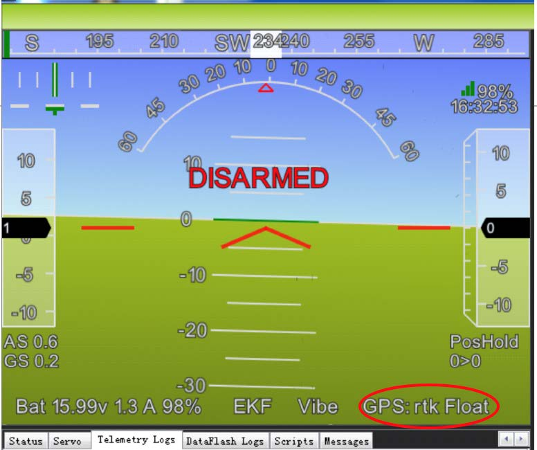

# Here 4 Manual

## Here 4 **High Precision Dual-band RTK Navigation**

## Overview

Here 4 is a professional High Precision Dual-band RTK Navigation module. It supports multiple GNSS options such as BeiDou, Galileo, GLONASS, GPS, QZSS.

The Here 4 utilizes advanced algorithms and multi-frequency DGNSS signals to quickly achieve an RTK Fix within seconds. This results in highly reliable positioning at an accuracy within centimeters.

The Here 4 goes beyond being a simple GNSS module. It combines flight control and navigation functionalities into a single device. With 8 PWM or BDSHOT outputs, an RCIN, Hotshoe, and camera trigger, it offers a self-contained solution for accurate mapping and precise control capabilities.

## Features

1. Equipped with u-blox F9P, a professional high precision Dual-band RTK navigation module.
2. Powerful processing performance provided by a built-in STM32H7 chip. It offers real-time processing and data optimization, and Unmanned Industry standard AP\_Periph Firmware.
3. The tailor-made Dual-band antenna from Taoglas supports L1and L5 frequencies. It features high gain, high sensitivity, and high stability.
4. Here 4 provides built-in Drone-ID feature.\
   \***Blue version supports Drone-ID**
5. Here 4 uses multi-frequency DGNSS signals with advanced algorithms. This allows fast convergence to an RTK Fix, achieving more reliable and stable centimeter level positioning.
6. The Here 4 module is 16 x 68mm and 60g.
7. LED embedded with ProfiLEDs. Built-in multiple display modes for notification or navigation signals. Display modes can be selected according to specific scenarios via parameters or onboard Lua Scripting.
8. CAN FD, real time, and high transmission rate.
9. Built-in IMU. Through future firmware updates, Here 4 can achieve tightly coupled DGNSS-INS-fusing solutions.

## Specifications

| Features                    |                                                                                                                            |
| --------------------------- | -------------------------------------------------------------------------------------------------------------------------- |
| GNSS module                 | NEO-F9P                                                                                                                    |
| Processor                   | STM32H757                                                                                                                  |
| IMU sensor                  | ICM42688+RM3100                                                                                                            |
| Barometer                   | MS5611                                                                                                                     |
| Communication Protocol      | DroneCAN 8Mbit/s                                                                                                           |
| Receiver type               | Dual-band GNSS high precision receiver                                                                                     |
| GNSS systems                | GPS, GLONASS, Galileo and BeiDou + SBAS and QZSS                                                                           |
| Satellite bands             | B1I, B2a, E1B/C, E5a, L1C/A, L1OF, L5                                                                                      |
| Maximum GNSS systems        | 4                                                                                                                          |
| Navigation update rate（RTK） | up to 20 Hz                                                                                                                |
| Positioning accuracy        | 0.01 m + 1 ppm CEP                                                                                                         |
| Maximum speed               | 500 m/s                                                                                                                    |
| Convergence time（RTK）       | < 10 sec                                                                                                                   |
| Acquisition                 | 
Cold starts 25s Aided start 2s Hot start 2s
                                                                   |
| Sensitivity                 | 
Tracking &#x26; Navigation: –167 dBm Cold starts: –148 dBm Hot starts: –157 dBm

Reacquisition: –160 dBm
 |
| Antenna                     | Dual band antenna                                                                                                          |
| Protocols                   | NMEA、UBX binary、RTCM 3.3、SPARTN 2.0.1                                                                                      |
| Anti-spoofing               | Advanced anti-spoofing algorithms                                                                                          |

## Pinout

<figure><figcaption></figcaption></figure>

<table><thead><tr><th width="245"></th><th></th></tr></thead><tbody><tr><td>CAN</td><td>x2（Current firmware only supports CAN1-green、blue、white、grey）</td></tr><tr><td>Working Temperature</td><td>-40 °C to +85 °C</td></tr><tr><td>Size</td><td>16 x 68 mm</td></tr><tr><td>Weight</td><td>60g (with cable)</td></tr></tbody></table>

**Here 4 can enable flight controller function by connect to a Breakout board.**

**(Current firmware does not support this function)**

<figure><figcaption></figcaption></figure>

### **Power**

| PIN | Name |
| --- | ---- |
| 1   | 5V   |
| 2   | 5V   |
| 3   | NC   |
| 4   | NC   |
| 5   | GND  |
| 6   | GND  |

### **CPPM / S.BUS / SERVO SYSTEM**

| PIN | Name    |
| --- | ------- |
| 1   | RC\_IN  |
| 2   | PWM 8   |
| 3   | PWM 7   |
| 4   | PWM 6   |
| 5   | PWM 5   |
| 6   | PWM 4   |
| 7   | PWM 3   |
| 8   | PWM 2   |
| 9   | PWM 1   |
| 10  | PPS     |
| 11  | HOTSHOE |

### **11 Pin in**

| PIN | Name    |
| --- | ------- |
| 1   | PWM 8   |
| 2   | PWM 7   |
| 3   | PWM 6   |
| 4   | PWM 5   |
| 5   | PWM 4   |
| 6   | PWM 3   |
| 7   | PWM 2   |
| 8   | PWM 1   |
| 9   | RC\_IN  |
| 10  | HOTSHOE |
| 11  | PPS     |

### **10 Pin in**

| PIN | Name     |
| --- | -------- |
| 1   | 5V       |
| 2   | CAN1\_H  |
| 3   | CAN1\_L  |
| 4   | CAN2\_H  |
| 5   | CAN2\_L  |
| 6   | GPS\_TX  |
| 7   | GPS\_RX  |
| 8   | I2C\_SCL |
| 9   | I2C\_SDA |
| 10  | GND      |

### **CAN**

| PIN | Name   |
| --- | ------ |
| 1   | 5V     |
| 2   | CAN\_H |
| 3   | CAN\_L |
| 4   | GND    |

### **Uart**

| PIN | Name     |
| --- | -------- |
| 1   | 5V       |
| 2   | GPS\_TX  |
| 3   | GPS\_RX  |
| 4   | I2C\_SCL |
| 5   | I2C\_SDA |
| 6   | GND      |


Please note that above Uart Pinout is for Here4 as a GPS Unit, and the pinouts are marked as they would connect to the Flight Controller.

When using Here4 as Flight Controller itself the notation will change, GPS\_TX will be UART\_RX and GPS\_RX will be UART\_TX. Ensure that you make necessary changes. Most likely you will need to cross RX and TX wires when connecting peripherals to Here4 as a Flight Controller.


## User Manual

## 1. For use with Ardupilot:

Connect the 4pin CAN cable from Here 4 to CAN1 or CAN2 on flight control.

**（Note: Current firmware only supports CAN1-green、blue、white、grey）**

Power the flight control and connect it to Mission Planner.

Go to **Config - Full Parameter** List page and modify the following parameters:

**CAN\_D1\_PROTOCOL: 1**

**CAN\_D2\_PROTOCOL: 1**

**CAN\_P1\_DRIVER: 1**

**CAN\_P2\_DRIVER: 1**

**GPS\_TYPE: 9**

**NTF\_LED\_TYPES: 231**

Once completed, click **Write Params**.

CAN function should be enabled after rebooting the autopilot.

### **Compass Setting**

**There is no safety switch. Safety switch can be disabled by modifying BRD\_SAFETYENABLE to 0. Another option is to connect to an external safety switch to GPS1 port.**

When using Cube orange+, compasses are ordered on the bottom. External CAN compass is selected by default.

<figure><figcaption></figcaption></figure>

Select the compasses by using the default setting (generally default setting is fine) and click "Start" to calibrate compasses.

<figure><figcaption></figcaption></figure>

## 2. Using with PX4:

By the time of this writing, PX4 v1.13 is being used. \
\***Please make sure that you are using the most recent stable release of PX4 firmware.**

Install PX4 firmware. Connect the 4pin CAN cable to CAN1 or CAN2 port

Connect to autopilot through GCS. Modify the parameter _**UAVCAN\_ENABLE**_ to _**Sensors Automatic**_ Config and reboot the autopilot.

<figure><figcaption></figcaption></figure>

## 3. Firmware update

Update procedures are shown as the following when there are any future firmware updates.

Mission Planner must be updated to the following or later version to have the new feature available:

<figure><figcaption></figcaption></figure>

Connect the 4pin CAN cable from CAN port on Here 4 to CAN1 on the autopilot.

Connect the autopilot to Mission Planner and go to the UAVCAN screen. Click SLCan Mode CAN1 to load CAN GPS status.

<figure><figcaption></figcaption></figure>

Click Menu > Update to check if there are any firmware updates for Here 4

<figure><figcaption></figcaption></figure>

Click the Update button. A window will pop up and ask if you want to search the internet for updates. Click _**Yes**_.

<figure><figcaption></figcaption></figure>

Wait for the firmware update to complete. Confirm the change in _**SW**_ Version. If the update was successful, reboot the Here 4.

## 4.Cube\_ID setting

For the set up procedure, please check\
[https://docs.cubepilot.org/user-guides/cube-id/cube-id](https://docs.cubepilot.org/user-guides/cube-id/cube-id).

## 5.RTK Use Operation

### 1. Base/Rover Survey by Mission Planner

This part of the tutorial uses Mission Planner ground software and Arducopter-4.3.5 flight firmware for operating instructions. RTK mode requires a base station. The following tutorial Uses "Here+" base stations as an example. Users can also use other u-blox M8P/F9P base stations (such as HerePro, etc.), or use the local wireless RTK correction service.

**Prepare Before use：**

To use Here 4 on a UXV, you need the following hardware： Computer, telemetry modules, Here 4 , Here+Base Antenna, Here+Base, Tripod(Stand).

<figure><figcaption></figcaption></figure>

**Before use, please make sure that the hardware connection is correct:**

**Ground side:** Connect the base antenna to the base station, then connect the base station module to the computer through the USB port; The Telemetry module should be connected to another USB port of the same computer.&#x20;

**UXV side:** Connect Here 4 to CAN interface, and telemetry module to the TELEM interface on flight control.

<figure><figcaption></figcaption></figure>

#### **Antenna Placing**

**Placing the RTK Antenna is very important for getting precise RTK positioning**

Normal GPS positioning, only requires you to place the device near a window and it will provide you a GPS location over a period of time. But that's not enough for RTK. For the working environment of RTK, there are special requirements on antenna placement, which are much more stricter than GPS.

The best environment for the base and rover antenna is a clear view of the sky that is 30 degrees above the horizon. RTK antenna can be elevated but ensure that there are no obstacles around, such as buildings, trees, cars, and etc

**Examples of bad environments:** indoors, urban areas, forests, or near the ground.

**Examples of good environments:** Open spaces, peak of a mountain, roof of a building.

Do not place the antenna near electronic devices, as high power electronic devices in close proximity may affect the radio frequency noise of the GPS signal. Examples are mobile phone base stations, high voltage transformers, etc.

Please place the base station in an outdoor environment with sufficient sky coverage to obtain a good satellite signal.

Place the base station on a stable and elevated platform, such as a tripod.

<figure><figcaption></figcaption></figure>

**Base Module Setting using Mission Planner**

Start with a base module setup first. During the base station setup, the rover and the UXV do not need to be turned on.

Open the Mission Planner ground station software on your computer and go to the "initial setup → Optional Hardware → RTK/GPS Inject". You will see the following page:

<figure><figcaption></figcaption></figure>

Select the correct base module com port in the top left corner and click ‘connect’. In the SurveyIn Acc section, enter the absolute geographic accuracy that you expect your Here+ base station to achieve. In the Time column, enter the minimum survey time you expect. Click on Restart, the ground station will transfer the data you have entered to the base module, the base module will start a new round of surveying. You will see the following page:

<figure><figcaption></figcaption></figure>

During the survey process, the right box will show the current survey status:

**The Position is invalid:** The base station has not yet reached a valid location;

**In Progress:** The survey is still in progress;

**Duration:** The number of seconds that the current surveying task has been executed;

**Observation:** the number of observations acquired;

**Current Acc:** Absolute geographic accuracy that the current base station can achieve;

**The Green bar** at the lower part of the Mission Planner page shows the current satellites being detected and the signal strength related to each satellite. At least eight or more satellite signals need to be guaranteed to exceed the red line (Only when the satellite signal exceeds the red line,  the effective number of satellites have been connected).

The base station needs a certain amount of time to meet the accuracy requirements of your input. Testing shows that in an open area without sky coverage, the base station will achieve the absolute accuracy of 2m within a few minutes; to reach the absolute accuracy of less than 30cm takes about an hour; to reach the absolute accuracy of 10cm takes a few hours.

It should be noted that the absolute geographic accuracy of the base station here will affect the absolute geographic accuracy of the rover module without affecting the relative accuracy between the base station and rover. If your application does not require UXV with high absolute geographic accuracy, you do not need to set the base station's precision too high, which helps to avoid a longer survey time.

Even if the accuracy of the base station is 1.5 to 2 m, the position accuracy of the rover module relative to the base station can still reach the centimeter level.

After the survey is complete, the Mission Planner will display the following page:

<figure><figcaption></figcaption></figure>

In the RTCM box it shows that the base status indicator is green and both GPS and Glonass satellite systems are green (if you want to change the satellite system, refer to the following section). The box on the right says "Position is valid".

To store the current location in Mission Planner: Click "Save Current Pos", enter a name in the dialogue box, and click "OK". As shown below, you can see your saved location in the list. Click the "Use" button for the location you saved. The base station will enter the fixed mode and the status will show "Using FixedLLA". In the future, if you set the base station in the same location, you do not need to conduct the survey again, just click the "Use" button that corresponds to the location you have saved.

<figure><figcaption></figcaption></figure>

**Rover Module and Flight Controller Setup**

Once the base station is established, you can activate the UXV. By utilizing the same telemetry module to connect with Mission Planner, the base station data will be transmitted through the telemetry module to the Here4 rover module on the UXV. On the main page of Mission Planner, you will be able to observe the current GPS status, which will be indicated as either RTK Float, RTK Fixed, or 3D RTK. These indications signify that the UXV's positioning has entered the RTK mode. RTK Float represents a floating-point solution, while RTK Fixed represents a fixed solution. RTK Fixed mode offers higher accuracy but requires a stronger signal strength. The term "3D RTK" is a comprehensive reference to both RTK Float and RTK Fixed in the Mission Planner interface.

<figure><figcaption></figcaption></figure>

### **2. Single Base to Multiple Rovers**

There are 2 methods to do this:

1.)Use 1 telemetry to multiple telemetry broadcasting ;

or

2.)Use multiple 1 to 1 telemetry modules with USB hub

Ground station configuration: connect all telemetry modules to the computer via USB hub. Open Mission Planner to locate the base then connect it with flight controllers. Select AUTO connecting as shown below. All recognized flight controllers on the ports will be connected. You may select the UXV from the dropdown list below:

<figure><figcaption></figcaption></figure>

If you connected the UXVs with 1 telemetry module, they should share the same COM port:

## 6. U-Center Firmware Update


Please do not update your Here4 Ublox firmware if you purchased your unit after 7th December 2023 before consulting your reseller. The firmware on new Here4s has special firmware which adds support for Moving Baseline, firmware from ublox website do not support that feature. Updating the firmware may drop Moving Baseline support from your units.



Ensure that you have the latest firmware on Here4 before this process. Please follow [#3.-firmware-update](here-4-manual.md#3.-firmware-update "mention") to update the firmware.


Latest NEO F9P L1L5 firmware can be found here under Firmware Update section. [https://www.u-blox.com/en/product/neo-f9p-module?legacy=Current#Documentation-&-resources](https://www.u-blox.com/en/product/neo-f9p-module?legacy=Current#Documentation-&-resources)&#x20;

1. Inside DroneCAN/UAVCAN config page of Mission Planner. Select Menu and Check


If the following option is not visible in Mission Planner, then update Mission Planner to latest Beta from Help menu.


<figure><figcaption></figcaption></figure>

2. Select port for u-Center to connect on.

<figure><figcaption></figcaption></figure>

3. Select baudrate to set for ublox communication.

<figure><figcaption></figcaption></figure>

4. Open u-center (Ensure that its version 22.07+). Under connections select Network connections > New.

<figure><figcaption></figcaption></figure>

5. Set url to tcp://127.0.0.1:500.

<figure><figcaption></figcaption></figure>

6. Select Tools>Firmware Update Utility. Select the downloaded firmware from ublox website in the tool. Ensure that baudrate is same as set in Mission Planner. And Options are correctly selected as shown below. And then click GO.

<figure><figcaption></figcaption></figure>

## 7. Moving baseline

<figure><figcaption></figcaption></figure>


Please note that early Here4 units (Pre December 2023 Production Here4 Black and Alpha Here4 Blue Units) do not support Moving Baseline. If you have such units and require this feature you will need to contact your reseller. To check if your unit has Moving Baseline support please follow the steps below.


#### Steps to verify Ublox Firmware version

<figure><figcaption></figcaption></figure>

* Connect Here4 Units as shown above and ensure the firmware running on them is atleast v1.13.
* Connect CubeOrange to the Mission Planner and Open DroneCAN/UAVCAN window.
* Reboot the Here4 units, and wait for few seconds until the message as shown below appears.
* The firmware supporting Moving Baseline has firmware hash: u-blox 1 HW: 00190000 SW: EXT CORE 1.00 **(49f616)**

<figure><figcaption></figcaption></figure>

Once all settings and versions are confirmed, set following parameters for Moving Baseline on Ardupilot:\

* [GPS\_TYPE](https://ardupilot.org/copter/docs/parameters.html#gps-type) = 22 (“DroneCAN moving baseline base”)
* [GPS\_TYPE2](https://ardupilot.org/copter/docs/parameters.html#gps-type2) = 23 (“DroneCAN moving baseline rover”)
* [GPS\_AUTO\_CONFIG](https://ardupilot.org/copter/docs/parameters.html#gps-auto-config) = 2 (AutoConfig DroneCAN)
* [GPS\_AUTO\_SWITCH](https://ardupilot.org/copter/docs/parameters.html#gps-auto-switch) = 1
* Set the [GPS\_POS1\_X](https://ardupilot.org/copter/docs/parameters.html#gps-pos1-x)/Y/Z and [GPS\_POS2\_X](https://ardupilot.org/copter/docs/parameters.html#gps-pos2-x)/Y/Z parameters for the GPS antennas (see [Sensor Position Offset are here](https://ardupilot.org/copter/docs/common-sensor-offset-compensation.html#common-sensor-offset-compensation)). You must establish the relative positions of each GPS location on the vehicle with respect the vehicle’s motion.
* [GPS1\_CAN\_OVRIDE](https://ardupilot.org/copter/docs/parameters.html#gps1-can-ovride) (Base NODEID) and [GPS2\_CAN\_OVRIDE](https://ardupilot.org/copter/docs/parameters.html#gps2-can-ovride) (Rover NODEID) determine which physical DroneCAN GPS is used for GPS1 and GPS2. These are automatically populated at boot from the detected addresses, which are also shown in [GPS\_CAN\_NODEID1](https://ardupilot.org/copter/docs/parameters.html#gps-can-nodeid1) and [GPS\_CAN\_NODEID2](https://ardupilot.org/copter/docs/parameters.html#gps-can-nodeid2), but can be overriden, if needed. You will need to determine which physical CAN GPS is assigned as GPS1 and GPS2 in order to setup the position offsets (see [Sensor Position Offset are here](https://ardupilot.org/copter/docs/common-sensor-offset-compensation.html#common-sensor-offset-compensation))
