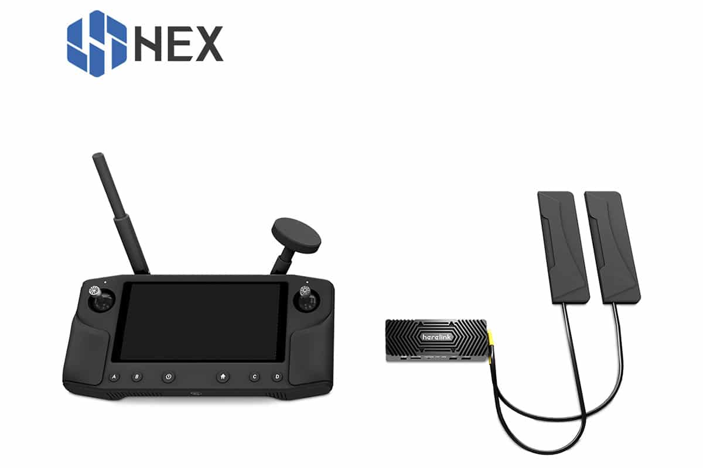
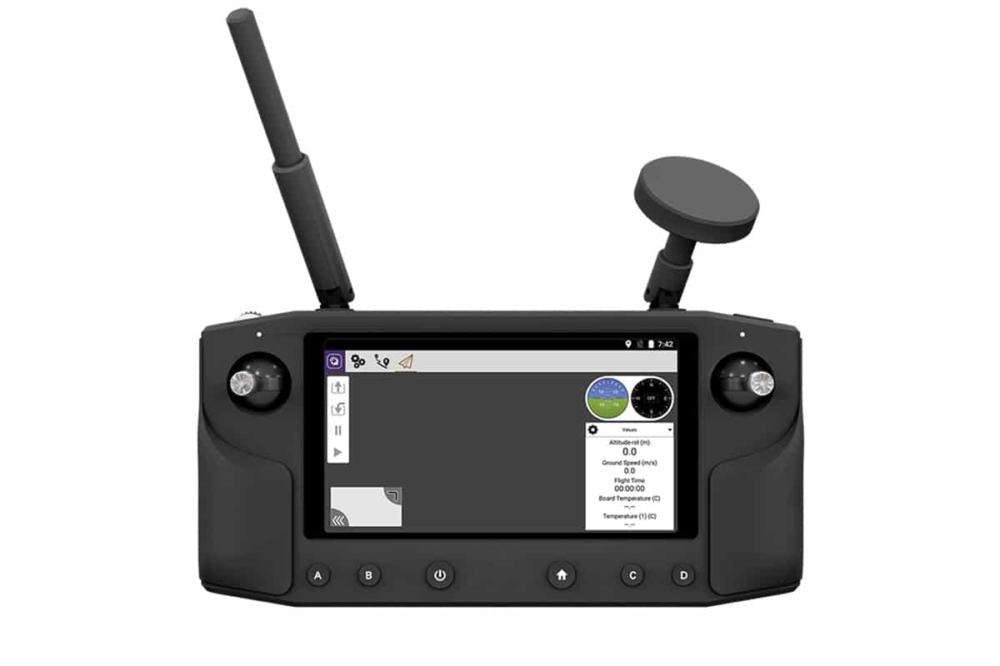
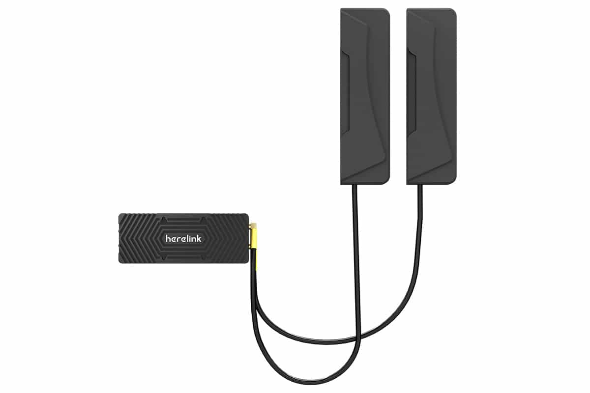

# Herelink HD Video Transmission System

## Overview

Herelink is a intigrated remote controler and wireless digital transmission system designed to be used with the Cube Autopilot, Ardupilot or PX4.  

Herelink allows RC contorl, HD video and mavlink telemetary data to be tranmitted upto 20km range. Both air unit and ground station included intigrated 8 core SOC for custom application developmeent.

## Features
* Android based smart device with 5.46 inch 1080P capacitive touch screen.
* ARM Cortex A53 4 core 2.2GHz + Cortex A53 4 core 1.4GHz SOC in both air and ground units. 
* Dual hall affect self centering gimbals with removalbe sticks. 
* Dual micro HDMI 1080P 60fps video inputs. 
* Dual S.bus signal output for simultaneous control of autopilot and pan/tilt cameras.
* Integrated digital transmission system simultaneously transmiting video,flight data and control. 
* Built-in Solex TX App and QGC ground station with mavlink support for Ardupilot and PX4 firmware.
* 6 customisable Mavlink buttons and Mavlink/Sbus hardware wheel. 
* RC gimbal control on dedicated service indipendant from APP. 

## Technical specifications

### Remote & Air Unit:

| Feature | Specifacation |
| :--- | :--- |
| SOC: | ARM Cortex A53 4 core 2.2GHz + Cortex A53 4 core 1.4GHz |
| Image Processing: | Mali-T860 GPU |
| SDR:| A7 + DSP |
| Memory: | Air Unit: LPDDR3: 1GB, Ground Station: LPDDR3: 2GB, EMMC: Air / Ground 4GB |
| Transmission Distance: |  FCC 20km CE / SRRC 12km Image transmission delay: ≤ 110ms Image transmission: 720p@30fps 1080p@30 / 60fps transmission,signal bandwidth 20MHz / 10MHz |
| Frequency Band: | 2.4GHz ISM Receive sensitivity: -99dBm@20MHz BW Interference recovery: < 1s |

### Controller:

| Feature | Specifacation |
| :--- | :--- |
| Size: | 217 × 106.5 × 31mm not including external antenna and rocker |
| Screen: |  5.46 inch 1080P, 16 million colors, capacitive touch screen |
| Frequency Band: | 2.4GHz ISM Receive sensitivity: -99dBm@20MHz BW Interference recovery: < 1s |
| Size: | 78.5x30x13mm |
| Audio: | Built-in speaker × 1, built-in microphone × 2 |
| Remote control: | rocker × 2, scroll wheel × 1, bottom button × 6, with backlight, top button × 1 (right) |
| Wireless: |  Blutooth / WIFI / GPS / 2.4G map transmission ground |
| Inputs: | MicroUSB × 1, Micro SD × 1 (supports maximum 64G expansion) |
| Antenna: | Curcular (5dBi) × 1 detachable, omnidirectional (2dBi) × 1 detachable,built-in wifi antenna, built-in GPS antenna, external GPS antenna interface x 1 |
| Power : | Built-in 4950 mAh Lipo Battery |
| Charging : | Support micro USB port 5v 2A current charging |
| Power consumption: | The average power consumption does not exceed 4W (only picture transmission work, medium screen brightness, WiFi off, GPS off) |

### Air Unit:

| Feature | Specifacation |
| :--- | :--- |
| Size: | 78.5x30x13mm |
| Video Input: | Micro HDMI x 2: Input for external camera video signals |
| Power Input:  | 2 Pin interface x 1:5V-12V power input interface,average power consumption of the single-sided module is less than 4W |
| Telemetary: | 3 Pin interface x 1:3.3V / 5V level UART interface Mavlink Compatible |
| Control Output: |4 Pin interface x 1 : Two 3.3V level RC output connectors (S.bus in phase, S.bus inverting or PPM signal output, ground terminal control) |
| USB: | Micro USB x 1: for debugging upgrades, support OTG mode |
| Antenna: |  MMCX antenna jack x 2: used for signal transmission and ground communication |

## Technical Confomity

