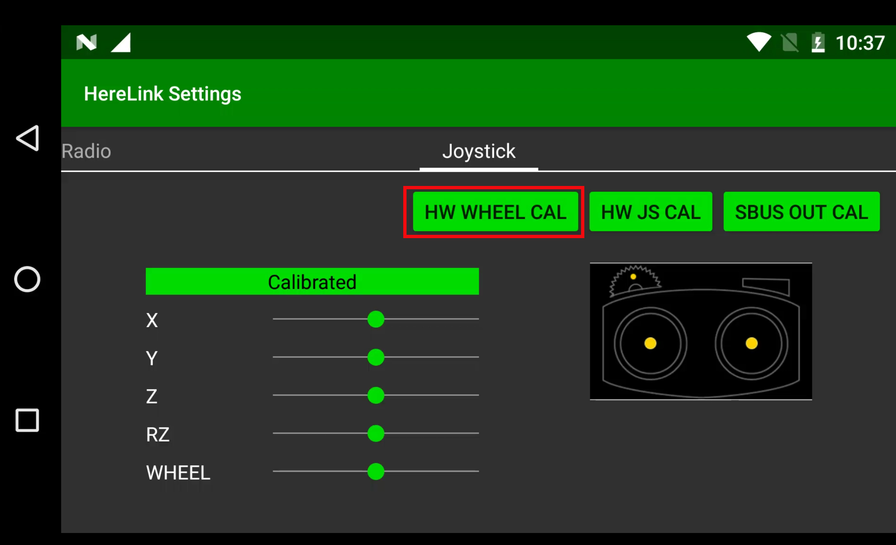

# One Time Setup

## Joystick Hardware Calibration

In case you did an update using `flash_all` script, or are observing issues with Joystick Control even after calibrating using Joystick Calibration Menu and RC Calibration from Ground Station App, please follow the following tutorial.

* From App Launcher slide down the notification drawer from the top and select Herelink Setting

* Click 'Start rollwheel'  and follow the calibration steps
* **Note** once complete you can check its correct functioning by looking at the values change, click Pass to return to joystick screen

# Herelink HD Video Transmission System

## Features
* Android based device with 5.46 inch, 1080P capacitive touch screen.
* Dual Hall Affect self centering gimbals. 
* Dual Micro HDMI 1080P 60fps video input. 
* Dual S.bus signal output for simultaneous control of autopilot and pan/tilt cameras.
* The integrated digital transmission system can simultaneously transmit video,flight data and control. 
* Built-in Solex TX App and QGC ground station with mavlink support for Ardupilot and PX4 firmware.
* Programable buttons and scroll wheel via Mavlink. 
* RC gimbal control on indipendant service seperate from APP. 
* Custom channel button and PWM value assignment.

## Technical specifications

### Air Unit:

| :--- | :--- |
|Processor: SoC – | Cortex A53, 2.2GHz + Cortex A53, 1.4GHz GPU: 4 core, Mali-T860 SDR: A7 + DSP Storage: Sky: LPDDR3: 1GB Ground: LPDDR3: 2GB Sky / Ground: EMMC: 4GB |
| Transmission Distance: |  FCC 20km CE / SRRC 12km Image transmission delay: ≤ 110ms Image transmission: 720p@30fps 1080p@30 / 60fps transmission,signal bandwidth: 20MHz / 10MHz |
| Frequency Band: | 2.4GHz ISM Receive sensitivity: -99dBm@20MHz BW Interference recovery: < 1s |
| Size: | 78.5x30x13mm |
| Video Input: | Micro HDMI x 2: Input for external camera video signals |
| Power Input:  | 2 Pin interface x 1:5V-12V power input interface,average power consumption of the single-sided module is less than 4W |
| Telemetary: | 3 Pin interface x 1:3.3V / 5V level UART interface Mavlink Compatible |
| Control Output: |4 Pin interface x 1 : Two 3.3V level RC output connectors (S.bus in phase, S.bus inverting or PPM signal output, ground terminal control) |
| USB: | Micro USB x 1: for debugging upgrades, support OTG mode |
| Antenna: |  MMCX antenna jack x 2: used for signal transmission and ground communication |

### Controller:

Housing: plastic

Dimensions: 217 × 106.5 × 31mm (the whole machine does not contain external antenna and rocker)

Screen: 5.46 inch, 1080P, 16 million colors, capacitive touch screen

Audio: Built-in speaker × 1, built-in microphone × 2
Remote control: rocker × 2, scroll wheel × 1, bottom button × 6, with backlight, top button × 1 (right)
Communication : BT / WIFI / GPS 2.4G map transmission ground
Indicator light: Top tri-color lamp × 2 (left, right)
Interface: MicroUSB×1, TFlash×1 (supports maximum 64G expansion)
Antenna: Orientation (5dBi) × 1 detachable, omnidirectional (2dBi) × 1 detachable
Built-in wifi antenna, built-in GPS antenna, external GPS antenna interface
Power : Built-in 4950 mAh Lipo Battery
Charging : Support micro USB port 5v 2A current charging
Power consumption: The average power consumption does not exceed 4W (only picture transmission work, medium screen brightness, WiFi off, GPS off)
