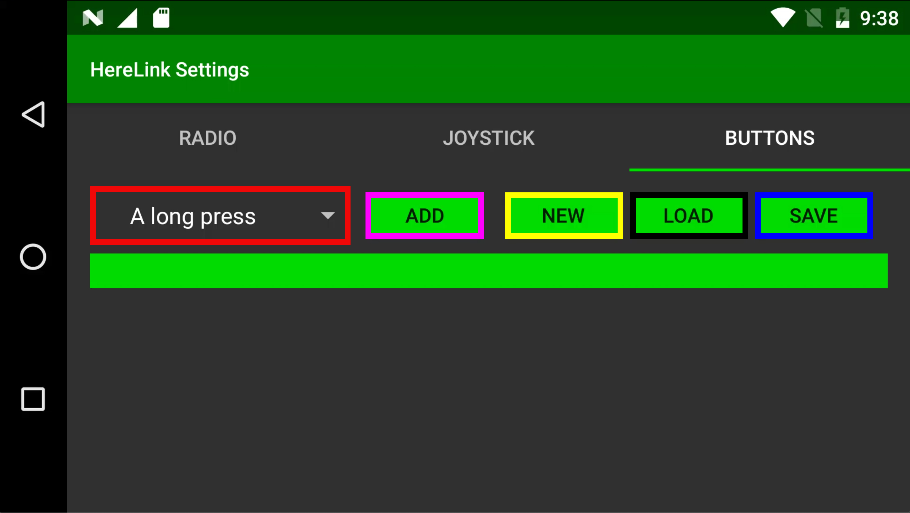

# Sbus Button Configuration

## Autopilot Mode Selection Important


Autopilot mode selection must not be programmed to sbus channels. Mode selection should be configured Mavlink commands within Solet TX or QGC, More info . [Mode Selection & Mavlink Buttons](configure-mavlinkbuttons.md)


## Sbus Outputs

The Herelink settings app allows you to program buttons A,B,C,D,Cam & HW Wheel to control  sbus outputs on the air unit, Herelink has dual independent sbus  outputs on bus 1 and bus 2. 
Buttons can be configured on channels 5 - 16 on bus 1 and channels 1-16 on bus 2.  

Channels 1-4 on Bus 1 are reserved for RC control.

Each button can be programmed in one of 3 modes with long press and short press actions in Toggle and Multi modes. 

## Button Action Modes Available: 

* Toggle  = Output latches between two pwm values with a short or long press option. 
* Momenty = Output changes to active value when pressed and held, returns to default when released. 
* Multi = Sends command for channel to go to preset pwm value. Multi buttons can be stacked on both short and long press as well as multiple buttons configurations to allow channel outputs to range in values.  

To select the mode either press T for Toggle, M for Momantry, when neither T or M  is selected the button is in Multi mode. 

## Profiles 

Herelink Sbus Buttons allows you to save multiple button profiles. This means you can set up Herelink to have multiple configurations for different applications.   

## Home Button 

The home button can only be configured with mavlink commands in Solex TX or QGC.  It is advised to set Homebutton Long Press to ‘RTL’ command as user safety backup. 

## Sbus Button Configuration

### Buttons Screen Overview

* Red = Button Selection Menu 
* Purple = Add Button 
* Yellow = New Profile 
* Black = Load Profile 
* Blue = Save Settings

### To Configure 

From App Launcher slide down the notification drawer from the top and select Herelink Setting. Slide left for Buttons screen. Here you will find the button configuration options for sbus. 

Click ‘NEW’ and type name for your new profile and press OK.

Select the first button you want to configure from the drop down menu then click ‘ADD’

Select Desired mode ie Toggle, Momenty or leave blank for Multi 

Note:  when setting up Multi mode buttons at least one must be selected as default, this sets the default output pwm on system boot. 

For Toggle & Momentary set default pwm and active pwm values, these values are selected by scrolling left and right on the number to select the desired value. 

Tip: To move to the top end of the range you can scroll backwards, also ‘Flicking’ the numbers will scroll faster though the range.  

If setting a Multi mode button  set desired active pwm output. 

Set sbus channel output and Bus output number. 

Once configured you must click SAVE to store settings. 

Next contine to add more buttons via the above process. 

Multi button config allows you to set short and long press options as well as other buttons to set stages outputs on a sbus channel,  below is an example of two buttons changing a channel to 4 different pwm values.  

