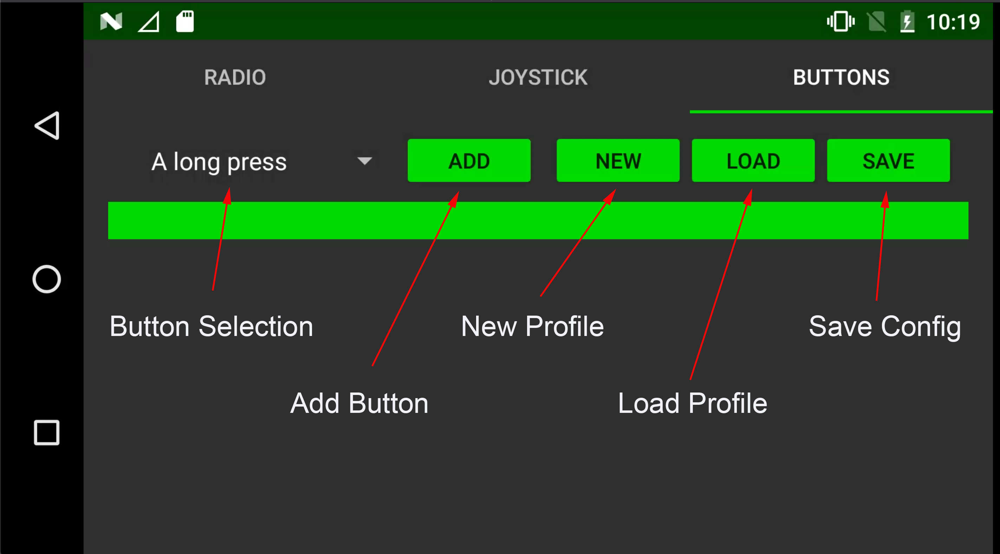
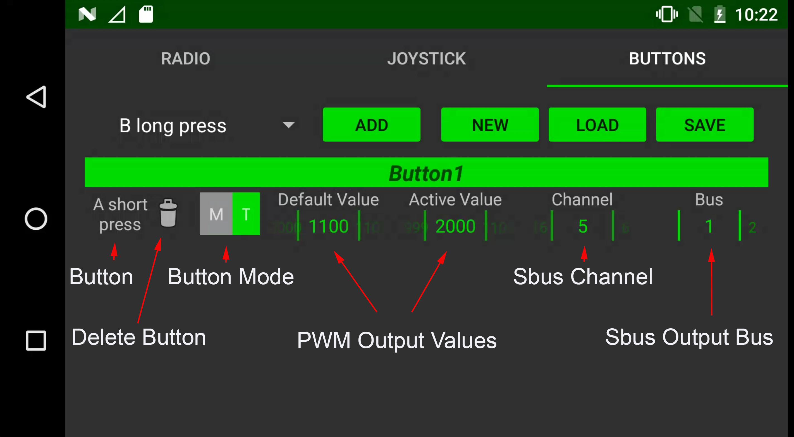
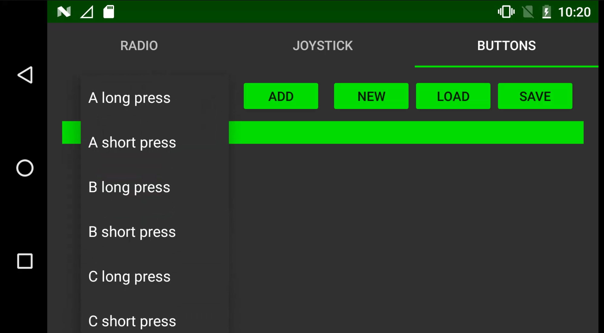
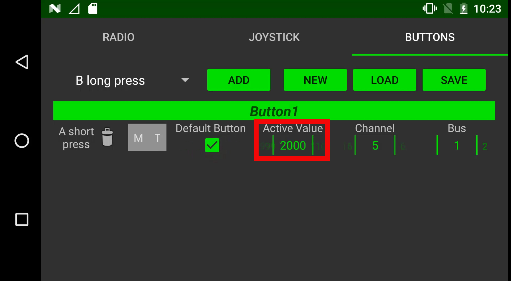

# Sbus Button Configuration

Herelink is fitted with six programmable buttons and one hardware wheel.  These can be configured to control sbus channel outputs from the air end’s dual sbus connector and to send Mavlink commands to the autopilot via Solex TX or QGC.


More info see . [Herelink Pairing, RC Calibration & Setup](one-time-setup.md)


## Autopilot Mode Selection - Important

Autopilot mode selection must not be programmed to sbus channels. Mode selection should be configured to Mavlink commands within Solet TX or QGC to ensure predictable behavior in the event of signal loss or system reboot. 


More info see . [Mode Selection & Mavlink Buttons](mavlink_buttons.md)


**Important Note:**
Ardupilot sets Sbus channel 5 to mode selection as default, this should be disabled with herelink by setting the pram FLTMODE_CH: to 0.

## Sbus Outputs

The Herelink settings app allows you to program buttons A,B,C,D,Cam & HW Wheel to control  sbus outputs on the air unit, Herelink has dual independent sbus outputs on bus 1 and bus 2. 
Buttons can be configured on channels 5 - 16 on bus 1 and channels 1-16 on bus 2.  

Channels 1-4 on Bus 1 are reserved for RC control.

Each button can be programmed in one of 3 modes with long press and short press actions in Toggle and Multi modes. 

### Button Modes Available 

* Toggle  = Output latches between two pwm values with a short or long press option. 
* Momenty = Output changes to active value when pressed and held, returns to default when released. 
* Multi = Sends command for channel to go to preset pwm value. Multi buttons can be stacked on both short and long press as well as multiple buttons configurations to allow channel outputs to range in values.  

To select the mode either press T for Toggle, M for Momantry, when neither T or M  is selected the button is in Multi mode. 

## Profiles 

Herelink Sbus Buttons allows you to save multiple button profiles. This means you can set up Herelink to have multiple configurations for different applications.   

## Sbus Button Configuration

### Buttons Screen Overview

## To Configure 

* From App Launcher slide down the notification drawer from the top and select Herelink Setting. Slide left for buttons screen. Here you will find the button configuration options for sbus. 

* Click ‘NEW’ and type name for your new profile and press OK.

* Select the first button you want to configure from the drop down menu then click ‘ADD’

* Select desired button mode by tapping the letter, ie: Toggle, Momenty or leave blank for Multi 

**Note: When setting up Multi mode buttons at least one must be selected as default, this sets the default output pwm on system boot.**

* For Toggle & Momentary set the default pwm and active pwm values, these values are selected by scrolling left and right on the number to select the desired output. 

**Tip: To move to the top end of the range you can scroll backwards, also ‘Flicking’ the numbers will scroll faster though the range.**  

* If setting a Multi mode button set desired active pwm output. 

* Set sbus channel output and bus. 

* Once configured you must click SAVE to store settings. 

* Next contine to add more buttons via the above process. 

* To remove a button config simply click the bin icon next to the name. 

### Multi Buttons 

Multi button config allows you to set short and long press options as well as other buttons to set stages outputs on a sbus channel,  below is an example of two buttons changing a channel to 4 different pwm values.  

When setting up Multi mode buttons at least one on each channel must be selected as default value, this sets the default output pwm the system will default to on power on. 

