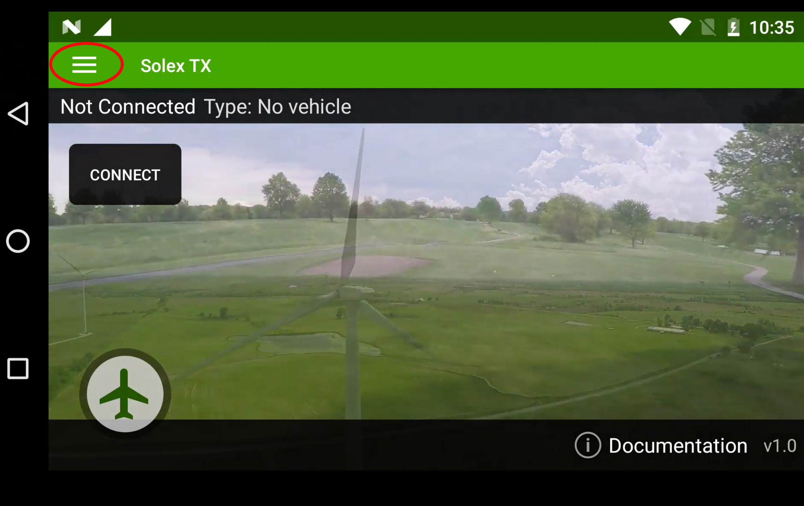
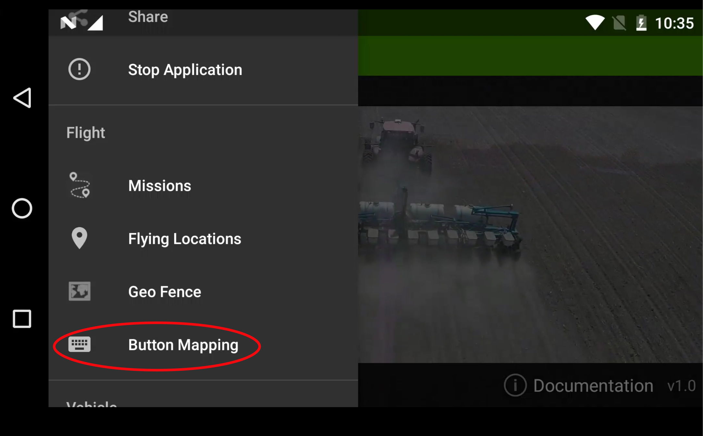
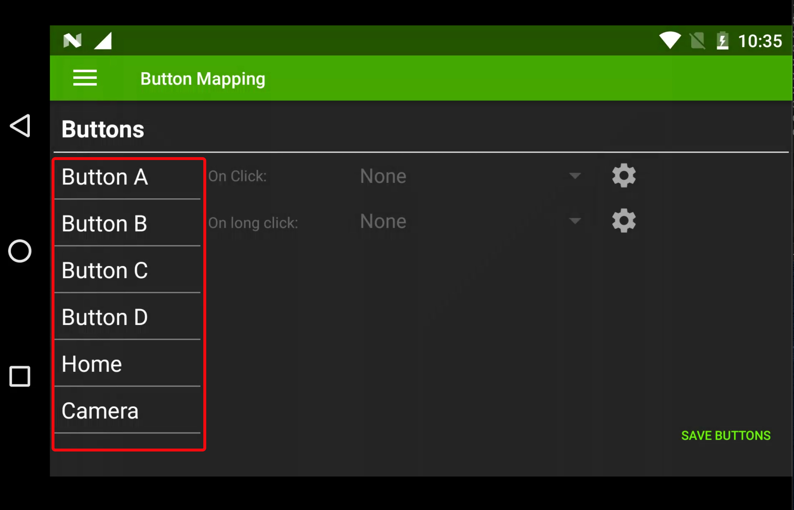
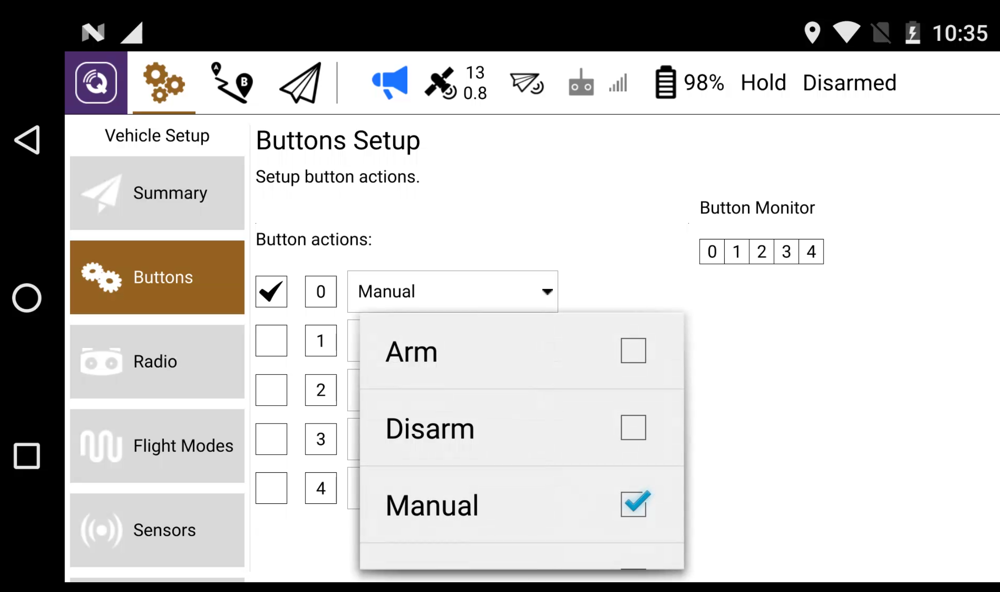
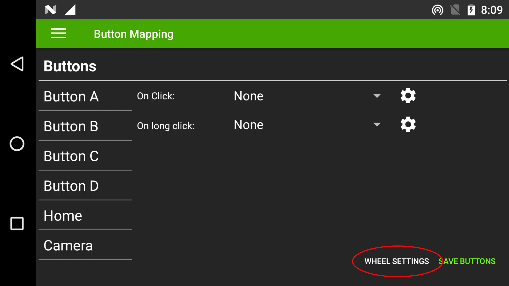
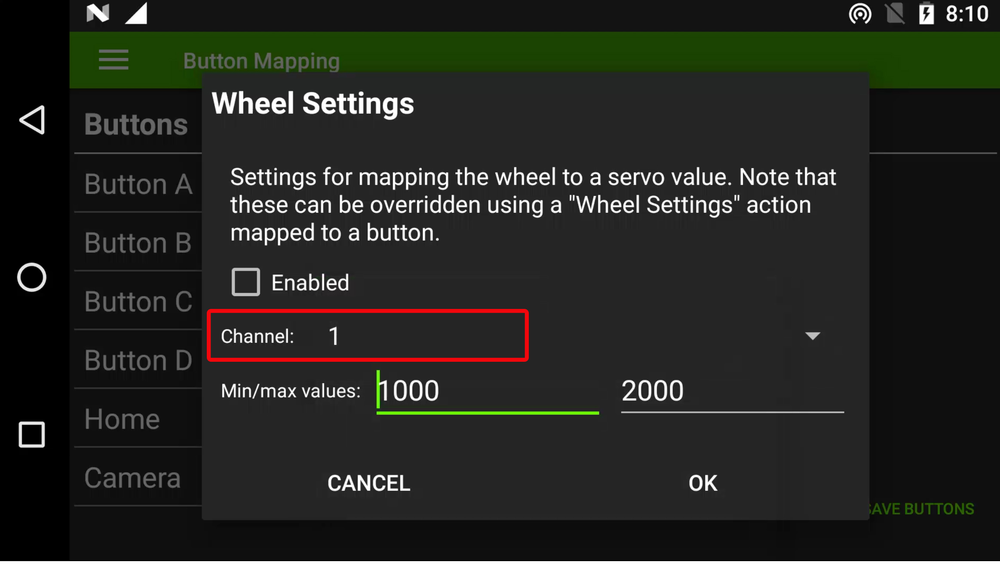

# Modes & Mavlink Buttons Configuration

Buttons A,B,C,D,Cam, Home & HW Wheel can be configured in Solex TX and QGC to Mavlink commands, these include

* Mode Selection 
* Arm/Disarm 
* Servo Output Control 
* Relay Control 
* HW Wheel Channel Mapping
* App Specific Commands

## Autopilot Mode Selection

Autopilot mode selection must only be programmed to Mavlink button commands within Solet TX or QGC.

## Button Configuration

### **To Configure in Solex TX**

* Open Solex TX App 
* Click 3 line in top left corner

* Select 'Button Mapping' 

* Choose desired button

* Select either 'Click' or 'Long Click' \(**Note** this allows you to set two functions to each button\) 

* Click on drop down to select the function you want

* Click on small cog to select option with-in selected function  

* Select function option

* Repeat for each button assignment and click 'Save Buttons' in bottom corner to finish

### **To Configure in QGC**

* Open QGC
* Click the 3 cogs in top left corner

* Select 'Buttons' 
* Tick the box next to the desired button
* Click on drop down to select function
* Repeat for each button 

## Hardware Wheel

The hardware wheel is mapped to SBUS channel 5 by default but can also be configured in Solex TX to Servo output channels 1-16 on the Cube Autopilot, you also have the ability to switch the servo output via a button in Solex TX.

### **To Configure Wheel in Solex TX**

* Open Solex TX App 
* Click 3 line in top left corner
* Select 'Button Mapping' as above
* Click 'Wheel Settings' in the bottom corner

* Select the desired servo channel from 1- to 16

* Select the PWM output range for your application

* Click the 'Enabled' box to activate the output

* Finish by clicking OK and click 'Save Buttons' in bottom corner
* To configure a button to change the wheel servo output configure the button to 'Wheel Settings' 

* Click the cog and set new channel and PWM values and click OK and then 'Save Buttons' in bottom corner.  

Once changed the wheel will output on the new selected channel, to return to its original servo output you will need to program one button function to 'Clear Wheel Settings' as shown above.

