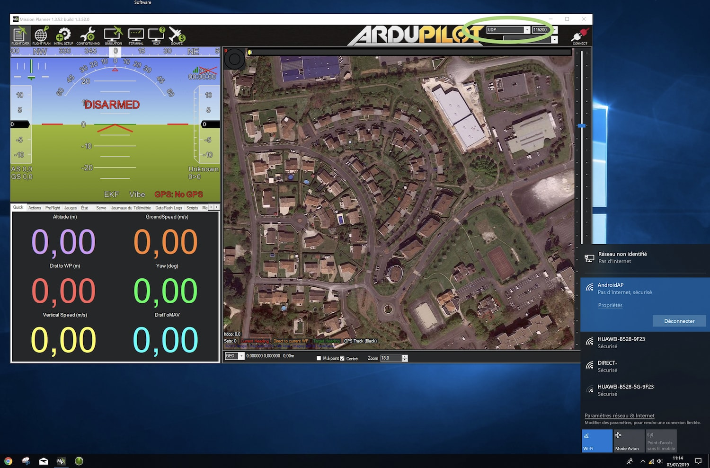
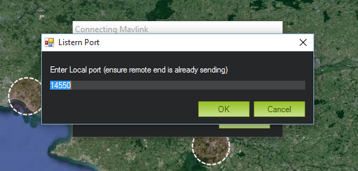

# Connecting to Mission Planner


For enabling video stream please refer [Share video Stream](share-video-stream.md)


# You are now connected to the Herelink HotSpot Wifi. 

* Open Mission planner 
* Set the port to 'UDP' \(top right\) 
* Click 'Connect' 
* A popup window will open. Leave it on default port '14550' and click OK

# You are now connected to the same wifi network as the Herelink is.

Mavlink
* Open Mission Planner
* Set the port to 'UDPCL' \(top right\)
* Click 'Connect'
* Enter the IP of the herelink controler [Find your IP](https://ccm.net/faq/33725-how-to-check-your-android-ip-address)
* Enter port '14552'

you will now have mavlink working into Mission Planner

Video - Requires Mission Planner 1.3.70 beta or above
* Start Solex or QGC to ensure your video is working (this is required to start the streaming process)
* Right click the HUD
* Navigate to Video > Herelink Video
* This process may download the files required to play the video, unless you have already done this
* Enter the same IP as you did in the mavlink step
