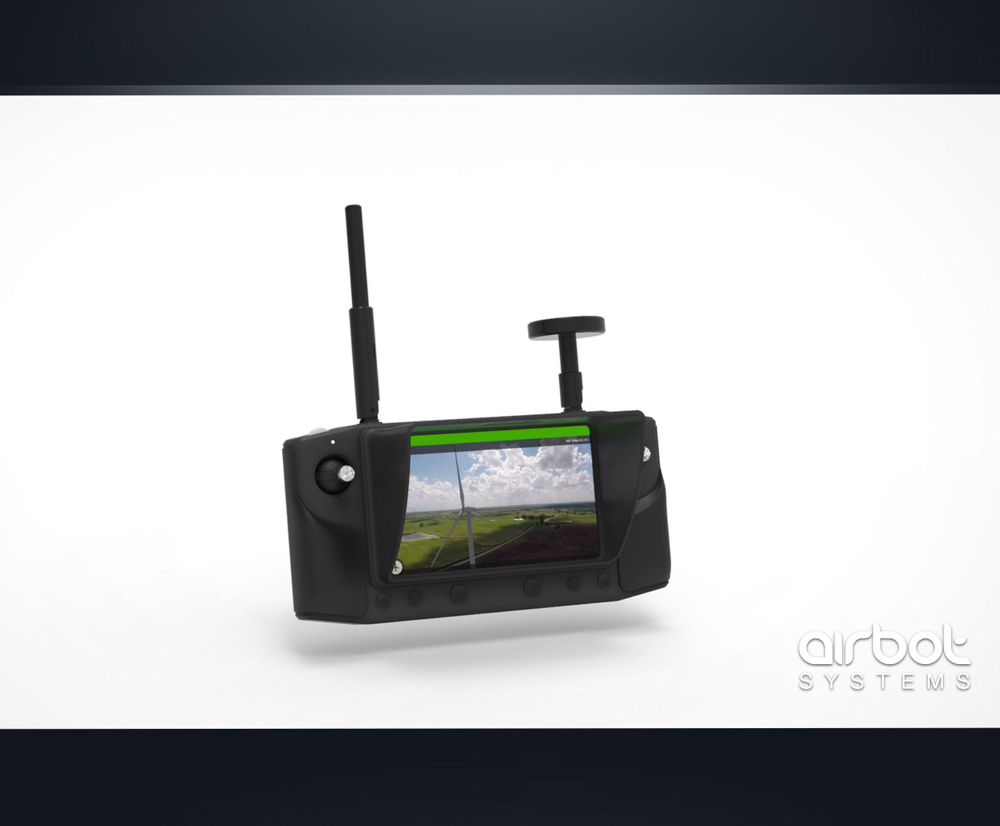

# Herelink Accessories

## Herelink Sunshades

Different sunshades designs are available and downloadable for free on [Airbot Systems](https://www.airbot-systems.com/free-downloads/) website. These files are STL and can be printed on any 3D printer.\
\
**Version 1  :** \
\- Basic sunshade short version\
\- Basic sunshade long version\
\
Version\_1 can be attached to the Herelink by using thin strips of double taped foam or thin strips of Velcro hooks (to make it removable)

**Version 2 :**\
\- Self tight sunshade short version\
\- Self tight sunshade long version\
\
This version is an improved one on which two brackets have been added. This make it quick and easy removable by using a 1/4 screw.
