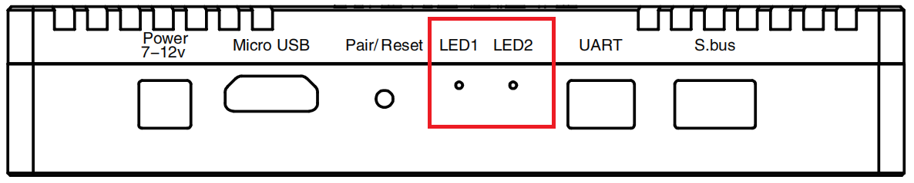

# Herelink Overview

Herelink is an integrated remote controller, ground station and wireless digital transmission system designed to be used with the Cube Autopilot, Ardupilot or PX4. Herelink allows RC control, HD video and telemetry data to be transmitted upto 20km between the ground station and air unit, the Herelink remote controller features custom Solex TX and QGC applications and both air unit and ground station feature an integrated 8 core SOC for custom application development.

Herelink 1.1 is based on the original platform and functions of Herelink 1.0. The controller improved the display brightness up to 1000 nit. Moreover, an additional Ethernet interface is available on airunit1.1 to support more peripheral devices and adapt to more applications, a SD card slot is available on the airunit 1.1.

Please use the most current version of flasher\_win to upgrade your HereLink1.1 controller and HereLink1.1 airunit firmware. ([https://docs.cubepilot.org/user-guides/herelink/herelink-user-guides/upgrading-firmware#download-firmware-upgrade-application](https://docs.cubepilot.org/user-guides/herelink/herelink-user-guides/upgrading-firmware#download-firmware-upgrade-application))

## HereLink / HereLink 1.1 Technical specifications

## **1. Airunit and Controller**

|         Processor         |                 SoC – Pinecone S1                |
| :-----------------------: | :----------------------------------------------: |
|          **SOC**          | 4 \*Cortex A53, 2.2GHz / 4 \* Cortex A53, 1.4GHz |
|          **GPU**          |                 4 Core, Mali-T860                |
|          **SDR**          |                     A7 + DSP                     |
|         **Menory**        |    Airunit LPDDR3 1GB \| Controller LPDDR3 2GB   |
|        **Storage**        |       Airunit EMMC: 4GB\|Controller EMMC：8G      |
| **Transmission Distance** |         FCC 20km \| CE / SRRC / MIC 12km         |
|      **Video Delay**      |                      110 ms                      |
|    **Image resolution**   |           720p@30fps \| 1080p@30/60fps           |
|     **Frequency Band**    |                    2.4GHz ISM                    |
|  **Receive sensitivity**  |                  -99dBm@20MHz BW                 |
|        **Recovery**       |                       < 1s                       |

## 2. Controller

|        Case Material       |                                                             Plastic                                                            |
| :------------------------: | :----------------------------------------------------------------------------------------------------------------------------: |
|         **Weight**         |                                 (herlink1.0) 516g（Including 2 antennas) \| Here Link 1.1: 536g                                 |
|          **Size**          |                                  217×106.5×31mm (not include external antennas and joy-sticks)                                 |
|         **Screen**         |                                   5.46 inch，1080P，16 million colors, capacitive touch screen                                   |
|    **Screen brightness**   |                                      **Herelink1.0** :600nit \| **Herelink 1.1** :1000nit                                      |
|          **Audio**         |                                          Built-in speaker × 1, built-in microphone × 2                                         |
|         **Remoter**        |    Hall affect gimbals with removable sticks x 2, scroll wheel × 1, bottom button × 6 with backlight, top button × 1 (right)   |
| **Wireless Communication** |                                      Bluetooth / WIFI / GPS / 2.4G map transmission ground                                     |
|     **Indicator light**    |                                          tricolour LED \*2 (Up right and left corner)                                          |
|        **Interface**       |                                       MicroUSB × 1, Micro SD × 1 (supports maximum 64GB)                                       |
|    **External Antenna**    |                     Directional antenna (5dBi) \*1 detachable ，omnidirectional antenna(2dBi) \*1 detachable                    |
|    **Build-in Antenna**    |                         built-in wifi antenna, built-in GPS antenna, external GPS antenna interface x 1                        |
|          **Power**         |                                                 Build-in 4950 mAh Lipo Battery                                                 |
|        **Charging**        |                                          Support micro USB port 5v 2A current charging                                         |
|    **Power Consumption**   | The average power consumption does not exceed 4W (only picture transmission work, medium screen brightness, WiFi off, GPS off) |

## **3. Airunit**

### **Airunit1.0**

|         Case Material        |                                         Aluminum Alloy                                         |
| :--------------------------: | :--------------------------------------------------------------------------------------------: |
| **Weight**(antenna included) |                                      **Herlink 1.0** ：95g                                      |
|           **Size**           |                                          78.5×30×15mm                                          |
|     **Signal Bandwidth**     |                                          20MHz / 10MHz                                         |
|     **Power Consumption**    |                        The average power consumption does not exceed 4W                        |
|       **Micro HDMI 1**       |                              Camera video signal input (Recommend)                             |
|       **Micro HDMI 2**       |                                    Camera video signal input                                   |
|        **Power Input**       |    Recommended supply voltage 7V: minimum 6V, maximum 12V and avoid sharing BEC with servos    |
|      **UART Interface**      |                                            3.3V UART                                           |
|      **S.bus Interface**     |                                  Dual RCout ，S.bus1 and S.bus2                                 |
|         **Micro USB**        | Used for debugging and upgrading, support OTG mode\*\*（need external power for USB device）\*\* |
|          **Buttom**          |                                Used for pairing and state reset                                |
|   **Indicator light 1 ，2**   |                    Used to indicate state for pairing and vedio transmission                   |
|   **MMCX antenna jack 1，2**  |                      Used for signal transmission and ground communication                     |

### **Airunit1.1**

|                   Case Material                  |                                           Aluminum Alloy                                          |
| :----------------------------------------------: | :-----------------------------------------------------------------------------------------------: |
|           **Weight**(antenna included)           |                                       **Herelink 1.1**: 98g                                       |
|                     **Size**                     |                                            78.5×30×15mm                                           |
|               **Signal Bandwidth**               |                                           20MHz / 10MHz                                           |
|               **Power Consumption**              |                          The average power consumption does not exceed 4W                         |
|                 **Micro HDMI 1**                 |                               Camera video signal input (Recommend)                               |
|                 **Micro HDMI 2**                 |                                     Camera video signal input                                     |
|                  **Power Input**                 |     Recommended supply voltage \~7V: minimum 6V, maximum 12V and avoid sharing BEC with servos    |
|                **UART Interface**                |                                             3.3V UART                                             |
|                **S.bus Interface**               |                                   Dual RCout ，S.bus1 and S.bus2                                   |
|                   **Micro USB**                  | Used for debugging and upgrading, support OTG mode\*\*（no need external power for USB device）\*\* |
|                    **Buttom**                    |                                  Used for pairing and state reset                                 |
|             **Indicator light 1 ，2**             |                     Used to indicate state for pairing and vedio transmission                     |
|             **MMCX antenna jack 1，2**            |                       Used for signal transmission and ground communication                       |
|    **SD Slot（only supported by Airunit 1.1）**    |                                          For future usage                                         |
| **ETH Interface（only supported by Airunit 1.1）** |                                   Network protocol device access                                  |

## 4.Airunit Interface Specification

#### (Airunit1.0 & Airunit 1.1)

**Power：**

| Pin # | Name  | Description                                |
| ----- | ----- | ------------------------------------------ |
| 1     | Power | Power IN，7V - 12.6V max（3s Lipo supported） |
| 2     | GND   | Ground pin                                 |

**UART：**

| Pin # | Name | Description               |
| ----- | ---- | ------------------------- |
| 1     | RXD  | RX of air module，3.3V TTL |
| 2     | TXD  | TX of air module，3.3V TTL |
| 3     | GND  | Ground pin                |

**S.bus ：**

| Pin # | Name        | Description           |
| ----- | ----------- | --------------------- |
| 1     | S.bus out 1 | RX for control signal |
| 2     | GND         | Ground pin            |
| 3     | S.bus out 2 | RX for Gimbal signal  |
| 4     | GND         | Ground pin            |

**ETH（only supported by Herelink 1.1）：**

| Pin # | Name | Description |
| ----- | ---- | ----------- |
| 1     | TX+  | AUTO MDIX   |
| 2     | TX-  | AUTO MDIX   |
| 3     | GND  | Ground pin  |
| 4     | RX+  | AUTO MDIX   |
| 5     | RX-  | AUTO MDIX   |

## Accessories

1. HereLink Airunit \*1
2. HereLink Controller \*1
3. Omnidirectional antenna \*1
4. Directional antenna \*1
5. Airunit antenna \*2
6. Joy-stick \*2
7. HDMI cable \*1
8. Power cable \*1
9. Telemetry cable \*1
10. S.bus cable \*1
11. USB cable \*1
12. Back board \*1
13. M1.6x16mm（Fan screw）\*5
14. M1.6（Fan Nut）\*5
15. Washer（Fan washer）\*5
16. O-ring（Fan O-ring）\*20
17. M1.6x3mm（Airunit case screw）\*5
18. M3x10mm（Back board mounting screw）\*3
19. M3 Nut（Back board mounting nut）\*3
20. Fan\*1（available in Herelink1.1）

## AirUnit LEDs

**LED1：**

Solid Green Light : Receiving HDMI 1 Signal

Solid Red Light : Receiving HDMI 2 Signal

Solid Yellow Light : Receiving flight control data signal

Geen and Red light flickered alternately : Receive 2 vedio stream signal

Geen Yellow, and Red light flickered alternately : Receive 2 vedio stream signal and flight control signal

No Light : Receiving no valid video signal or flight controller signal

**LED2：**

Geen light flickered : Pairing

Solid green light : Receiving valid control signal and power is normal

Solid Yellow light : Unpaired/no valid signal received

Red light flickered : Unstable power

No Light : Airunit is not powered

**Pair / Reset Button：**

Controller pairing and Enter upgrade mode

## Button and LEDs

**Button：**

|  Upper Left Wheel  | Control gimbal (configurable)         |
| :----------------: | ------------------------------------- |
| Upper Right Button | Take photo (configurable)             |
| Upper Right Button | Configurable                          |
|      Button B      | Configurable                          |
|    Power Button    | Power on/off and unlock screen        |
|     Home Button    | Return to Land options (configurable) |
|      Button C      | Configurable                          |
|      Button D      | Configurable                          |

**Leds（Left）：**

|   Flashing Red   | Critical battery power   |
| :--------------: | ------------------------ |
|   **Solid Red**  | Low battery power        |
| **Solid Yellow** | Medium battery power     |
|  **Solid Green** | Sufficient battery power |

