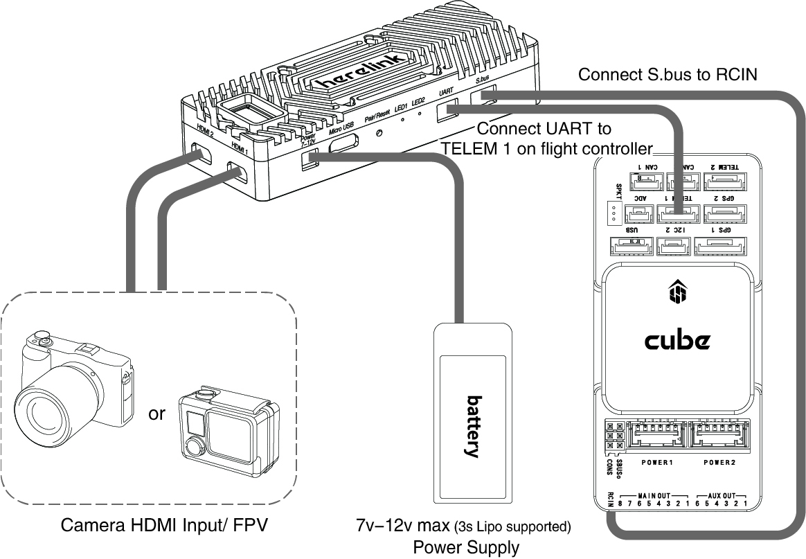
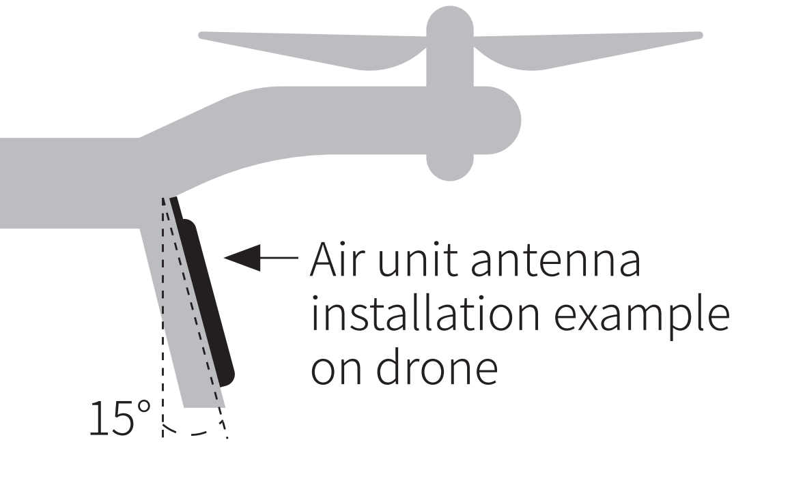
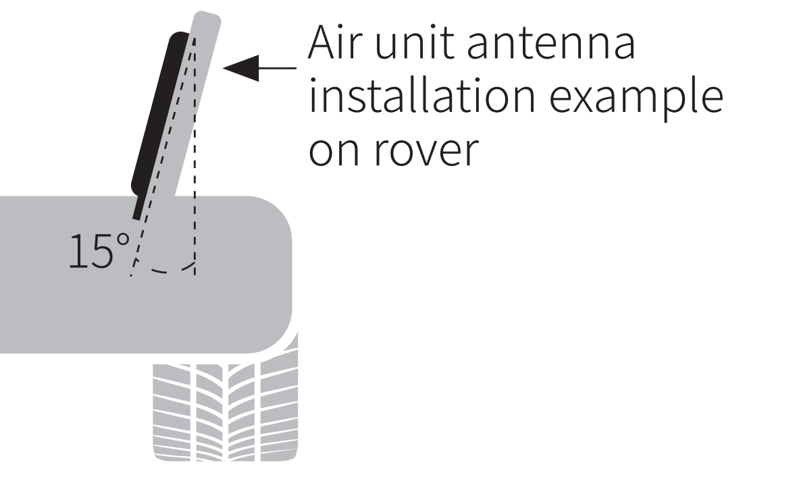
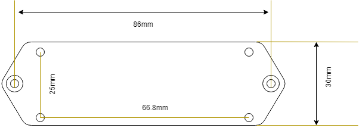
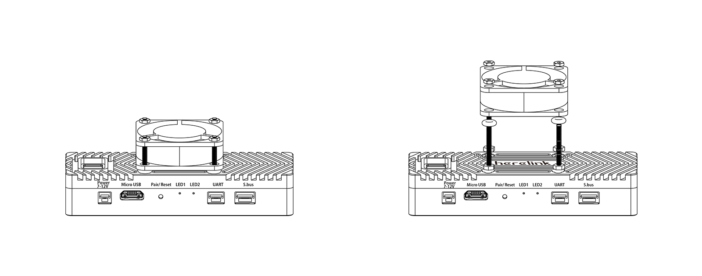

# Assembly and Connection

## 1.Install Controller Antenna

**1.** To assemble the antenna, plug the omni-directional antenna into the top left hole of the controller.

**2.** Align the antenna pointer and mounting hole with the pointer and mounting hole of the controller.

**3.** Then slightly press and rotate clockwise lock.

> Note: The rotation angle of both antenna is a fixed angle of 90 degrees. Do not forcibly rotate the antenna Angle.

### 2.Airunit connection

**1.** Mount the Rover Unit securely to the drone.(Choose best install position according to cable length)

**2.** Choose the best position to attach the rover unit antennas. Airunit antenna should no attached to metal parts or any conductor，which will affect the signal transmit distance. The antenna should be installed vertically and keep an Angle of about 15 degrees to obtain better gain.

Please refer to Figure 1 and Figure 2 below. (Note that carbon fiber is also conductive material.)

**3.** Connect **S.bus** on Airunit to the **RCIN** on the Flight Controller.

**4.** Connect **UART** on the Airunit to the **TELEM 1** or TELEM 2 on the Flight Controller.

**5.** Connect 5V - 12.6V max (3s Lipo supported) battery to the power input on the Rover Unit.

**6.** Connect camera to HDMI 1 (preferred) on the Airunit. If you are using two video stream,please connect the second camera to HDMI 2. You may switch from Stream 1 and Stream 2 on controller to display the corresponding video stream.

## 3.Airunit back board assembly

**1.** Use M16x3mm screw to mount Airunit on back board.

**2.** Ues M3x10mm screw and M3 nut to mount Airunit to Rover.

## 4.Airunit cooling fan installation procedure

**1.** Take out the fan from airunit package and use M1.6\*16mm screw, M1.6 nut and washer.

**2.** Snap M1.6\*16mm screw in 4 mounting hole on top of the airunit ,and install washers and o-rings,finally tighten the nut according to diagram above.

**3.** Connect the positive and negative terminals of the fan to the 5-12 V power supply.

