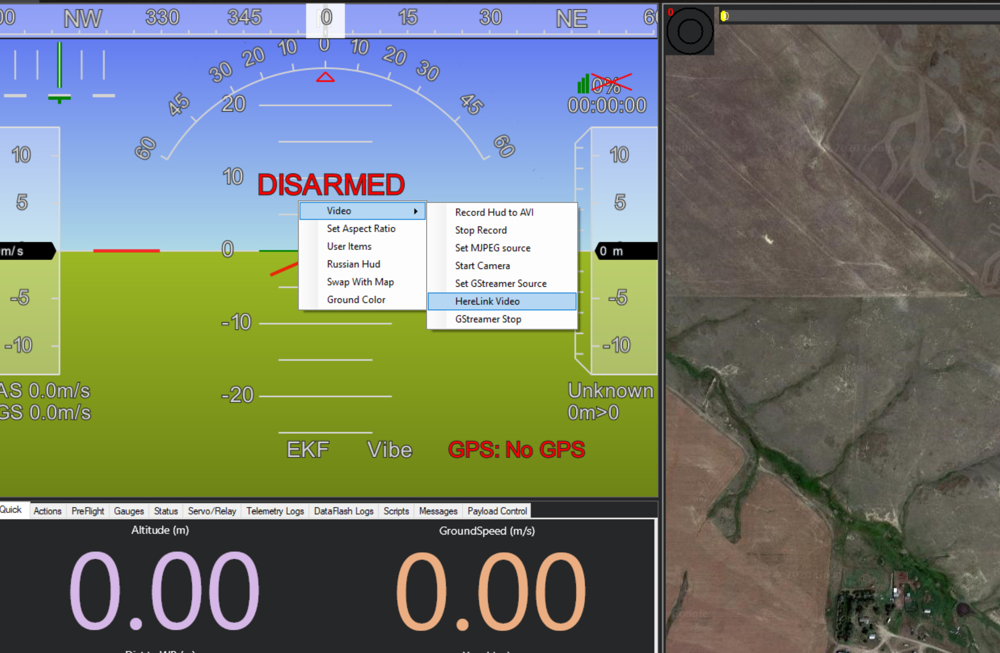
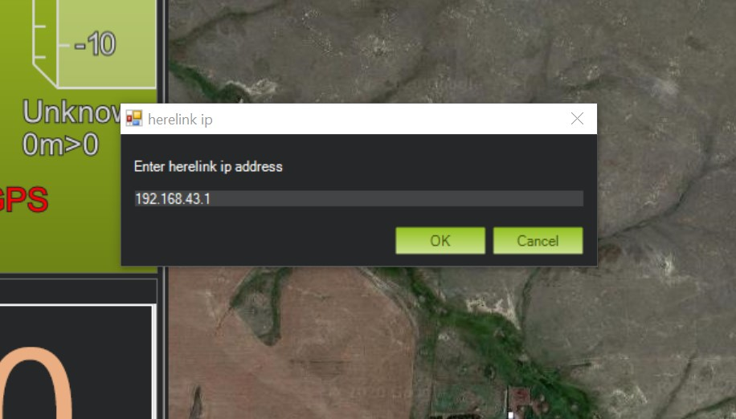

# Connecting to Mission Planner

## Connecting to Mission Planner


For enabling video stream in Herelink settings please refer [Share video Stream](share-video-stream.md)


## You are now connected to the Herelink HotSpot Wifi.

### **Mavlink**

* Open Mission Planner
* Set the port to 'UDP' \(top right\)
* Click 'Connect'
* Enter port '14550'

## You are now connected to the same wifi network as the Herelink is.

Mavlink

* Open Mission Planner
* Set the port to 'UDPCL' \(top right\)
* Click 'Connect'
* Enter the IP of the Herelink controller [Find your IP](https://ccm.net/faq/33725-how-to-check-your-android-ip-address)
* Enter port '14552'

You will now have Mavlink working into Mission Planner

\*This configuration applies when we connect using USB TETHER or any other interface that is not WIFI. The Mavlink traffic being Broadcast from the WIFI Access Point by default, when connecting with USB or Ethernet, it is necessary to specify IP address of HereLink station so it can access the UDP port 14552.

### To view live Herelink video in Mission Planner

**Note: Video requires Mission Planner 1.3.70 beta or above**

* Start Solex or QGC to ensure your video is working \(this is required to start the streaming process\)
* Right click the HUD
* Select 'Video' 
* Select 'Herelink Video'
* The first time you do this Mission Planner may need to download the files required to play the video. Your device will require and internet connection to be able to do this, you may need to disconnect from the Herelink hotspot to perform this step
* A popup window will open, enter the same IP as you did in the mavlink step and click OK

