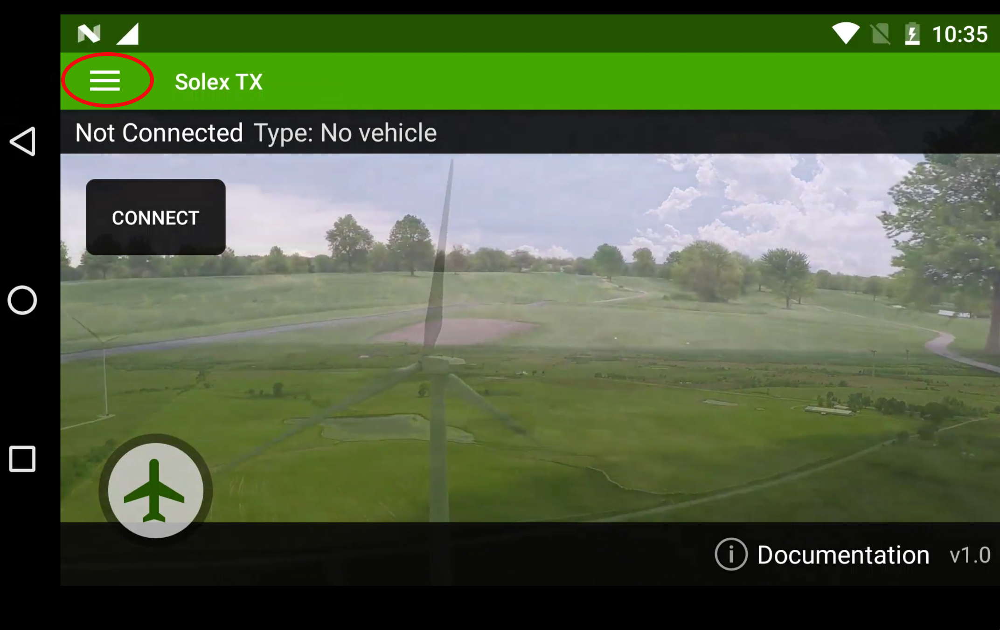
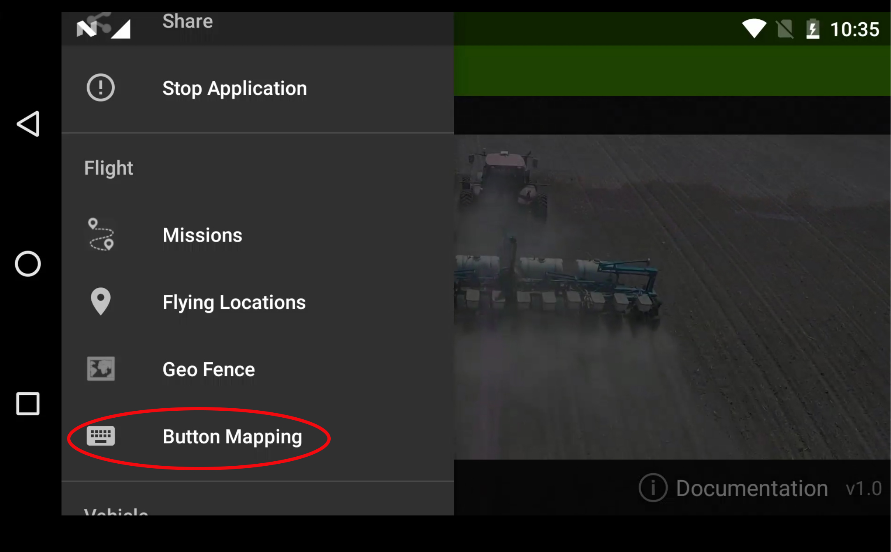
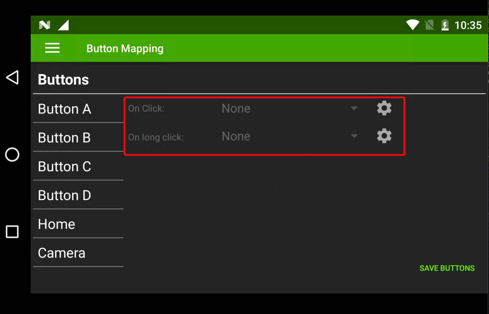
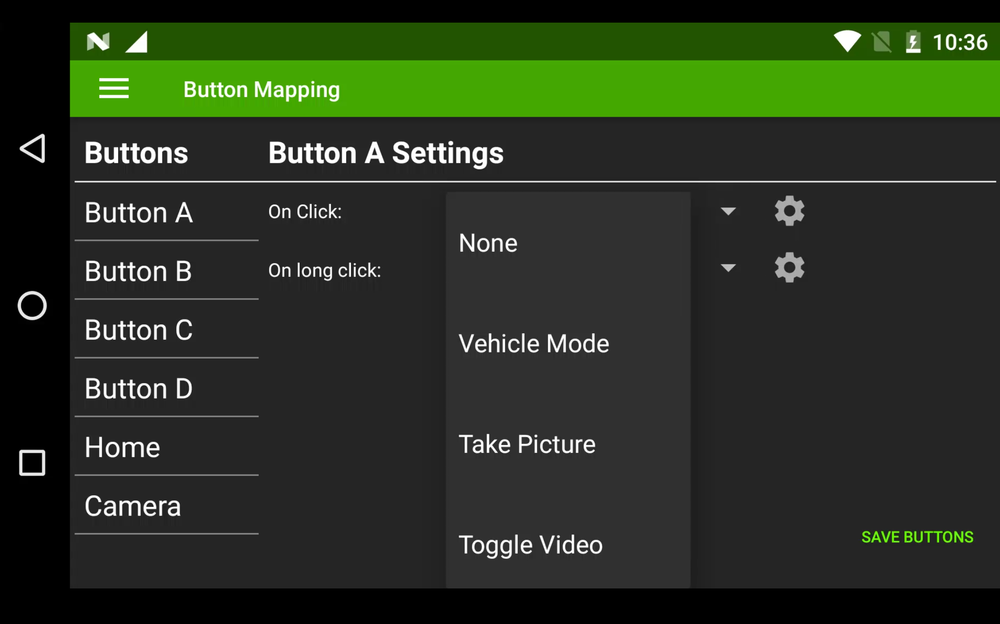
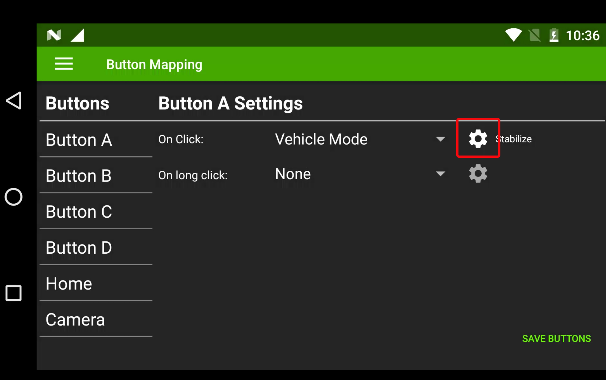
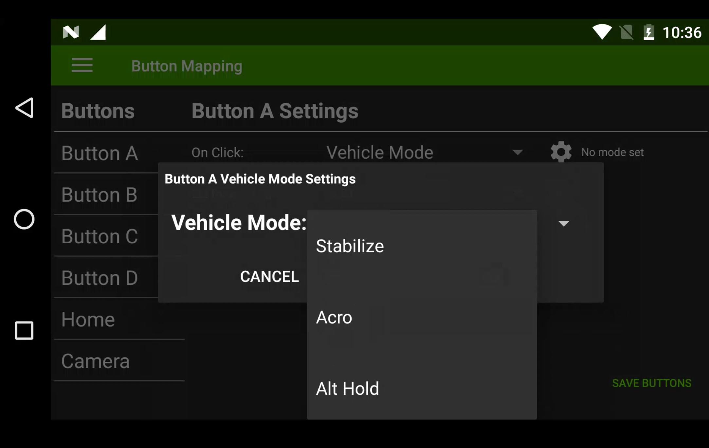
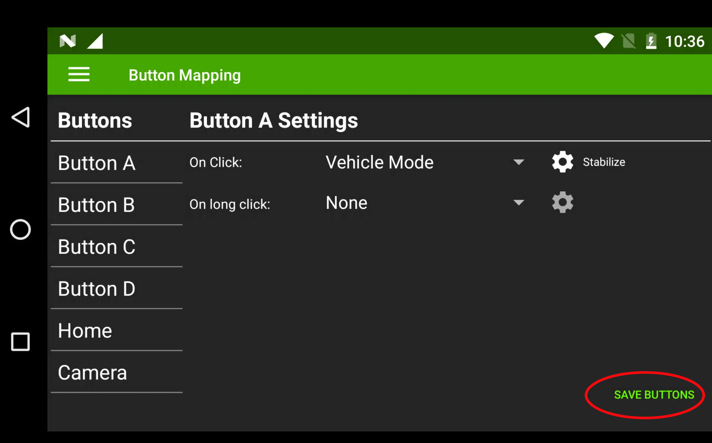
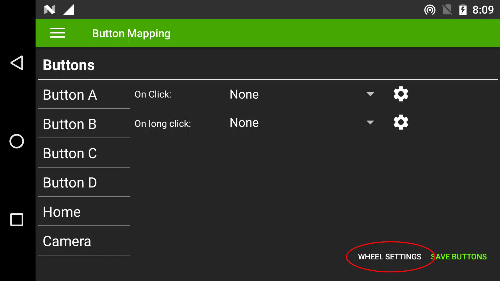
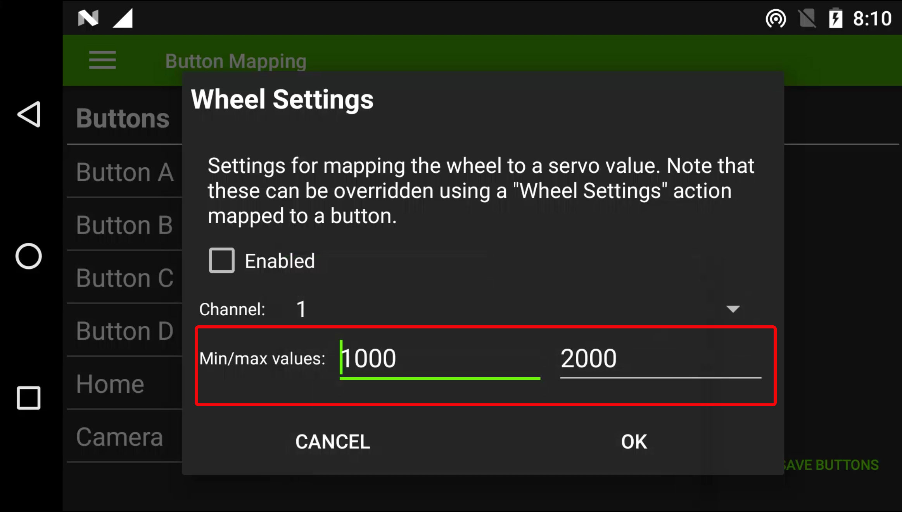
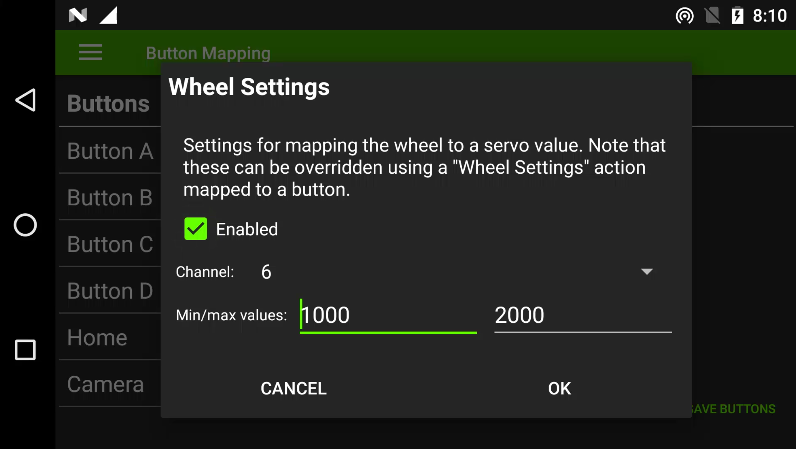

# Configure Modes & Mavlink Buttons

Herelink is fitted with six programmable buttons and one hardware wheel. These can be configured to control sbus channel outputs from the Rover Unit's dual sbus connector and to send Mavlink commands to the autopilot via Solex or QGC. For examples ,flight mode selection, servo output and control GCS.

You Can configure buttons A, B, C, D, Cam, Home and HW Wheel as Mavlink commands in Solex and QGC. These commands include

* Vehicle Mode
* Home Mode Prompt
* Take Picture
* Toggle Video
* Camera Switch
* Map/Video toggle
* Toggle HUD
* Set Servo
* Non-Latch Servo
* Set Relay
* MAVLink command
* Arm
* Disarm
* Toggle Arm
* Wheel Settings
* Clear Wheel Settings

In Ardupilot and PX4, Solex TX and QGC have on-screen switching control for selecting and changing flight modes If you want to set one or more buttons to change flight mode, it must be set only to Mavlink button commands, i.e. set button control in Solex or QGC, not thej Sbus signal in Channel 5.

Mavlink provides a secure command link for flight mode changes, immune to system restarts and signal loss.

After the configuration flight mode is selected, the user should confirm that the **Fail Safe** been setted correctly and test before using it.

**Note**: Ardupilot set Sbus channel 5 as the default flight mode selection, which should be disabled when using Herelink by setting the "FLTMODE\_CH" parameter in all parameters to 0.

\*\*Home button: \*\*You are advised to use the RTL command by long or short pressing the Home button.

## Configure Buttons

### **Solex**

**Button Mapping**

* Open Solex

* Click the menu in the top left corner

Select **Button Mapping**

* Choose desired button

* Select either Click or Long Click (**Note** this allows you to set two functions to each button)

* For example, if you want to set Button A, click Button A and then click the option box on the right to select the desired function.

* For example, if you want to set the button as flight mode switch, click the gear icon and choose the desired flight mode for chosen button.

* select desired flight mode

* For other BUTTONS that need to be set, please use procedure above to set corresponding function. Then click "SAVE BUTTONS" at the bottom to SAVE the Settings

**Hardware Wheel**

Wheel configuration in Solex TX to Servo output channels 1-16 on the Autopilot, you also have the ability to switch the servo output via a button in Solex.

* Open Solex
* Click the hamburger menu icon in top left corner
* Select Button Mapping as above
* Click WHEEL SETTINGS in the bottom right corner

* Select the desired servo channel from 1- to 16

* Set the PWM output range suitable for your application.

* Click on the Enabled to activate the output,
* Finish by clicking OK and click SAVE BUTTONS in bottom corner.

* To configure a button to change the wheel servo output configure the button to WHEEL SETTINGS.

* Click the gear icon and set new channel and PWM values and click OK and then SAVE BUTTONS in bottom right corner.

* Once changed the wheel will output on the new selected channel, to return to its original servo output you will need to program one button function to Clear Wheel Settings as shown above.

### **QGC**

* Open QGC
* Click gear icon on top left corner.

* Select **Button**
* Select the box on left for desired button.
* Click the drop-down menu to select features.
* Repeat the procedure for each button and select desired flight mode.

