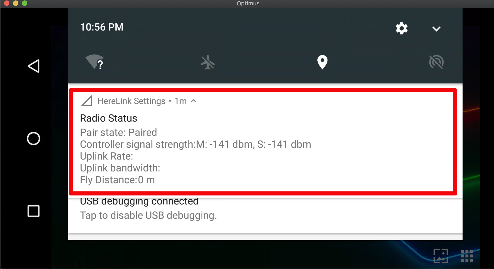

# Pairing, RC Calibration & Setup

Note: Before set Sbus button (button is default to Sbus channel),please pay special attention to the flight mode settings on the Mavlink button page, i.e. button settings in Solex TX and QGC

## 1. Controller calibration

* From App Launcher slide down the notification drawer from the top

Click **'HW JS CAL'**

Here are some comtroller calibration and function settings.

* SAVE (after modified controller configuration must click save to take effect)
* Calibrated (Calibration state, If the indicator is red,calibration for roller hardware, rocker hardware and SBUS output is necessary. If the indicator is green, it is normal and no calibration is required )
* HW WHEEL CAL
* HW JS CAL
* SBUS OUT CAL SBUS
* AXIS
* INPUT
* REV
* DZ
* EXPO
* CH#
* Wheel Acc
* Throt Cent 0
* Mode
* Dual Cont
* MAIN
* IP

**First time use requires three calibration steps**

**1.** Calibrate the hardware wheel

* Select **“ HW WHEEL CAL”**

*   Click **Start rollwheel** and follow the calibration steps.

    **Note** once complete you can check its correct functioning by looking at the values change,
* Click **Pass** to return to joystick screen.

&#x20;

* After the rollwheel calibration is complete, proceed to the next step.

## **2**. Calibrate the joysticks

* Click **HW JS CAL**

*   Click **Start Calibration** to begin the process and follow the instructions in the green box ,and the sick movement arrows located around the sticks on the remote as highlighted in red below.

    > Note: At the beginning of the calibration process, the stroke of the joystick on the screen will not change with the actual joystick. You only need to calibrate according to the instruction.

&#x20;

* At the end of this process if you are happy with the input behavior you can click **Pass** and the calibration will be stored, if you're experiencing any issues click **Fail** and start the calibration process again using a little more pressure in the corners.

* After the Joy-Stick calibration is complete, proceed to the next step.

## **3.** Calibrate SBUS Output

* Follow the RC stock movement steps as shown in the highlight section moving the stick through each position. Finally move the wheel then the calibration is done.

* Once all calibrations have been completed the \*\*Calibrated \*\* status will turn green ，which indicate that all remote calibrations have been completed.

## 3.Controller setting

### **RC Transmitter Modes**

RC Transmitter Modes can be setted selected using the Mode option at the bottom,click **SAVE** to save the modification.

For some special models that cannot use the mid-throttle, you can select Throt Cent 0 to set the mid-throttle to throttle 0, then click **SAVE** to save the modification.

### **Wheel setting**

The wheel is set as W axis input, you can click **REV** to reverse the input.

**CH#** is used to configure the output channels, SBUS1 for channel 1-16 ,SBUS2 for channel 17-32 .

Click **Wheel Acc** to make oupput stack and not return to the middle, then click **SAVE** to save the modification.

### **Dual control mode**

Herelink can use 2 controller to control 1 Airunit indorder to meet more requirement. This function requires connecting the wifi hotspot of the secondary controller to the master controller or connecting the master controller and the secondary controller to the same WIFI to access the LAN.

* **Master switch setting**, Click **Dual Cont** and **MAIN** then click **SAVE** to save the modification.

Secondary controller's RC channel will show up after connect, you can assigned secondary controller's Joystick and Wheel channel to any channel of the mater control, then click **SAVE** to save the modification.

* **Secondary controller setting**, click **Dual Cont** ans select the corresponding IP address. If master and secondary controller connect with wifi hotspot, then set the IP address to 192.168.43.1.
* If connect access the LAN, please follow the steps below to check the master IP address , then click **SAVE** to save the modification.

To check the master IP , you can open the WIFI interface and then click the Settings icon in the upper right corner, then you can check the IP in it.

The master image can be displayed on the secondary controller, and the image and data can be connected to the QGroundControl ground station according to the data sharing procedure later.

### **Trainer Mode**

Dual control can also be used as a trainer mode for teaching.

* Turn on and connect master and secondary control
* Set the X2, Y2, Z2 R2 channels of the secondary controller on the main control as channels 1, 2, 3, and 4 respectively, corresponding to the main control channel. Click **SAVE** to SAVE the Settings after completion.

After setting, press the CAM button in the upper right corner of the main control to make channel 1, 2, 3 and 4 of the secondary control. Release the button to make channel 1, 2, 3 and 4 of the main control normal.

###
