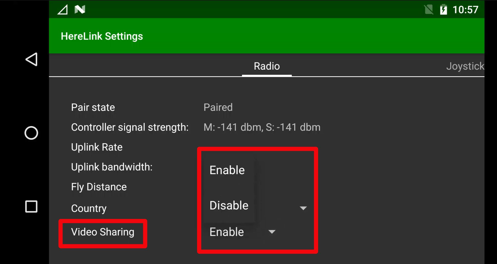
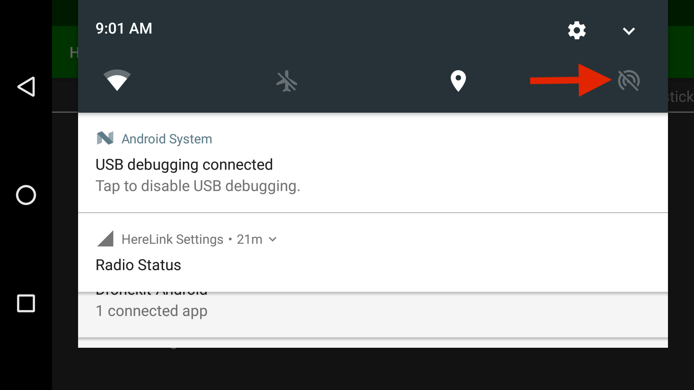

# Share video Stream

## 1. Enable the video stream on Herelink

* Slide down the Notification Drawer and tap the Herelink Settings tab

* Scroll down in Radio Settings and Enable the Video Sharing


Please note that video stream isn't available until a GCS app enables it, so ensure atleast one GCS app is running in the background with correct stream selected.


## 2. Connect over Wifi Tethering

* Pull down the Notification Drawer and enable Hotspot.

* To configure press and hold hotspot logo, and you should see following screen.

* Then under Set up Wifi hotspot configure name and password for the hotspot.

* The video stream will be available at `rtsp://192.168.43.1:8554/fpv_stream`to connected devices.

## 3. Connect over USB tethering

* Press and hold the Hotspot button under notification logo.

* Under `Tethering & portable hotspot` find `USB tethering`, turn it on.

* The video stream will be available to connected devices over USB via `rtsp://192.168.42.129:8554/fpv_stream`

## 4. Connect via Wifi Connection

* If Herelink is connected over wifi, you can get video stream using IP of Herelink on the network.
* Press and hold Wifi option in Notification drawer and select settings.

* Scroll down to find the IP Address

* The video stream will be available to connected devices over USB via `rtsp://<ipaddress>:8554/fpv_stream`

## 3. Display the video stream

In this example we use VLC media player

* Open VLC and go to File &gt;&gt; Open network
* Type the url address provided on the HereLink stream menu and click "Open" 

* The video stream window will automatically opens, if not, you can force it by clicking right on the video stream link &gt;&gt; Play

