# How To Update Firmware

Herelink can be updated on PC, Mac and Linux as per the below process. Newer firmware versions allow you to update the Herelink remote via wifi from with-in the settings app, this is only available if you have the Solex TX app installed.

> Please choose the correct method to upgrade your device.
>
> Please refer to the following method to determine

**Determine Controller upgrade method :** If the controller open QGC directly right after controlled been turned on, and Solex is not installed. Please upgrade with PC. For other cases, see OTA Online Upgrade below.

**Determine Airunit upgrade method :** If your airunit is unable to pair with controller, or did not show airunit firmware version like below or no such page. Please upgrade with PC. For other cases, please check OTA Online Upgrade below.

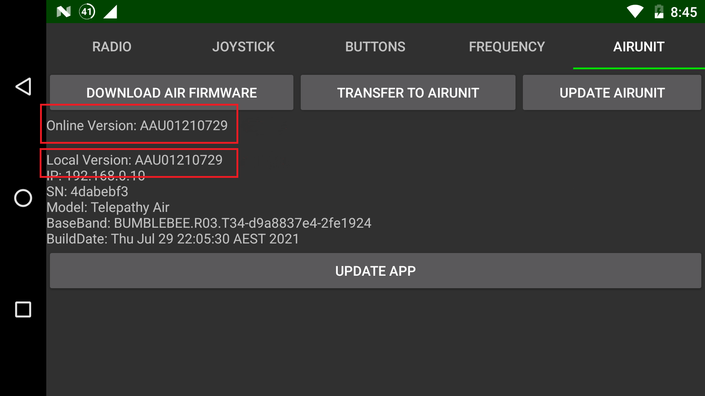

## 1. Upgrade Via PC

### **Download firmware upgrade application**

* Windows ：[https://herelinkfw.cubepilot.org/flasher\_win.zip](https://herelinkfw.cubepilot.org/flasher\_win.zip)
* MAC ：[https://herelinkfw.cubepilot.org/flasher\_mac.zip](https://herelinkfw.cubepilot.org/flasher\_mac.zip)
* Linux ：[https://herelinkfw.cubepilot.org/flasher\_linux.zip](https://herelinkfw.cubepilot.org/flasher\_linux.zip)

### **Controller Upgrade**

1. Connect controller to PC via USB.
2.  Put the Herelink Remote Unit into Fastboot mode by pressing **Power** and **D** button simultaneously while turning on.

    (at least one antenna needs to be connected)
3. Extract and Run the application packaged inside the zip file.After Remote Unit upgrade is complete the Unit will automatically restart once finished.
4. Herelink Remote Unit will boot up with Activation window, follow the Activation steps below to continue.

### **Airunit Upgrade**

1. Extract and Run the application packaged inside the zip file
2. Power Airunit with **7-12v** power supply ，Connect Airunit to PC via USB. At least one antenna needs to be connected，UART and SBUS cables are no need to connect.
3. The program identifies the device and downloads the firmware, requiring the PC to be connected to the Internet during upgrade.
4. After the download is complete, it will automatically start to write and restart after the writing is complete.

> In some Windows systems it's been found that due to incorrect Driver setup, Herelink units fail to be detected. In such cases please power up by pressing Power+D button until "Fastboot" screen shows up. Install driver from here https://developer.android.com/studio/run/win-usb. In cases where driver was already installed, Uninstall Device from Device manager (Ensure to check the "also uninstall driver" option), and then reconnect and install the correct driver from Google.

## 2. Herelink Activate

After upgrading the Herelink firmware you may be required to activate your device, you will be presented with the 'Update Device' Screen

> **Note: Herelink must be connected to an internet connection via 5G WiFi to activate.**

* Connect Herelink to your WiFi connection from the settings menu

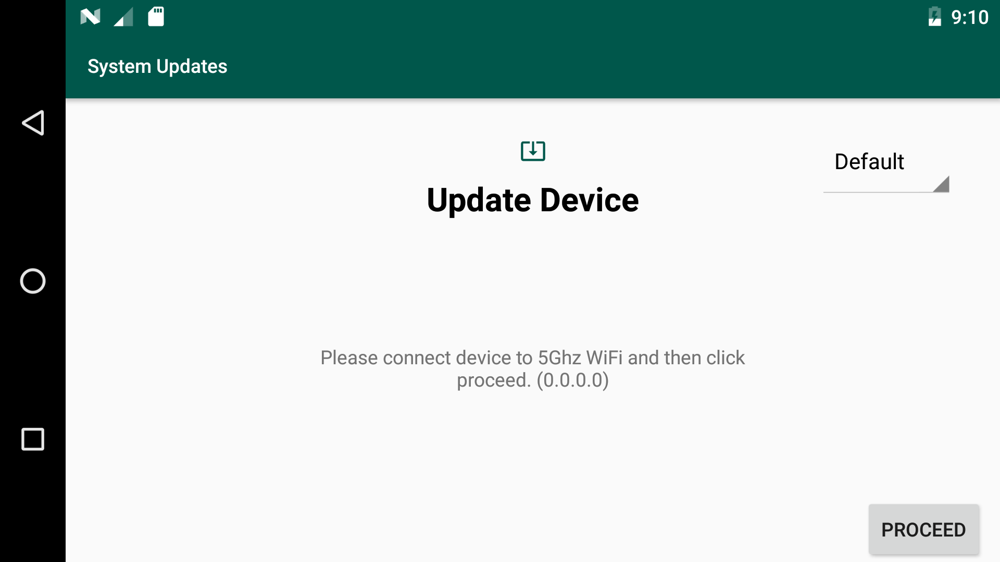

* Select your region then click 'Proceed'

* You will then be prompted to input your 16 digit software activation key.

> **Note**: On later Herelink versions your key will be located on the back of the controller, for earlier(before April 20th 2020) Herelink versions you should contact your original reseller to obtain a valid licence key.

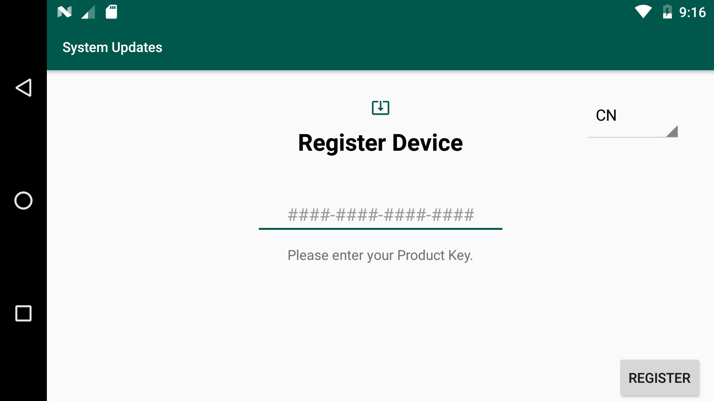

&#x20;

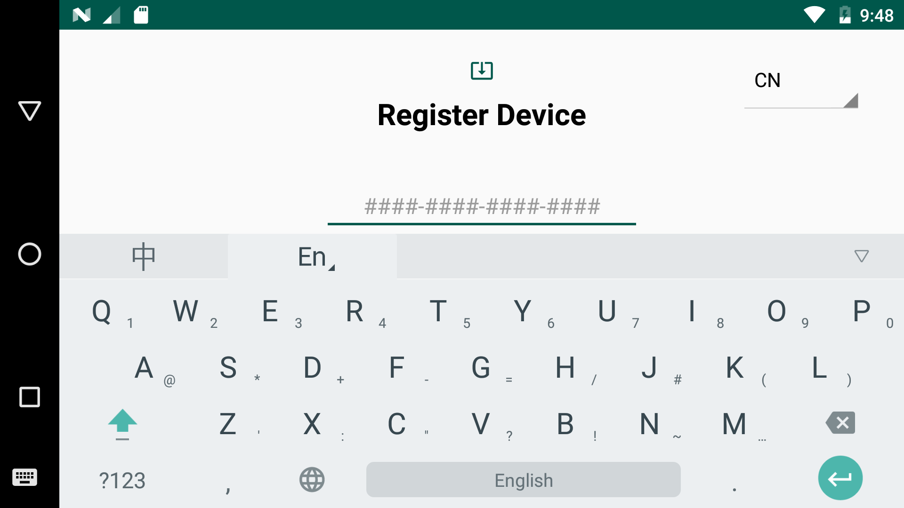

* Once input click 'done' the 'Register' and your device will then download the latest software and update automatically.

## **3. OTA Online Firmware upgrade(Via Wifi)**

If Solex is installed. Please upgarde with OTA (Via Wifi)

**Controller upgrade**

*   Make sure you Herelink is connected to 5G wifi

    **-Wi-Fi** _5.8GHz_

    **-IP Address** _Not in range 192.168.0.x_

    **-Region** _Select the correct region and within 5mins difference_
* Pull down from the top and select the settings cog in the top corner.

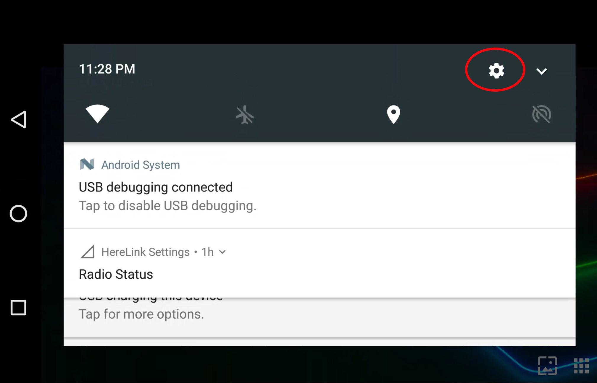

* Scroll to the bottom and click the 'About phone' option

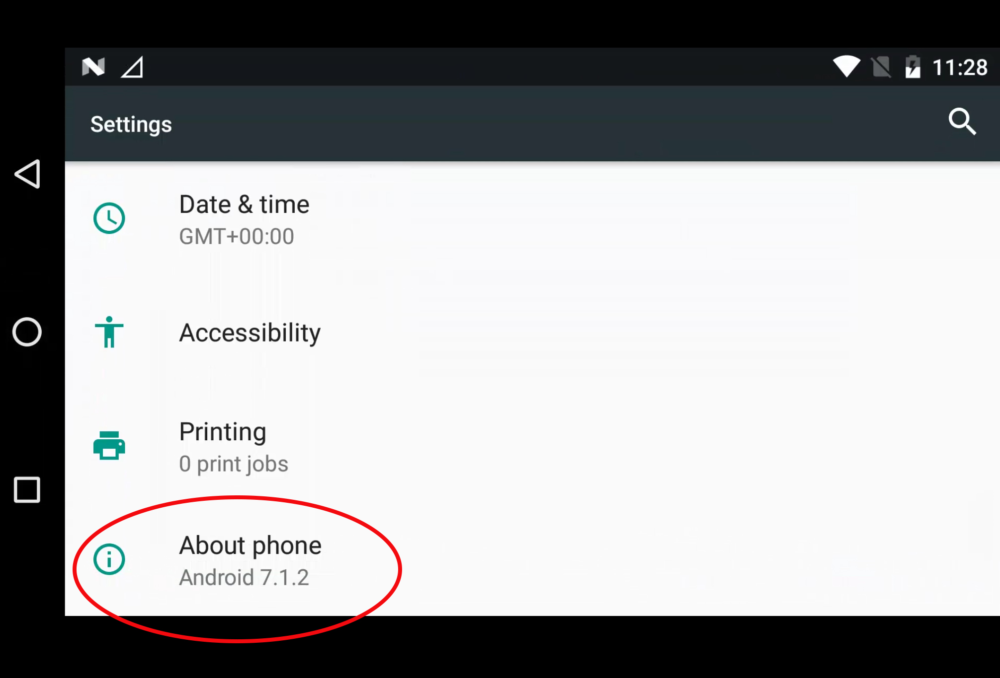

* Select 'System Update'

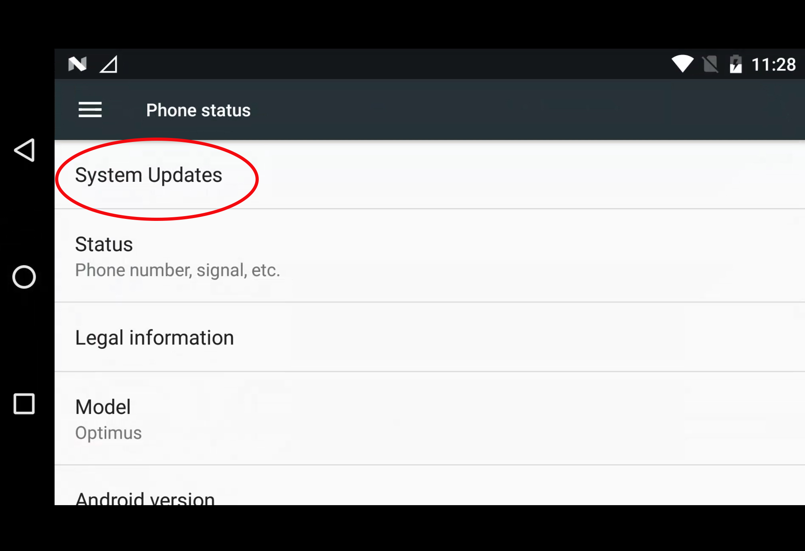

* Select 'CHECK FOR UPDATE' in the bottom corner

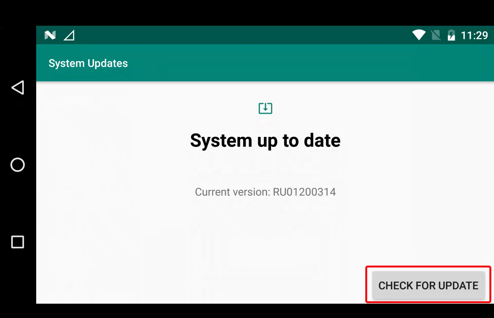

* The system will now check for latest update firmware and install it automatically

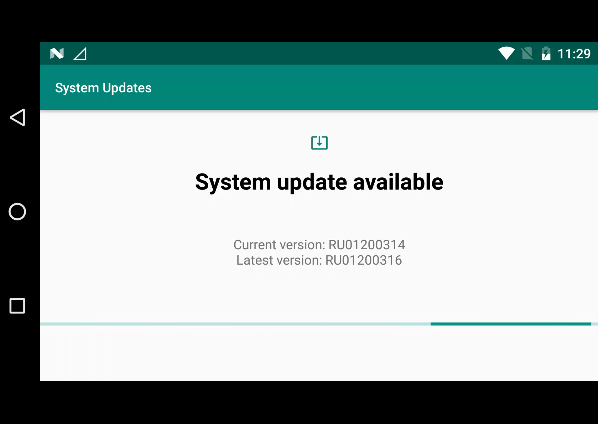

> **There are 4 things the need to be checked if you receive an error**
>
> \*\*1.\*\*You are connected to stable 5G wifi.
>
> \*\*2.\*\*The device time is correct.
>
> \*\*2.\*\*The IP address is correct.
>
> \*\*4.\*\*You entered the correct Key

**Airunit upgrade**

If you can view the airunit firmware version from controller, you can upgrade it through OTA Online Firmware upgrade(Via Wifi).

* Connect your controller to a 5G WIFI and make sure an internet connection is available
* Pair your Airunit with controller.
* From App Launcher slide down the notification drawer from the top.
* Select **Herelink Settings**

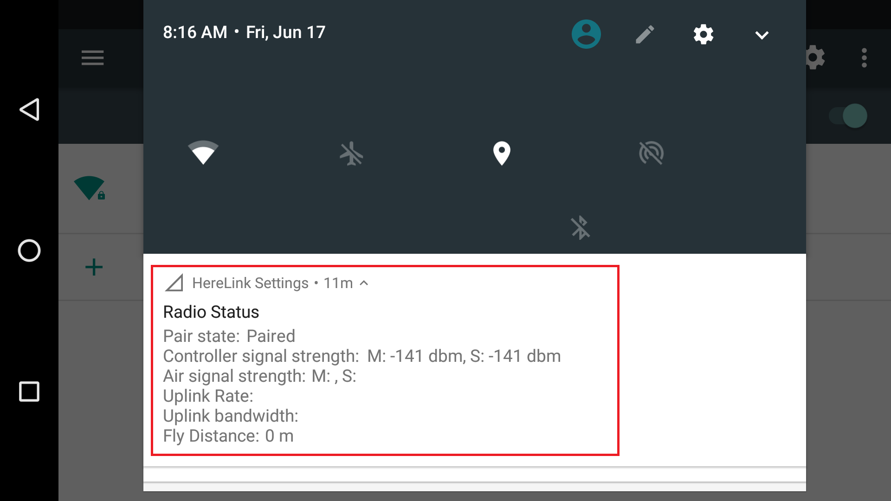

* select **AIRUNIT** tab

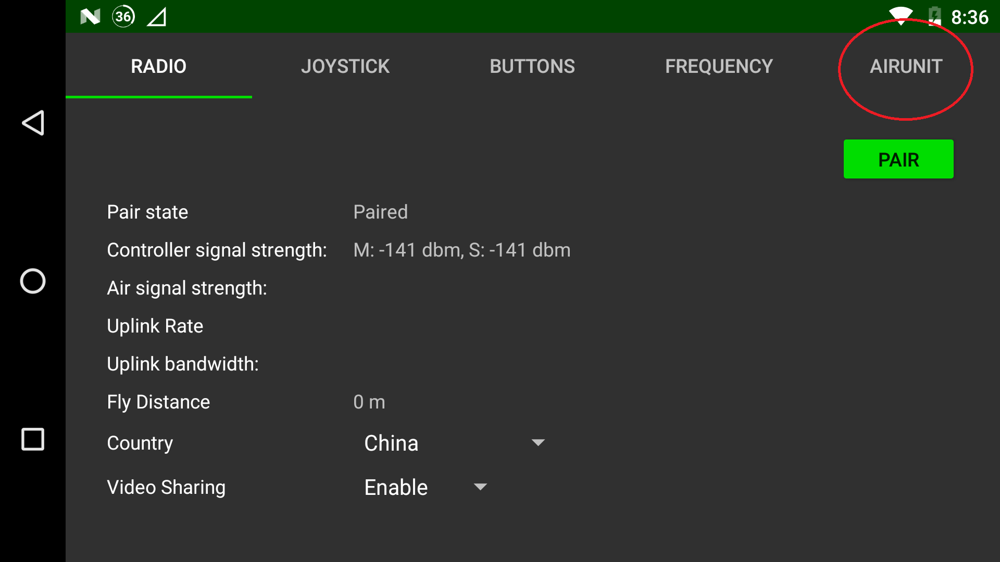

* After the update screen is displayed, determine whether the current version needs to be updated.

.png>)

* If there is a new online version, perform the following three steps in order to complete the upgrade.

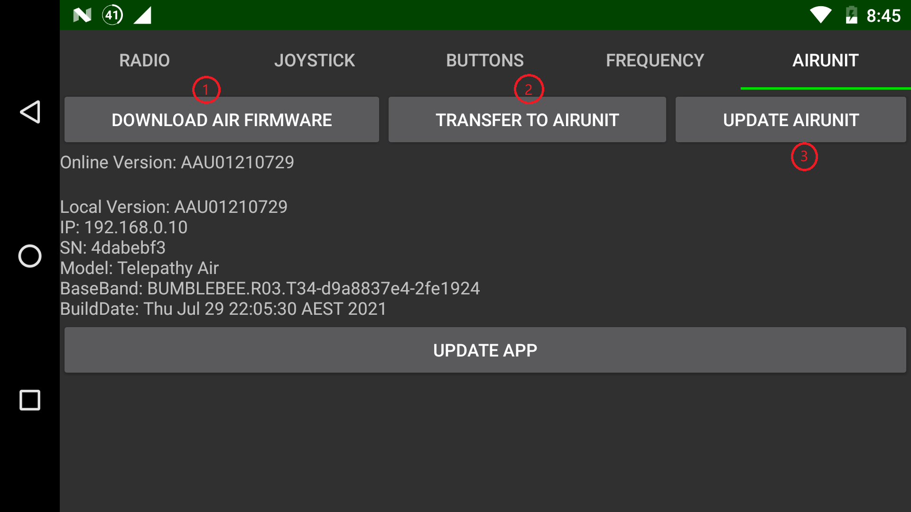

**1** Click **DOWNLOAD AIR FIRMWARE** to download firmware.The Air Unit Firmware will start downloading to the Ground Station.

(wait the progress bar until the download is 100%)

**2** Once downloading is complete,click **TRANSFER TO AIRUNIT** .The downloaded firmware will start to transfer to the Air Unit.

(wait the progress bar until the transfer is 100%)

**3** Once the transfer is complete,click **UPDATE AIRUNIT**.The new Air Unit firmware will be installed on the Air Unit.

(wait the progress bar until the installation complete)

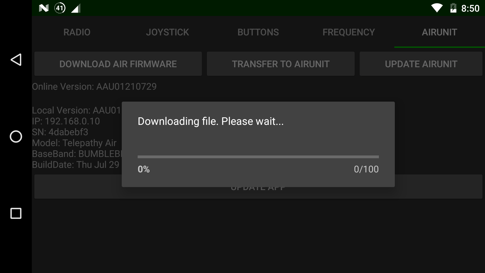
