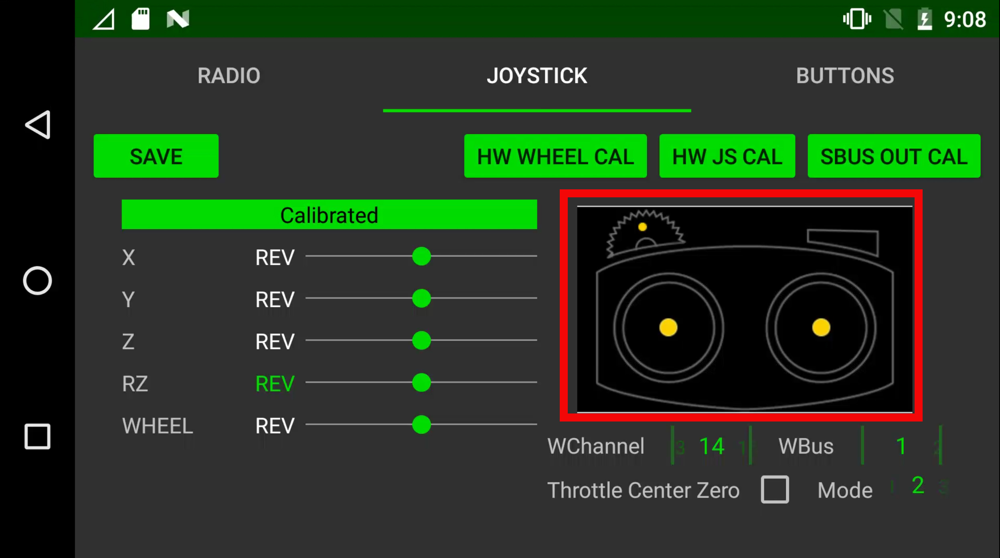

# Herelink Pairing, RC Calibration & Setup

Herelink has a dedicated system settings app for the setup and configuration of the Herelink RC control and radio system.

The Herelink Settings app allows you to

* Pair The Air Unit 
* Calibrate the RC
* Set RC Mode & Throttle Settings 
* Calibrate HW Wheel and Set Channel
* Set Radio Regional Settings
* Configure Sbus Buttons

The following tutorial will guide you through the steps to setup and calibrate the Herelink system.  For button setup there are dedicated pages in this wiki for Mavlink and Sbus button options, these should only be completed after performing the steps on this page. 

**Important: Please pay special attention to Mode setup on Mavlink Buttons page before configuring any buttons on your system. 

You can find that here * [Configure Modes & Mavlink Buttons](herelink/mavlink_buttons.md)

## Herelink Settings App

* From App Launcher slide down the notification drawer from the top

*  Select Herelink Setting 

* The settings app will open 

## Pairing with Air Unit

* Tap Pair button and then hold the `Pair/Reset` button on Air Unit until `LED2` blinks.

## Joystick and Wheel Hardware Calibration

* Swipe left to access the joystick screen.

Here you will find the sticks and hardware wheel options and calibration settings. 

From this screen you can 

* See RC Calibration Status 
* Calibrate Hardware Wheel
* Calibrate Sticks
* Set RC Stick Mode
* Set Hardware Wheel Sbus Channel & Bus
* Reverse RC Channel
* Set Throttle Centre Behavior

## Step 1: Calibrate the hardware wheel

* Select 'HW WHEEL CAL'.

* Click 'Start rollwheel'  and follow the calibration steps
* **Note** once complete you can check its correct functioning by looking at the values change, click Pass to return to joystick screen

* Once calibration is complete you can set the Sbus channel output and Bus output for the wheel on the highlighted settings
Bus 1 is the same output as the sticks and the wheel can be set to channels 5 - 16, on bus 2 the wheel can be set to channels 1 -16. 

* Once complete click 'SAVE' to store settings. 

## Step 2: Calibrate the joysticks

* Click 'HW JS CAL'

* This screen is split into 2 sections, joystick calibration on the left, joystick testing on the bottom right, instructions for the user to follow will be shown in the green box.  Click 'Start Calibration' to begin the process and follow the instructions in the green box  and the sick movement arrows located around the sticks on the remote as highlighted in red below.

**Note:** The joystick testing area in the bottom right will not move or show any input while you are calibrating the sticks. This is normal, this area will only diplay input after the joysticks have been calibrated.

 

* Once the joystick calibration step is complete the input test area in the red box will activate, follow the instructions above it to test the sticks input are functioning correctly by aligning the black and red circles in each step shown. This will test the joysticks are moving correctly in all axises.
* At the end of this process if you are happy with the input behaviour you can click ‘Pass’ and the calibration will be stored, if you're experiencing any issues click ‘Fail’ and start the calibration process again using a little more pressure in the corners.

## Step 3 RC Mode Selection , Throttle Behavior & Channel Reversing

Herelink supports rc modes 1 - 4 as well as the option to set the throttle centre as zero PWM output and reverse each channeel. 

* Set throttle center and RC mode via the below settings. 

* The stick sbus output can be reversed by clicking on ‘REV’ next to the channel you want to change.

* After making any changes click ‘SAVE” to store settings. 

## Step 4 Calibrate SBUS Output

* To calibrate the joystick SBUS outpiuts click 'SBUS OUT CAL'. 

* Follow the RC stock movement steps as shown in the highlight section moving the stick through each position.

* Once complete click ‘SAVE” to store settings. 

## **Selecting FCC/CE settings**

* Select the region you are residing in or matches closest to your locations policy from Country Under Herelink Settings main screen.

