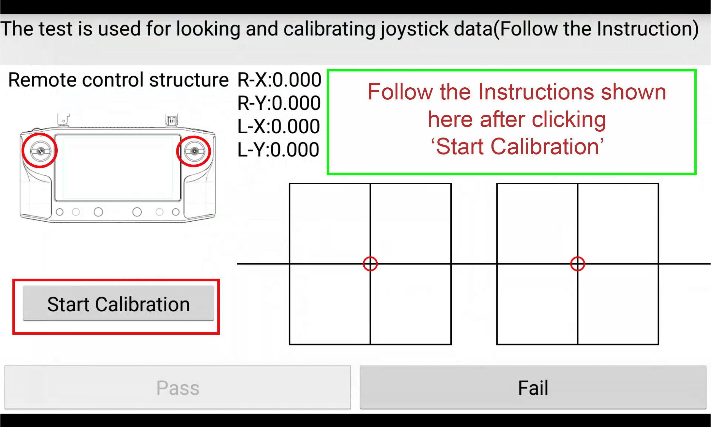
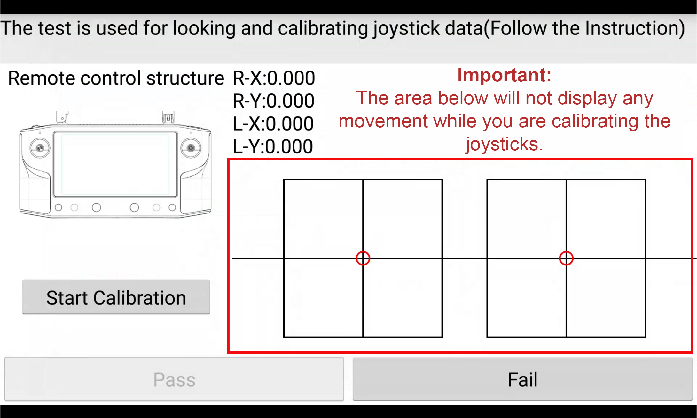

# One Time Setup

This tutorial will take you though the steps of paring the air unit, calibrating joysticks & hardware wheel.  Calibrating the SBUS outputs and setting the FCC/CE mode for the radio system on Herelink. 

## Herelinnk Settings App 

* From App Launcher slide down the notification drawer from the top and select Herelink Setting

* Slide left for Joystick screen.

## Pairing with Air Unit

* Open Herelink Settings by pulling notification drawer and tapping Herelink Settings:

* Tap Pair button and then hold the `Pair/Reset` button on Air Unit until `LED2` blinks.

## Joystick and Wheel Hardware Calibration

### Step 1:Calibrate the hardware wheel 

* Select 'HW WHEEL CAL'.

* Click 'Start rollwheel'  and follow the calibration steps
* **Note** once complete you can check its correct functioning by looking at the values change, click Pass to return to joystick screen

### Step 2:Calibrate the joysticks

* Click 'HW JS CAL'

* This screen is split into 2 sections, joystick calibration on the left, joystick testing on the bottom right, instructions for the user to follow will be shown in the green box.  Click 'Start Calibration' to begin the process and follow the instructions in the green box  and the sick movement arrows located around the sticks on the remote as highlighted in red below.

**Note:** The joystick testing area in the bottom right will not move or show any input while you are calibrating the sticks. This is normal, this area will only diplay input after the joysticks have been calibrated.

* Once the joystick calibration step is complete the input test area in the red box will activate, follow the instructions above it to test the sticks input are functioning correctly by aligning the black and red circles in each step shown.  This will test the joysticks are moving correctly in all axises.  

* At the end of this process if you are happy with the input behaviour you can click ‘Pass’ and the calibration will be stored, if you're experiencing any issues click ‘Fail’ and start the calibration process again using a little more pressure in the corners. 

### Step:3 Calibrate SBUS Output

* To calibrate the joystick SBUS click 'SBUS OUT CAL' and follow the steps as shown on the highlight section.

## **Selecting FCC/CE settings**

* Select the region you are residing in or matches closest to your locations policy from Country Under Herelink Settings

