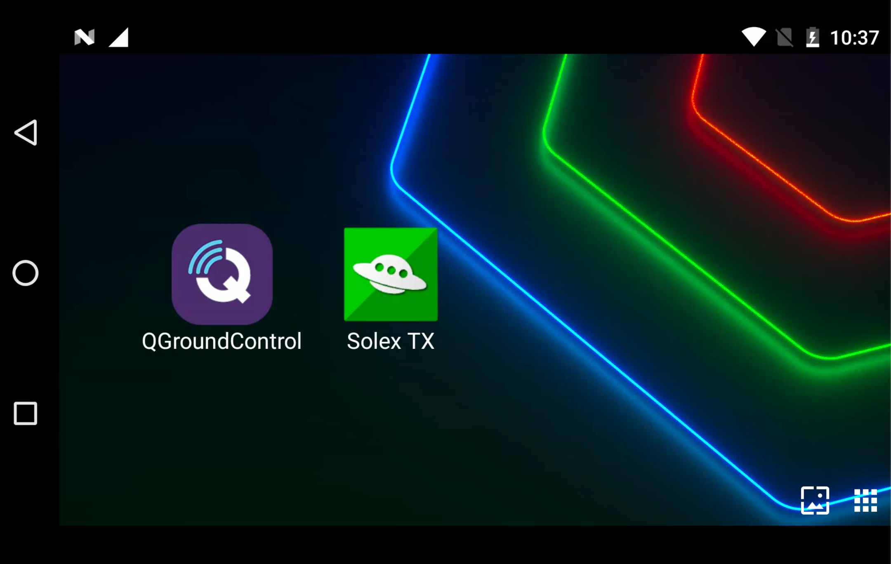
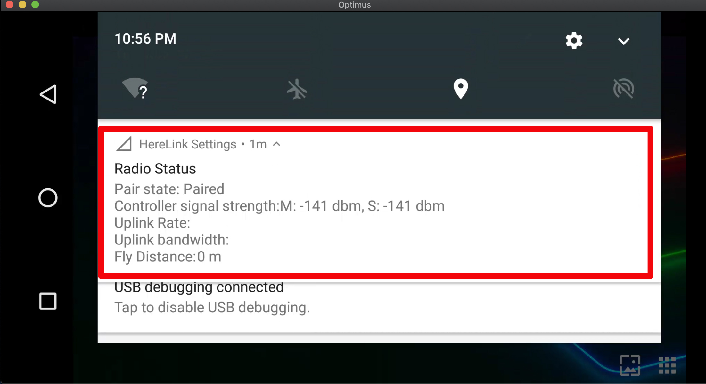
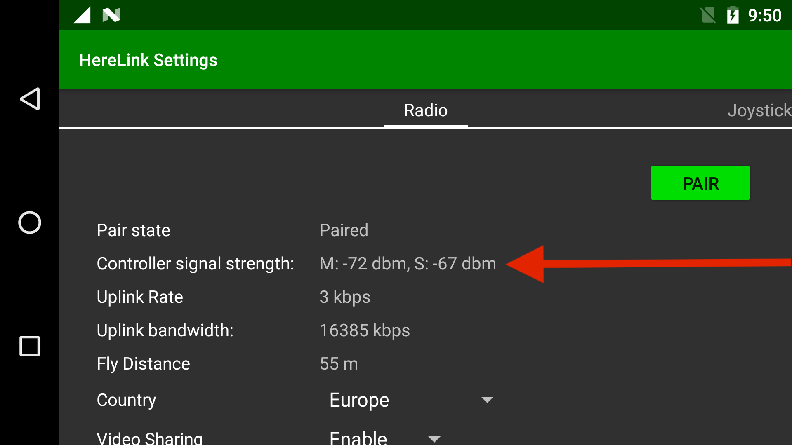
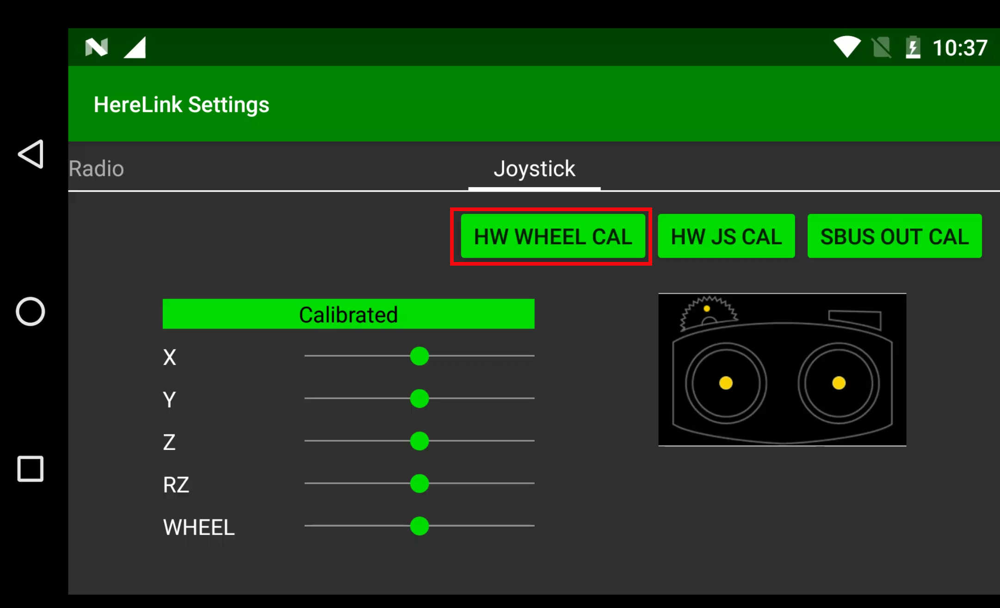
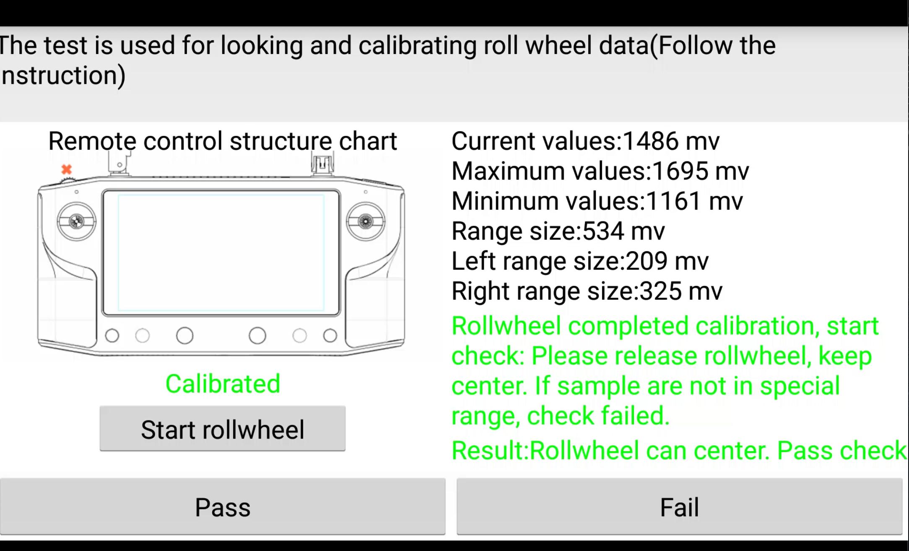
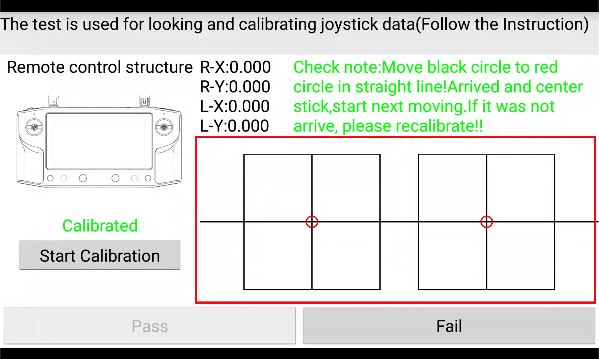
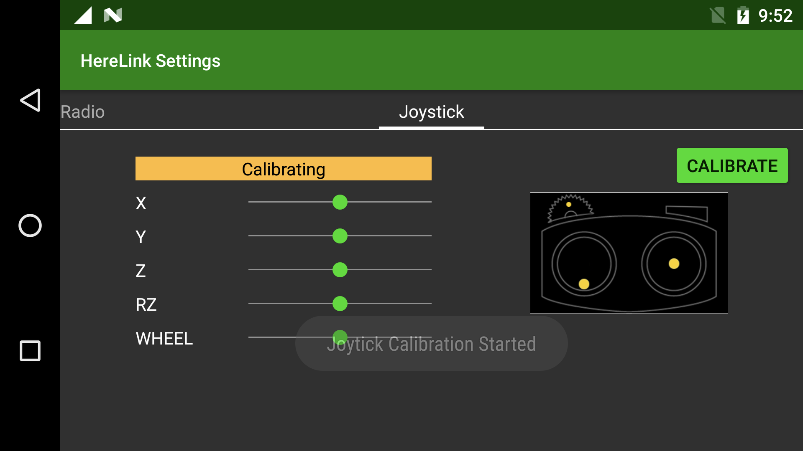
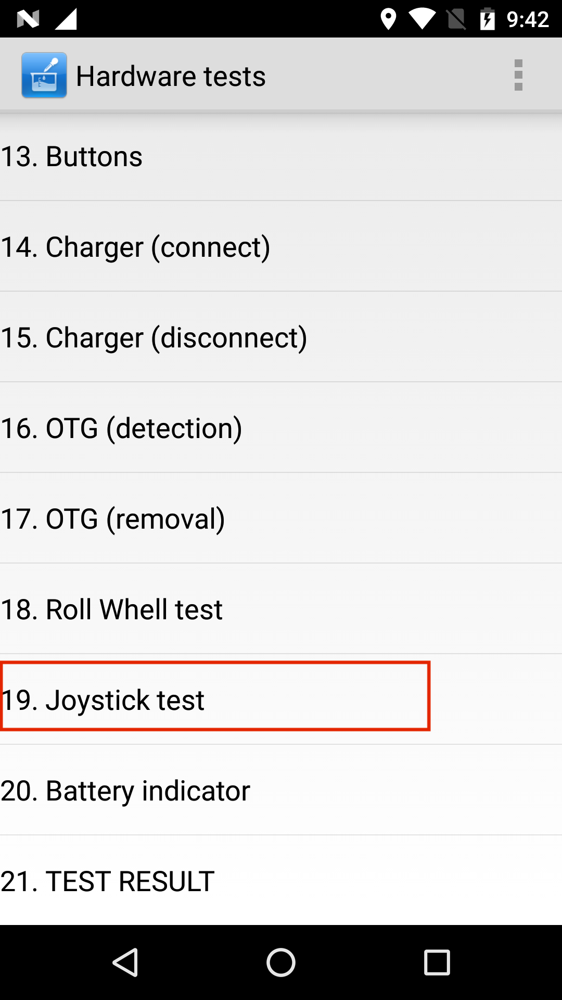

# One Time Setup

## Joystick Hardware Calibration

In case you did an update using `flash_all` script, or are observing issues with Joystick Control even after calibrating using Joystick Calibration Menu and RC Calibration from Ground Station App, please follow the following tutorial.

* From App Launcher slide down the notification drawer from the top and select Herelink Setting

* Slide left for Joystick screen.

* To calibrate the hardware wheel select 'HW WHEEL CAL'.

* Click 'Start rollwheel'  and follow the calibration steps
* **Note** once complete you can check its correct functioning by looking at the values change, click Pass to return to joystick screen

* To calibrate the joysticks click 'HW JS CAL'

* Click 'Start Calibration' to begin the process and follow the instructions in the top right hand side and the arrows located on the sticks on the remote as highlighted below.

* Once complete follow the instructions to test the sticks are functioning correctly by aligning the black and red circles on the highlighted boxes, once you complete all the steps click pass to return to the joystick screen. 

* To calibrate the joystick SBUS click 'SBUS OUT CAL' and follow the steps as shown on the highlight section.

## Pairing with Air Unit

* Open Herelink Settings by pulling notification drawer and tapping Herelink Settings:

* Tap Pair button and then hold the `Pair/Reset` button on Air Unit until `LED2` blinks.

## **Selecting FCC/CE settings**

* Select the region you are residing in or matches closest to your locations policy from Country Under Herelink Settings

## Herelink Hardware Tests 

You can access the hardware tests in Herelink as follows 

* Select `Phone` app.
* Enter `*#*#6484#*#*` , The last star will automatically start Hardware Test screen app.
* Scroll and enter Joystick Test, run through the process of Calibration and select Pass.

