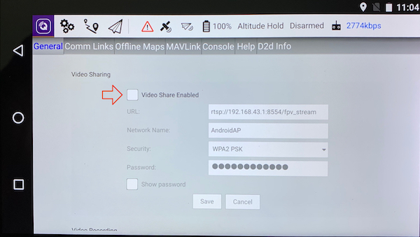
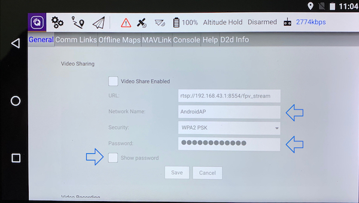

# Share video Stream

## 1. Enable the video stream on HereLink

1. Tapand scroll down in `General` Tab.
2. Scroll down to 'Video sharing' and enable it by taping in the corresponding button


If the 'video sharing' fields are empty, please upgrade your Air unit + Ground unit with the lastest firmware version


## 2. Connect to the HereLink network

1. On Herelink side, tap on 'Show password' to display it
2. On your computer, go to the wifi networks and search for 'AndroidAP'
3. Connect to 'AndroidAP' wifi with the password provided on the HereLink


Network Name and password can be customized by user


## 3. Display the video stream

In this exemple we use VLC media player

1. Open VLC and go to File &gt;&gt; Open network
2. Type the url address provided on the HereLink stream menu and click "Open" 

1. The video stream window will automaticaly opens, if not, you can force it by clicking right on the video stream link &gt;&gt; Play

