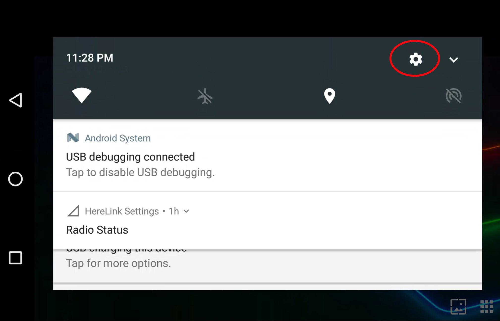
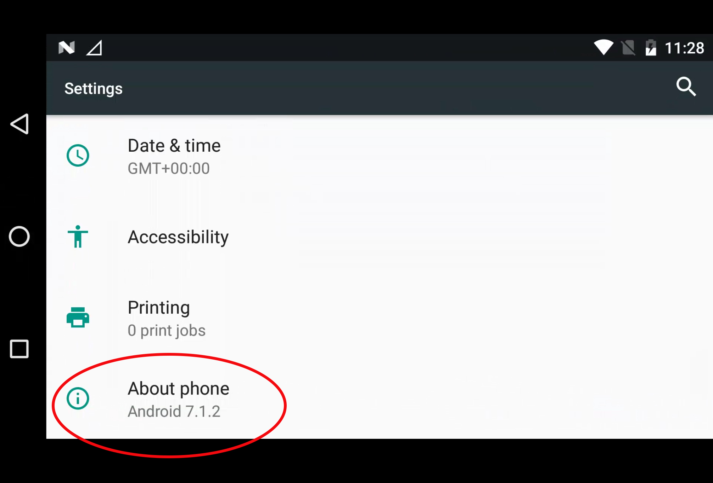
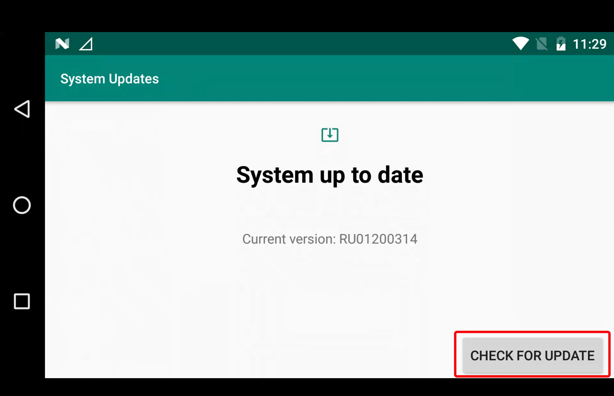
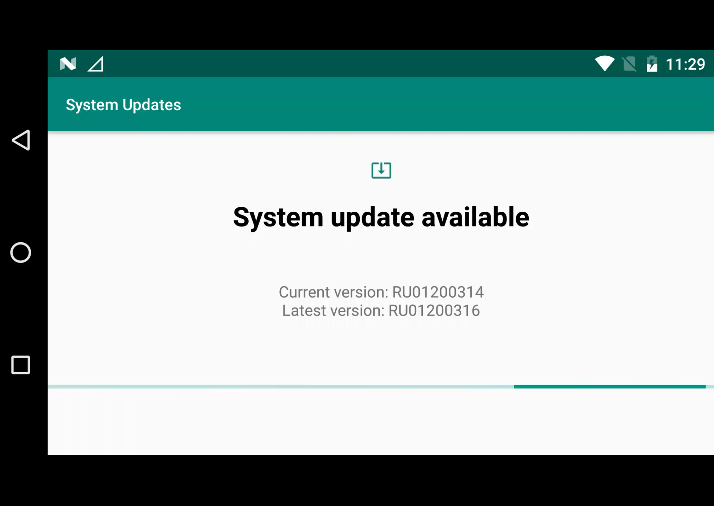

# How To Update Firmware

Herelink can be updated on PC, Mac and Linux as per the below process. Newer firmware versions allow you to update the Herelink remote via wifi from with-in the settings app, this is only available if you have the Solex TX app installed.

The Air end is updated via the same process as the remote via PC, Mac and Linux only.

## Flashing Firmware

1. Connect the Herelink Remote unit to your PC via USB.
2. Put the Herelink Remote Unit into Fastboot by pressing **Power** and **D** button simultaneously while turning on.
3. Download [flasher\_win.zip](https://herelinkfw.cubepilot.org/flasher_win.zip) [flasher\_mac.zip](https://herelinkfw.cubepilot.org/flasher_mac.zip) or [flasher\_linux.zip](https://herelinkfw.cubepilot.org/flasher_linux.zip).
4. Extract and Run the application packaged inside the zip file.
5. After Remote Unit upgrade is complete, you can connect Air Unit and run the application again.
6. The Units will automatically restart once finished.
7. Herelink Remote Unit will boot up with Activation window, follow the steps bellow to continue.

## Herelink Activation

After upgrading the Herelink firmware you may be required to activate your device, you will be presented with the 'Update Device' Screen

**Note: Herelink must be connected to an internet connection via WiFi to activate.**

* Connect Herelink to your WiFi connection from the settings menu

* Select your region then click 'Proceed'

* You will then be prompted to input your 16 digit software activation key. 

**Note:On later Herelink versions your key will be located on the box, for earlier Herelink versions you should contact your original reseller to obtain a valid licence key.**

* Once input click 'done' the 'Register' and your device will then download the latest software and update itself. 

## Herelink Remote Update Via Wifi

If your Herelink has Solex TX installed you can now update your ground station via the built in update feature.

**Note: The air end will still need to be updated via the above process.**

* Make sure you Herelink is connected to wifi and has an internet connection available
* Pull down from the top and select the settings cog in the top corner 

* Scroll to the bottom and click the 'About phone' option

* Select 'System Update' 

* Select 'CHECK FOR UPDATE' in the bottom corner 

* The system will now check for an update and install it automatically

