# HerePro Manual

## HerePro High Precision Multi-band RTK Navigation

### Overview

HerePro is a professional High Precision Multi-band RTK Navigation module. It supports various GNSS options such as BeiDou, Galileo, GLONASS, GPS, QZSS. To establish a precise Multi-band Multi-GNSS RTK system, follow these steps to connect two HerePro modules, one serving as the base and the other as the rover. It's important to note that both the HerePro rover and base have identical software and hardware, with the only variation being in the parameter settings.

HerePro utilizes multi-frequency DGNSS signals with advanced algorithms to converge on an RTK Fix in seconds, achieving more reliable centimeter level positioning.

### Features

**1.**  Equipped with u-blox F9P, a professional high precision Multi-band RTK navigation module.&#x20;

**2.** Powerful processing performance provided by a built-in STM32H7 chip. It offers real-time processing and data optimization, and Unmanned Industry standard AP\_Periph Firmware.

**3.** The tailor-made multi-band antenna from Taoglas supports L1, L2, and E5 frequencies. It features high gain, high sensitivity, and high stability.

**4.** HerePro base supports both fixed and moving base mode, selectable for different scenarios to maximize performance.

**5.** The HerePro module functions as both a base and a rover. Switching between these two functionalities is a straightforward process that can be achieved through parameter settings

**6.** HerePro uses multi-frequency DGNSS signals with advanced algorithms. This allow fast convergence to an RTK Fix, achieving more reliable and stable centimeter level positioning.

**7.** HerePro module is 15 x 78mm and 101g.

**8.** The HerePro supports voltages from 6V to 40V. This allows for compatibility with different voltage levels. To enhance safety, it supports redundant power input system.

**9.** The HerePro module is designed with a circular ProfiLEDs. It offers multiple built-in display modes. These modes can be easily selected based on specific needs, either through parameter settings or by utilizing the onboard Lua Scripting feature. This flexibility enables the module to effectively convey notifications or serve as a navigation signal, enhancing its usability and adaptability in different applications.

**10.** CAN FD, real time, and high transmission rate.

**11.** Built-in 9-axis IMU. Through future firmware updates, HerePro can achieve tightly coupled DGNSS-INS-fusing solutions.

## Specifications

<table data-header-hidden><thead><tr><th>Features</th><th></th><th data-hidden data-type="select"></th></tr></thead><tbody><tr><td><strong>Features</strong></td><td></td><td></td></tr><tr><td>Receiver type</td><td>184-channel u-blox F9P</td><td></td></tr><tr><td>GNSS systems</td><td>BeiDou, Galileo, GLONASS, GPS, QZSS</td><td></td></tr><tr><td>Satellite bands</td><td>BDS B1I B2I, GPS L1C/A L2C, GLONASS L1OF L2OF, GALILEO E1B/C E5b, QZSS L1C/A L2C</td><td></td></tr><tr><td>Maximum GNSS systems</td><td>4</td><td></td></tr><tr><td>Navigation update rate</td><td>Up to 20 Hz for RTK</td><td></td></tr><tr><td>Horizontal and vertical accuracy</td><td>RTK 0.01m +1ppm CEP</td><td></td></tr><tr><td>Heading accuracy</td><td>0.4 degrees</td><td></td></tr><tr><td>PVT horizontal positioning accuracy</td><td>1.5m CEP</td><td></td></tr><tr><td>Maximum altitude</td><td>50,000 m</td><td></td></tr><tr><td>Maximum speed</td><td>500 m/s</td><td></td></tr><tr><td>Convergence time</td><td>RTK &#x3C; 10s</td><td></td></tr><tr><td>Acquisition</td><td>Cold starts 24s</td><td></td></tr><tr><td></td><td>Aided starts 2s</td><td></td></tr><tr><td></td><td>Reacquisition 2s</td><td></td></tr><tr><td>Sensitivity</td><td>Tracking &#x26; Navigation: –167 dBm</td><td></td></tr><tr><td></td><td>Cold starts: –148 dBm</td><td></td></tr><tr><td></td><td>Hot starts: –157 dBm</td><td></td></tr><tr><td></td><td>Reacquisition: –160 dBm</td><td></td></tr><tr><td>Antenna</td><td>Multi-band dual antenna</td><td></td></tr><tr><td>Timepulse</td><td>Configurable from 0.25hz to 10mhz</td><td></td></tr><tr><td>Protocols</td><td>NMEA、UBX binary、RTCM 3.3</td><td></td></tr><tr><td>Anti-jamming</td><td>Active CW detection and removal</td><td></td></tr><tr><td></td><td>Onboard band pass filter</td><td></td></tr><tr><td>Anti-spoofing</td><td>Advanced anti-spoofing algorithms</td><td></td></tr><tr><td><strong>Pinout</strong></td><td></td><td></td></tr><tr><td>Power (XT30)</td><td>x2</td><td></td></tr><tr><td></td><td> </td><td></td></tr><tr><td>Debug</td><td>x1</td><td></td></tr><tr><td></td><td>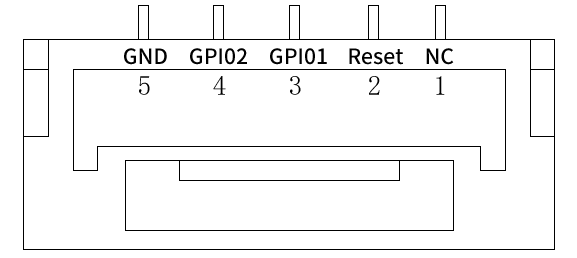</td><td></td></tr><tr><td>CAN </td><td>x2</td><td></td></tr><tr><td></td><td> </td><td></td></tr><tr><td>USB / GPIO</td><td>x1</td><td></td></tr><tr><td></td><td>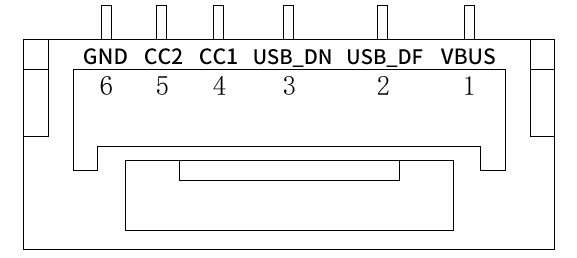 </td><td></td></tr><tr><td><strong>Others</strong></td><td></td><td></td></tr><tr><td>EMMC</td><td>2G</td><td></td></tr><tr><td>Flash</td><td>2M</td><td></td></tr><tr><td>RAM</td><td>1M</td><td></td></tr><tr><td>Input voltage</td><td>6 V - 40 V (maximum 60V)</td><td></td></tr><tr><td>Working Temperature</td><td>-40 °C to +85 °C</td><td></td></tr><tr><td>Size</td><td>17 x 78 mm</td><td></td></tr><tr><td>Weight</td><td>110g（without cable，with pogo pin board）</td><td></td></tr></tbody></table>

## User Manual

### 1. Install connector

HerePro does not come with connector installed. Before first time using, install the port connector as shown below:

Align the mount holes on port connect and HerePro. Then lock them tightly with 3 M3\*8 screws.

\
\

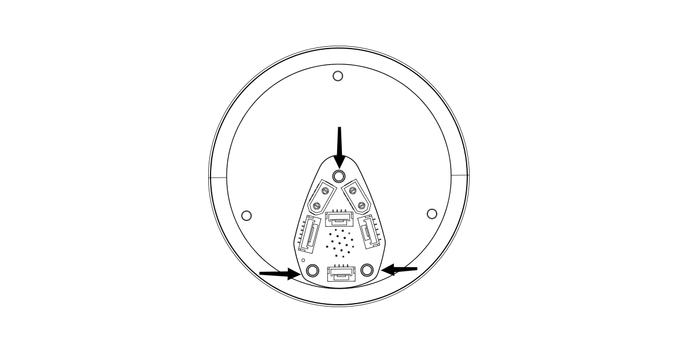

### 2. Using with Ardupilot:

Connect the 4pin CAN cable from left-hand-side CAN port on HerePro to CAN1 or CAN2 on autopilot. Then, supply 6V - 40V to HerePro. (or connect HerePro with type-c to PC directly for power supply)

Turn on the autopilot and connect it to Mission Planner. Go to Config - Full Parameter List page and modify the following parameters:

**CAN\_D1\_PROTOCOL: 1**

**CAN\_D2\_PROTOCOL: 1**

**CAN\_P1\_DRIVER: 1**

**CAN\_P2\_DRIVER: 1**

**GPS\_TYPE: 9**

**NTF\_LED\_TYPES: 231**

Once completed, click "Write Params". CAN function should be enabled after rebooting the autopilot.

**Compass Setting (Using the current firmware):**

> **There is no safety switch. Safety switch can be disabled by modifying BRD\_SAFETYENABLE to 0. Connecting external safety switch to GPS1 port is also an option.**

When using Cube Black, compasses are ordered from top to bottom as 1,2, and 3; When using Cube Orange+, compasses are ordered from top to bottom as 1 and 2. External CAN compass is selected as the last one by default.

To set external CAN compass as compass 1, move the UAVCAN compass to the top.

Select the compasses using (generally default setting is fine) and click "Start" to calibrate compasses.

### 3. Using with PX4:

> By the time of writing, PX4 v1.13.1 is being used.
>
> **\*Please make sure that you are using the most recent stable release of PX4 firmware.**

Install PX4 firmware. Connect the 4pin CAN cable to CAN1 or CAN2 port. Then, supply 6V - 40V power to HerePro. Connect to autopilot through GCS. Modify the parameter UAVCAN\_ENABLE to Sensors Automatic Config and reboot the autopilot.

### 4.GPS for Yaw

#### （For Ardupilot Firmware）

Two u-blox F9 GPS modules can be used to estimate yaw which removes the need for a compass which may suffer from magnetic interference from the ground or the vehicle’s motors and ESCs. This works even if the GPSs do not have RTK fix (RTCM data from a fixed RTK station or NTRIP server).

When DroneCAN GPS are used ,make sure that no SERIAL ports are setup with GPS protocol . Also be sure that the two DroneCAN GPS are on the same physical CAN bus from the autopilot（CAN port on the same flight control）. This might requires that a CAN bus splitter be used.&#x20;

Then set these parameters:

GPS\_TYPE = 22 (“DroneCAN moving baseline base”)

GPS\_TYPE2 = 23 (“DroneCAN moving baseline rover”)

GPS\_AUTO\_CONFIG = 2 (AutoConfig DroneCAN)

GPS1\_CAN\_OVRIDE (Base NODEID) and GPS2\_CAN\_OVRIDE (Rover NODEID) determine which physical DroneCAN GPS is used for GPS1 and GPS2. These are automatically populated at boot from the detected addresses, which are also shown in GPS\_CAN\_NODEID1 and GPS\_CAN\_NODEID2, but can be overridden if needed. You will need to determine which physical CAN GPS is assigned as GPS1 and GSP2 in order to setup the position offsets (see Sensor Position Offset are here)

For either Serial or DroneCAN GPS also set:

Set the GPS\_POS1\_X/Y/Z and GPS\_POS2\_X/Y/Z parameters for the GPSs . You must establish the relative positions of each GPS location on the vehicle with respect to the vehicle’s motion.

GPS\_AUTO\_SWITCH = 1

AHRS\_EKF\_TYPE = 3 (to use EKF3)

EK2\_ENABLE = 0 (to disable EKF2)

EK3\_ENABLE = 1 (to enable EKF3)

EK3\_MAG\_CAL is not used for this feature so it can be left at its default value (“0” for Plane, “3” for Copter, “2” for Rover)

EK3\_SRC1\_YAW = 2 (“GPS”) or 3 (“GPS with Compass Fallback”) if a compass(es) is also in the system

The above configuration assumes that you want the RTCMv3 data between the two GPS modules to go via the autopilot board.

### 5.LED Control

LED arrays on HerePro supports Lua script. The script can be saved into the EMMC on HerePro.

> There is an official Lua script for default setting. Put it into the EMMC if needed.
>
> Prerequisites: Set HerePro to Rover mode. Then connect it to Mission Planner via USB and upload the script to HerePro.

Connect the 4pin CAN cable from left-hand-side CAN port on HerePro to CAN1 or CAN2 on autopilot. Then, supply 6V - 40V to HerePro.

Connect the autopilot to Mission Planner via USB. Go to Initial Settings > Optional Hardware > UAVCAN page and click SLCan Mode CAN1. CAN device status will show up. Click Menu > parameters at the right-hand-side to modify the following parameters:&#x20;

Modify parameters “GPS\_TYPE” = 1，**“GPS\_RTCMSOURCE” = 0**，**“GPS\_RTCMSOURCE” = 0**. After that, click write params then Commit Params and reboot the HerePro.

After power cycle the HerePro, connect it to the computer through its USB port. Select the lower COM port as there are 2 for HerePro.

After connecting, go to Config > MAVFtp > APM > scripts screen and right click. Click Upload to import the new Lua script. Then reboot the HerePro.

Or connect HerePro to PC with USB-Type c directly.

Connect the HerePro to Mission Planner via USB. Go to Config > Full Parameter page to modify the relative parameters:&#x20;

<figure><figcaption></figcaption></figure>

### 6. Firmware update

> Update procedures are as shown as following if there are any future firmware update

**Mission Planner must be later or at the following version to have the new feature available:**&#x20;

Connect the 4pin CAN cable from left-hand-side CAN port on HerePro to CAN1 or CAN2 on autopilot. Then, supply 6V - 40V to HerePro. Connect the autopilot to Mission Planner and go to UAVCAN screen. Click SLCan Mode CAN1 to load CAN GPS status.

Click Menu > Update to check if there are any firmware updates for HerePro.

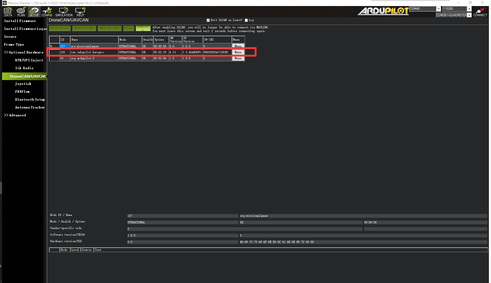

Click the Update button. A window will pop up and ask if you want to search the internet for updates. Click Yes.

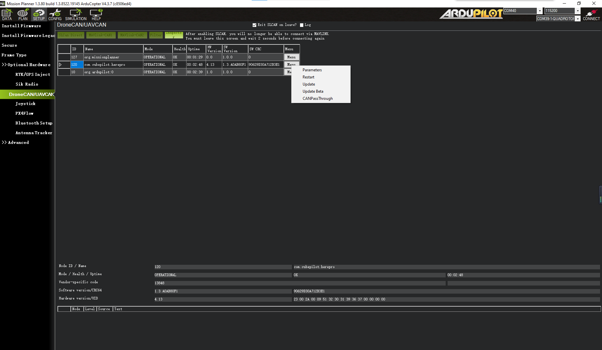

Wait for the firmware update to complete. Confirm the change in SW Version. If the update was successful, reboot the HerePro.

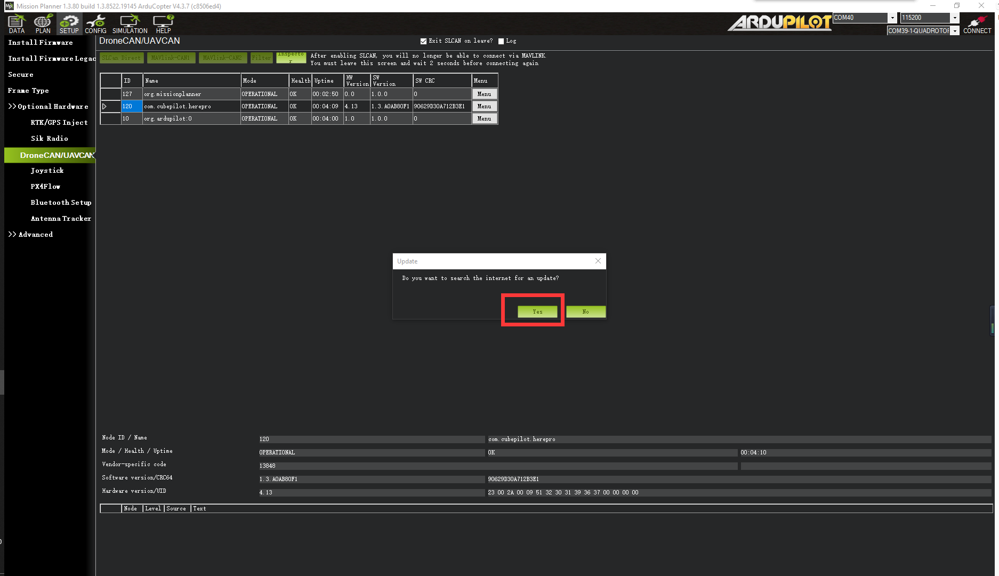

### 7. RTK manual

This part of the tutorial uses Mission Planner ground software and Arducopter-4.3.5 flight firmware for operating instructions. RTK mode requires a base station. The following tutorial Uses HerePro as an example. Users can also use other u-blox M8P/F9P base stations (such as Here+ RTK Base, etc.), or use the local wireless RTK correction service.

**Setup:**

To use HerePro RTK, you will need the following hardware : autopilot, computer, telemetry, HerePro, Tripod(Stand), and 6V-40V power supply or USB Type-C cable.

To use HerePro on a UXV, you need the following hardware : Computer, telemetry modules, HerePro, Tripod(Stand).

The following operations use 2 HerePro modules, with one as base and one as rover respectively. Connecting them 1 by 1 to setup their parameters.

**HerePro RTK rover parameter settings:**&#x20;

Connect the 4pin CAN cable from CAN port on HerePro to CAN1 or CAN2 on autopilot. Then, supply 6V - 40V to HerePro.

Connect the autopilot to Mission Planner via USB. Go to Initial Settings > Optional Hardware > UAVCAN page and click SLCan Mode CAN1. CAN device status will show up. Click Menu > parameters at the right-hand-side to modify the following parameters:&#x20;

.png>)

Modify parameters **“GPS\_TYPE = 1“**，**“SERIAL\_PASS1 = 0“**. After that, click write params then Commit Params and disconnect the HerePro.

.png>)

Connect another HerePro and continue.\

**HerePro Base parameter settings(Ground side):**&#x20;

Connect the 4pin CAN cable from left-hand-side CAN port on HerePro to CAN1 or CAN2 on autopilot. supply 6V - 40V to HerePro.

Connect the autopilot to Mission Planner via USB. Go to Initial Settings > Optional Hardware > UAVCAN page and click SLCan Mode CAN1. CAN device status will show up. Click Menu > parameters at the right-hand-side to modify the following parameters:&#x20;

<figure>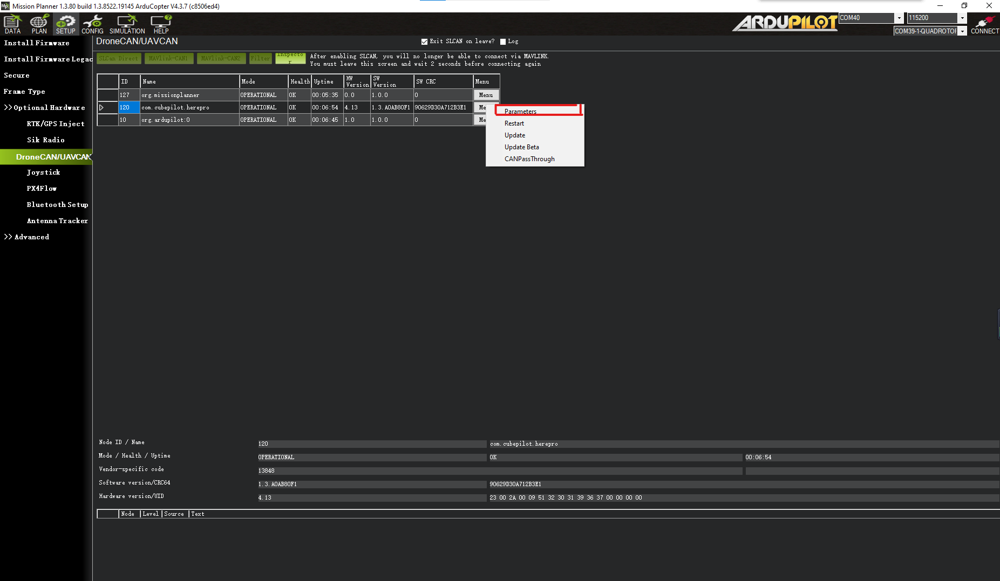<figcaption></figcaption></figure>

Modify parameters **“SERIAL\_PASS1 = 1”**. After that, click write params then Commit Params and disconnect the HerePro.

<figure>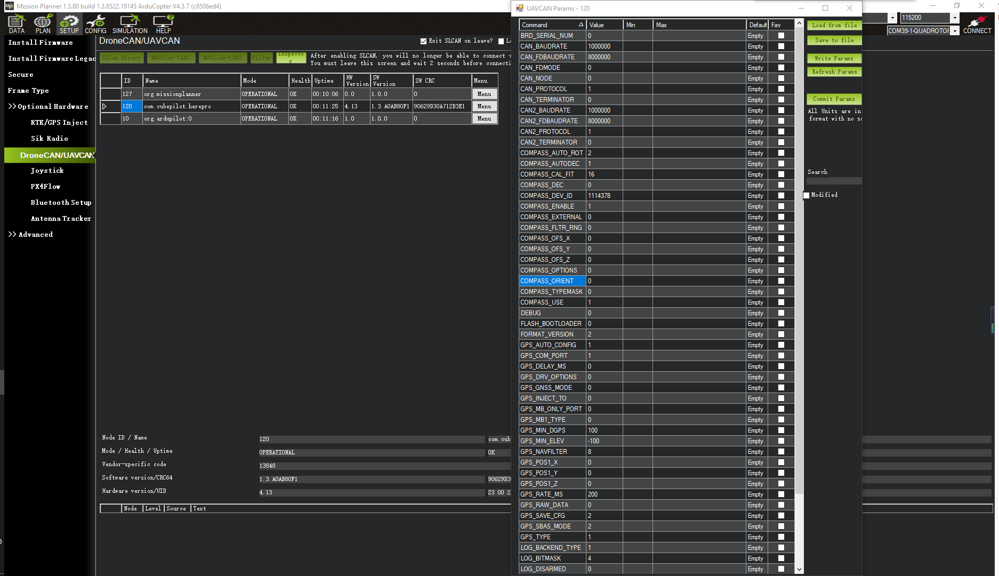<figcaption></figcaption></figure>

**Before using, please ensure that everything are correctly connected.:**&#x20;

**Base:** \
Power the HerePro base with 6V-40V. \
Connect its USB port to the computer USB port. (Or connect HerePro with type-c cable to PC)\
Connect a telemetry to another port on the computer.

**Rover:** \
Power the HerePro with 6V-40V. Connect it to CAN1 port on autopilot. Connect a telemetry to TELEM1 port on autopilot.

**Antenna Placement:** \
**RTK Antenna placement is very important for getting precise RTK positioning**\
RTK requires a much better environment to work. There are special requirements on placement of its antenna.

The best environment requires the base and rover antenna to have a clear view of the sky that is 20 degrees above the horizon. RTK antenna can be elevated but make sure that there are no obstacles around, such as buildings, trees, cars, and etc.

**Examples of a bad environment:** indoors, crowded urban area, forest, near the ground.

**Examples of a good environment**: Open spaces, peak of the mountains, roof of buildings.

Do not place the antenna near electronic devices, as high power electronic devices in close proximity may affect the radio frequency noise of the GPS signal. Examples are mobile phone base stations, high voltage transformers, and etc.

Please place the base station in an outdoor environment with sufficient sky coverage to obtain good satellite signal.&#x20;

Place the base station on a stable and elevated platform such as a tripod.

### **Base Module Setting using Mission Planner:**

Start with base module setup. During the base station setup, the rover and the UXV do not need to be turned on.

Open Mission Planner ground station software on computer and go to the "initial setup → Optional Hardware → RTK/GPS Inject". You will see the following page:

<figure>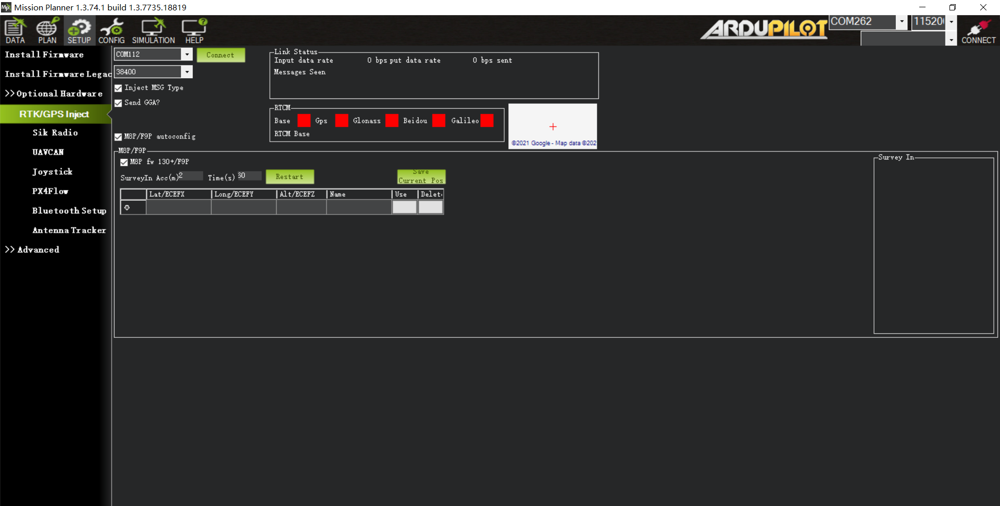<figcaption></figcaption></figure>

Select the correct base module COM port (There are 2 COM port for HerePro. Eg: COM13 and COM14. Select the bottom one.) at the top-left corner. Select baud rate **38400**. Uncheck **Send GGA**. Check “**M8P/F9P autoconfig**” and “**M8P fw 130+/F9P**”. Then click connect. In the SurveyIn Acc section, enter the expected absolute geographic accuracy. In the Time column, enter the expected minimum survey time. Click Restart. The ground station will now transfer the data you have entered to the HerePro base, the base module will start surveying. You will see the following screen:

<figure>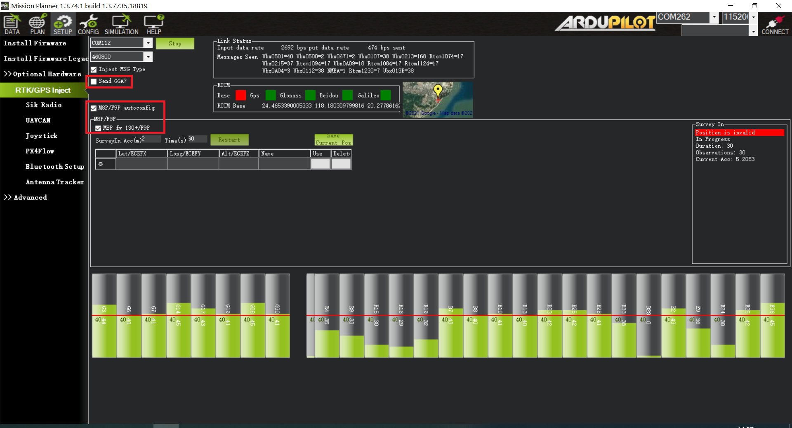<figcaption></figcaption></figure>

During the survey process, the right box will show the current survey status:

**Position is invalid:** The base station has not yet reached a valid location;

**In Progress:** The survey is still in progress;

**Duration:** The number of seconds that the current surveying task has been executed;

**Observation:** The number of observations acquired;

**Current Acc:** Absolute geographic accuracy that the current base station can achieve;

**The Green bar** at the lower part of the Mission Planner page shows the current satellites being detected and the signal strength related to each satellite. At least eight or more satellite signals need to be guaranteed to exceed the red line (Only when the satellite signal exceeds the red line, the effective number of satellites have been connected).

The base station needs a certain amount of time to meet the accuracy requirements of your input. Testing shows that in an open area without sky coverage, the base station will achieve the absolute accuracy of 2m within a few minutes; to reach the absolute accuracy of less than 30cm takes about an hour; to reach the absolute accuracy of 10cm takes a few hours.

It should be noted that the absolute geographic accuracy of the base station here will affect the absolute geographic accuracy of the rover module without affecting the relative accuracy between the base station and rover. If your application does not require UXV with high absolute geographic accuracy, you do not need to set the base station's precision too high, which helps to avoid a longer survey time.

Even if the accuracy of the base station is 1.5 to 2 m, the position accuracy of the rover module relative to the base station can still reach the centimeter level.

After the survey is complete, the Mission Planner will display the following page:

<figure><figcaption></figcaption></figure>

In the RTCM box, the base status indicator is green and indicators for different GNSS systems are also green. The box on the right shows Position is valid.

To store the current location in Mission Planner : Click Save Current Pos, enter a name in the dialogue box, and click OK. As shown below, you can see your saved location in the list. Click the Use button for the location you saved, the status will show Using FixedLLA. If you set the base station in the same location later, you do not need to survey again. You may click the Use button that corresponds to the location you have saved.

<figure>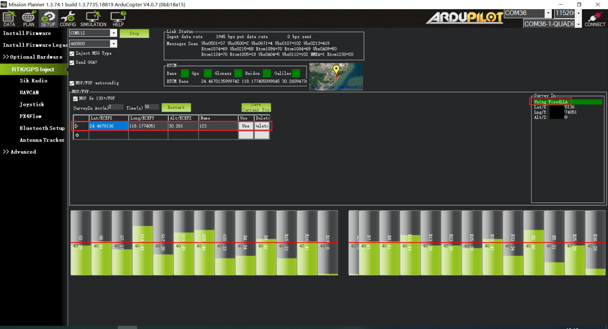<figcaption></figcaption></figure>

### **Rover Module and Flight Controller Setup**

After the base station is set up, you can turn on the UXV. Using the same Mission Planner to connect the telemetry, the base station data will be transmitted through telemetry to the HerePro rover on UXV. In the Mission Planner main page, you will see the current GPS status showing as RTK Float / RTK Fixed / 3D RTK, indicating UXVUAV positioning has entered RTK mode. RTK Float is a floating-point solution; RTK Fixed is a fixed solution. RTK Fixed mode has higher accuracy and requires better signal strength. 3D RTK is unified saying of RTK Float / RTK in the Mission Planner.

### **Single Base to Multiple Rovers:**

There are 2 methods to do this:

* Using 1 telemetry to multiple telemetry broadcasting; or
* Using multiple 1 to 1 telemetry modules with the USB hub

Ground station configuration: connect all telemetry modules to the computer via USB hub. Open Mission Planner to locate the base then connect it with flight controllers. Select AUTO connecting as shown below. All recognized flight controllers on the ports will be connected. You may select the UAV from the dropdown list below:

If you connected the UXVs with 1 telemetry module, they should share the same COM port:

2023/07/12
