# HerePro Manual

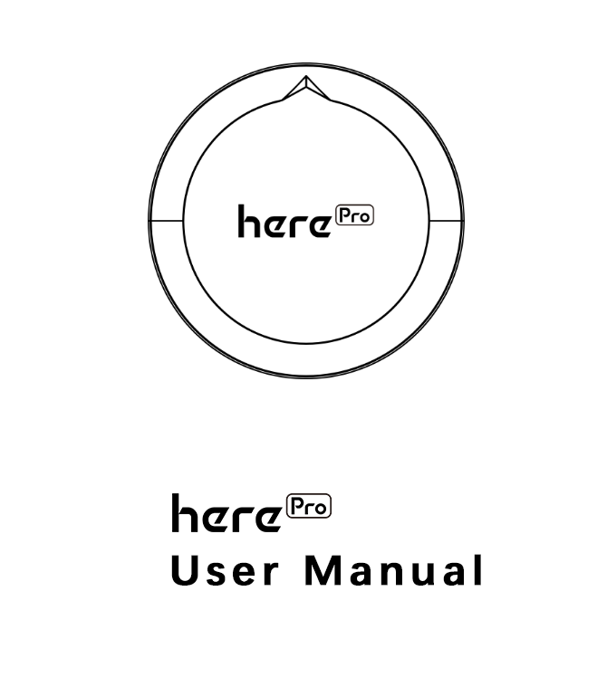

## HerePro **High Precision Multi-band RTK Navigation**

## Overview

HerePro is a professional High Precision Multi-band RTK Navigation module. It supports various GNSS options such as BeiDou, Galileo, GLONASS, GPS, QZSS. Connecting 2 HerePro modules, as base and rover respectively, can complete a precise Multi-band Multi-GNSS RTK system. The HerePro rover and base are identical in both software and hardware. Parameter setting is the only distinction.

HerePro uses multi-frequency DGNSS signals with advanced algorithms to converge on an RTK Fix in seconds, achieving more reliable centimeter level positioning.

## Features

**1.**  Equipped with u-blox F9P, a professional high precision Multi-band RTK navigation module.

**2.** Powerful processing performance provided by built-in STM32H7`53` chip. It offers real-time processing and data optimization, and Unmanned Industry standard AP\_Periph Firmware. Supports over CAN or USB firmware updates.

**3.** The tailor-made multi-band antenna from Taoglass supports L1, L2, and E5 frequencies. It features high gain, high sensitivity, and high stability.

**4.** HerePro base supports both fixed and moving base mode, selectable for different scenarios to maximize performance.

**5.** HerePro is a base and rover 2-in-1 Functionality switching can be easily done by parameter settings.

**6.** HerePro uses multi-frequency DGNSS signals with advanced algorithm allowing fast convergence to an RTK Fix, achieving more reliable and stable centimeter level positioning.

**7.** HerePro module is 15 x 78mm and 101g.

**8.** 6 - 40V dual and wide range input. Compatible with different voltage levels.Redundant power input for improved safety

**9.** Circular LED ring embedded with ProfiLEDs. Built-in multiple display modes for notification or navigation signals. Display modes can be selected according to specific scenarios via parameters or onboard Lua Scripting.

**10.** CAN FD, real time, and high transmission rate.

**11.** Built-in 9-axis IMU. Through future firmware updates, HerePro can achieve tightly coupled DGNSS-INS-fusing solutions.

## Specification

| **Features** |  |
| :--- | :--- |
| Receiver type | 184-channel u-blox F9P |
| GNSS systems | BeiDou, Galileo, GLONASS, GPS, QZSS |
| Satellite bands | BDS B1I B2I, GPS L1C/A   L2C, GLONASS   L1OF L2OF, GALILEO E1B/C E5b, QZSS L1C/A L2C |
| Maximum GNSS systems | 4 |
| Navigation update rate | Up to 20 Hz for RTK |
| Horizontal and vertical accuracy | RTK 0.01m  +1ppm CEP |
| Heading accuracy | 0.4 degrees |
| PVT horizontal positioning accuracy | 1.5m CEP |
| Maximum altitude | 50,000 m |
| Maximum speed | 500 m/s |
| Convergence time | RTK &lt; 10s |
| Acquisition | Cold starts 24s |
|  | Aided starts 2s |
|  | Reacquisition 2s |
| Sensitivity | Tracking & Navigation: –167 dBm |
|  | Cold starts: –148 dBm |
|  | Hot starts: –157 dBm |
|  | Reacquisition: –160 dBm |
| Antenna | Multi-band dual antenna |
| Timepulse | Configurable from 0.25hz to 10mhz |
| Protocols | NMEA、UBX binary、RTCM 3.3 |
| Anti-jamming | Active CW detection and removal |
|  | Onboard band pass filter |
| Anti-spoofing | Advanced anti-spoofing algorithms |
| **Pinout** |  |
| Power \(XT30\) | x2 |
|  | 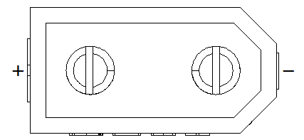  |
| CAN FD | x2 |
|  | 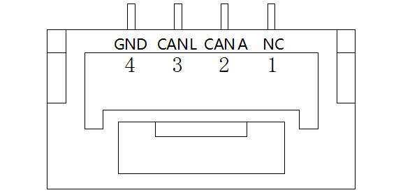  |
| USB / GPIO | x1 / x2 |
|  | 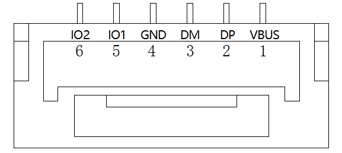  |
| **Others** |  |
| SD card | 16G |
| Flash | 2M |
| RAM | 1M |
| Input voltage | 6 V - 40 V \(maximum 60V\) |
| Working Temperature | -40 °C to +85 °C |
| Size | 15 x 78 mm |
| Weight | 101g（without cable） |

## User Manual

### 1. Install connector

HerePro does not come with stock connector for ports. Before first time using, install the port connector as shown below:

Align the mount holes on port connect and HerePro. Then lock them tightly with 3 M3\*8 screws.

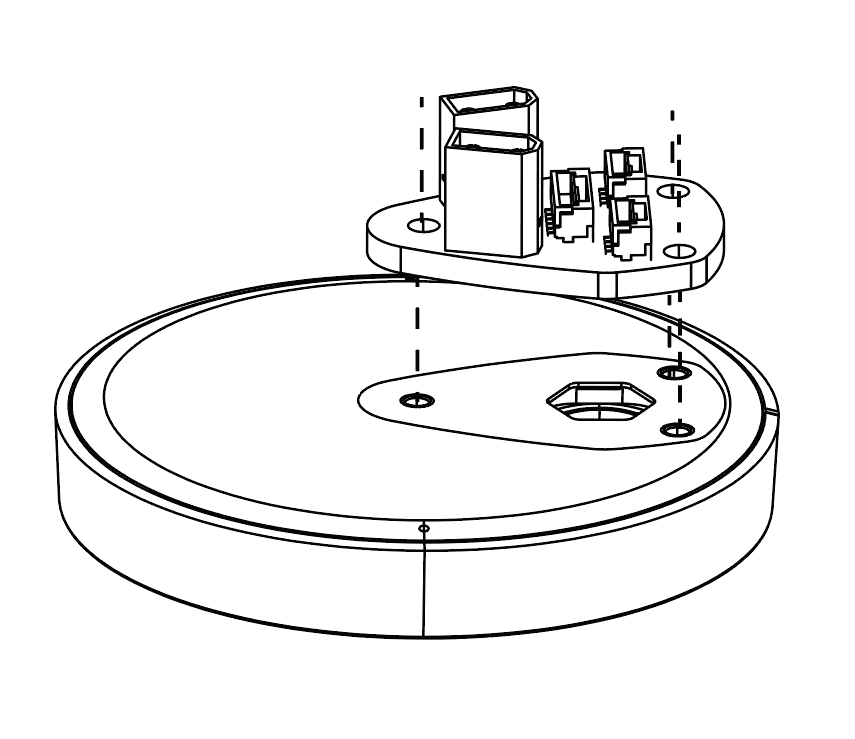

### 2. Using with Ardupilot:

Connect the 4pin CAN cable from left-hand-side CAN port on HerePro to CAN1 or CAN2 on autopilot. Then, supply 6V - 40V to HerePro.

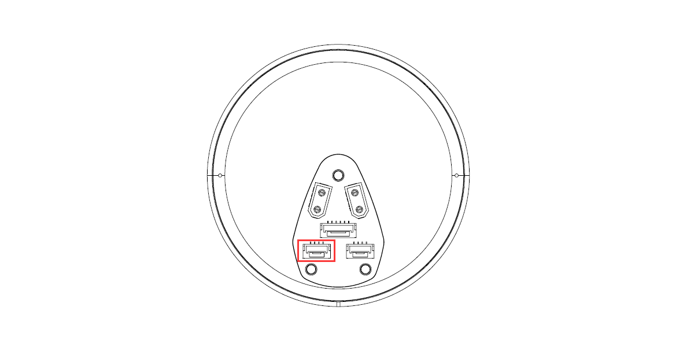

Turn on the autopilot and connect it to Mission Planner. Go to Config - Full Parameter List page and modify the following parameters:

**CAN\_D1\_PROTOCOL: 1**

**CAN\_D2\_PROTOCOL: 1**

**CAN\_P1\_DRIVER: 1**

**CAN\_P2\_DRIVER: 1**

**GPS\_TYPE: 9**

**NTF\_LED\_TYPES: 231**

Once completed, click "Write Params". CAN function should be enabled after rebooting the autopilot.

**Compass Setting \(Using the current firmware\):**

> **There is no safety switch. Safety switch can be disabled by modifying BRD\_SAFETYENABLE to 0. Connecting external safety switch to GPS1 port is also an option.**

When using Cube Black, compasses are ordered from top to bottom as 1,2, and 3; When using Cube Orange, compasses are ordered from top to bottom as 1 and 2. External CAN compass is selected as the last one by default.

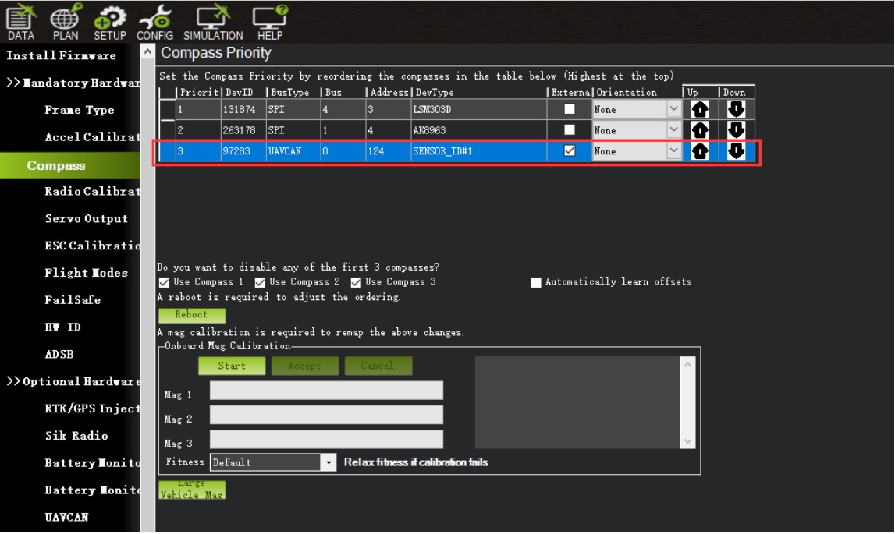

To set external CAN compass as compass 1, move the UAVCAN compass to the top.

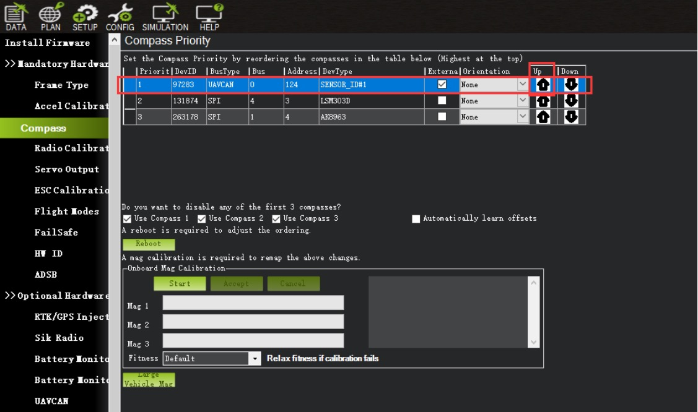

Select the compasses using \(generally default setting is fine\) and click "Start" to calibrate compasses.

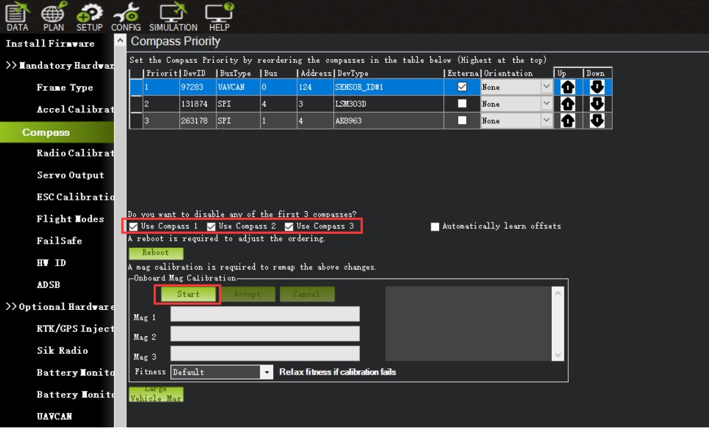

### 3. Using with PX4:

> By the time of writing, PX4 v1.12 beta 3 is being used.

Install PX4 firmware. Connect the 4pin CAN cable to CAN1 or CAN2 port. Then, supply 6V - 40V power to HerePro. Connect to autopilot through GCS. Modify the parameter `UAVCAN_ENABLE` to `Sensors Automatic Config` and reboot the autopilot.

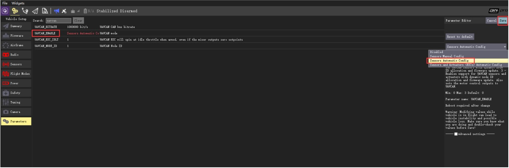

### 4.LED Control

LED arrays on HerePro supports Lua script. The script can be saved into the SD card on HerePro.

> There is an official Lua script for default setting. Put it into the SD card if needed.
>
> Prerequisites: Set HerePro to Rover mode. Then connect it to Mission Planner via USB and upload the script to HerePro.

Connect the 4pin CAN cable from left-hand-side CAN port on HerePro to CAN1 or CAN2 on autopilot. Then, supply 6V - 40V to HerePro.

Connect the autopilot to Mission Planner via USB. Go to `Initial Settings > Optional Hardware > UAVCAN` page and click `SLCan Mode CAN1`. CAN device status will show up. Click `Menu > parameters` at the right-hand-side to modify the following parameters:

Modify parameters **“GPS\_TYPE” = 1，“GPS\_RTCMSOURCE” = 0，“SERIALPASS” = 0**. After that, click `write params` then `Commit Params` and reboot the HerePro.

After power cycle the HerePro, connect it to computer through its USB port. Select the lower COM port as there are 2 for HerePro.

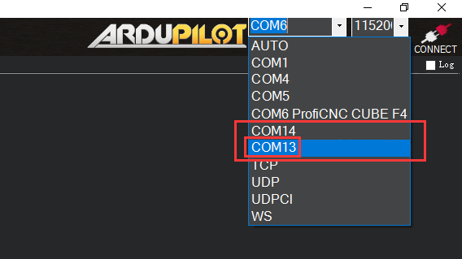

After connected, go to `Config > MAVFtp > APM > scripts` screen and right click. Click `Upload` to import the new Lua script. Then reboot the HerePro.

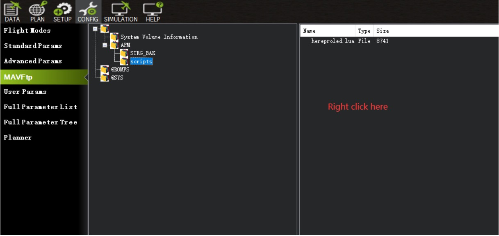

\("Right click here"\)

### 5. Firmware update

> Update procedures are as shown as following if there are any future firmware update

**Mission Planner must be later or at the following version to have the new feature available:** 

Connect the 4pin CAN cable from left-hand-side CAN port on HerePro to CAN1 or CAN2 on autopilot. Then, supply 6V - 40V to HerePro. Connect the autopilot to Mission Planner and go to `UAVCAN` screen. Click `SLCan Mode CAN1` to load CAN GPS status.

Click `Menu > Update` to check if there are any firmware update for HerePro.

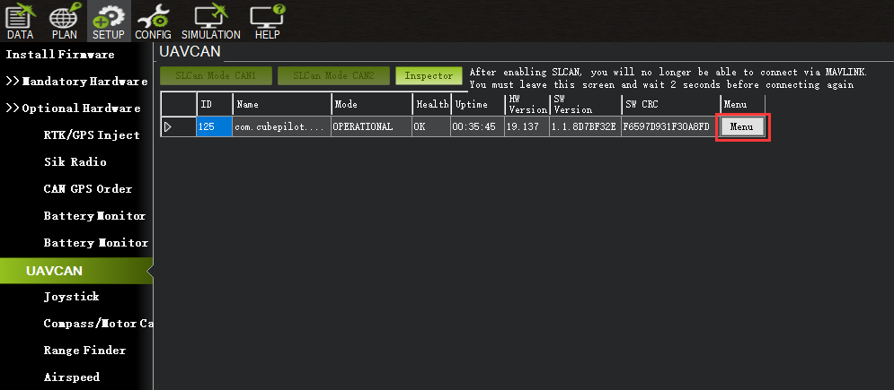

Click the `Update` button. A window with pop up and ask if you want to search the internet for update. Click `Yes`.

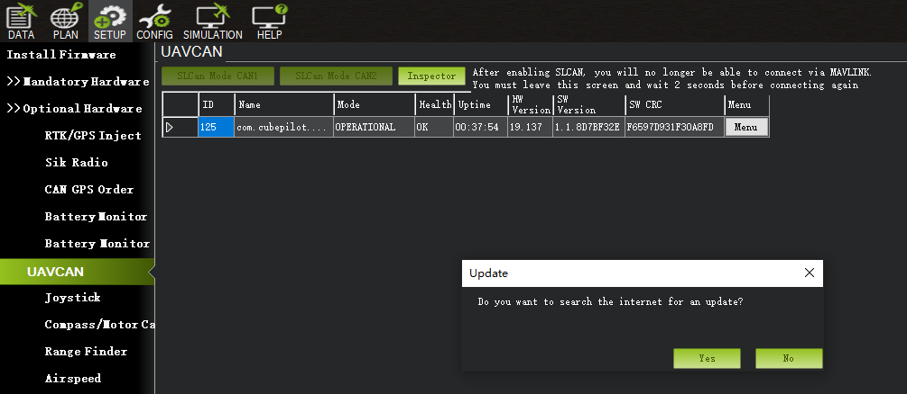

Wait for the firmware update to complete. Confirm the change in `SW Version`. If the update was successful, reboot the HerePro.

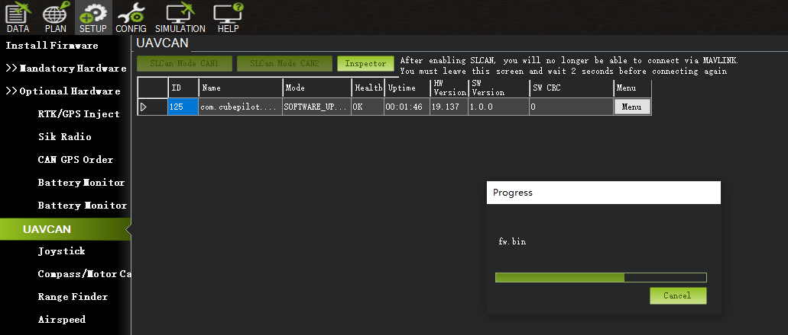

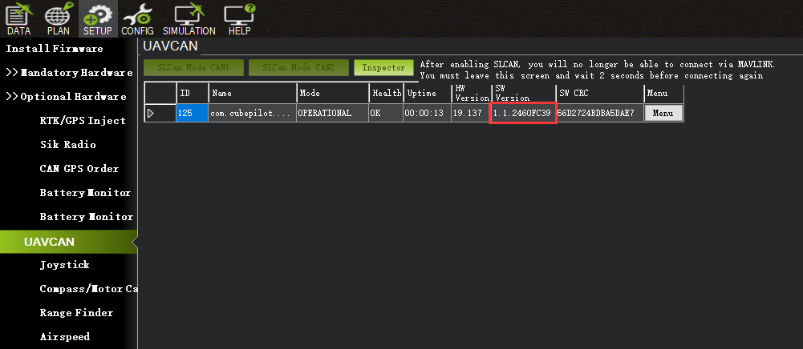

### 6. RTK manual

**Using Mission Planner for base surveying/rover positioning**

> In the tutorial, Mission Planner and Arducopter-4.0.7 will be used for demonstration.
>
> For RTK, 2 HerePro modules are needed. One as base and one as rover respectively.

**Setup:**

To use HerePro RTK, you will need the following hardware: autopilot, computer, telemetry, HerePro x2, 6V-40V power supply, Tripod\(Stand\)

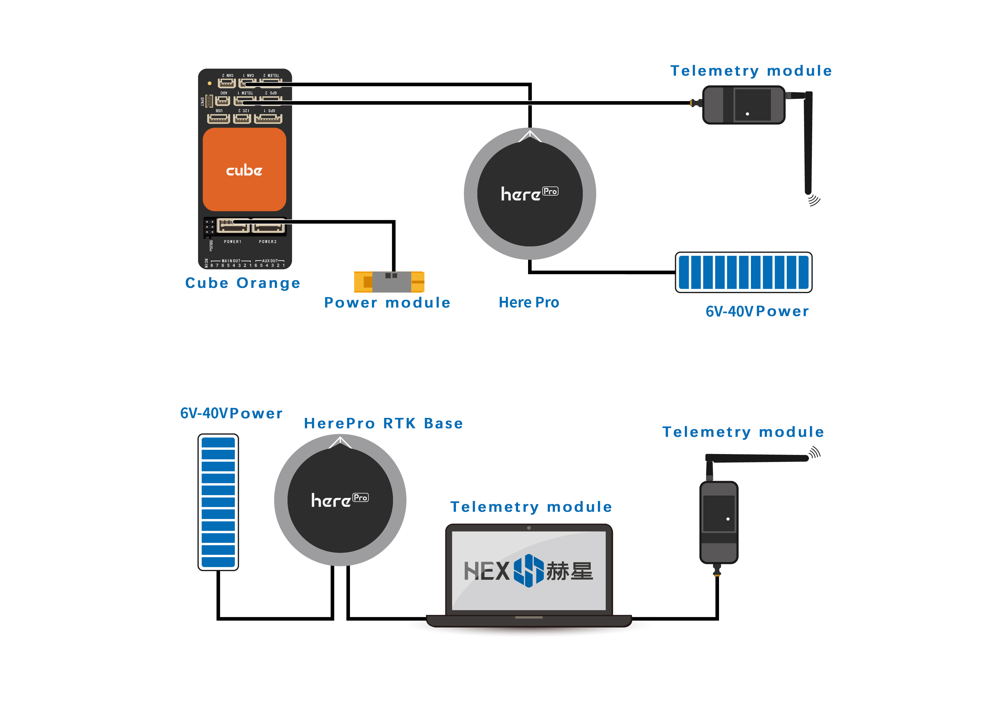

**The following operations use 2 HerePro module, with one as base and one as rover respectively. Connecting them 1 by 1 to setup their parameters.**

**HerePro RTK rover parameter settings:**

Connect the 4pin CAN cable from left-hand-side CAN port on HerePro to CAN1 or CAN2 on autopilot. Then, supply 6V - 40V to HerePro.

Connect the autopilot to Mission Planner via USB. Go to `Initial Settings > Optional Hardware > UAVCAN` page and click `SLCan Mode CAN1`. CAN device status will show up. Click `Menu > parameters` at the right-hand-side to modify the following parameters:

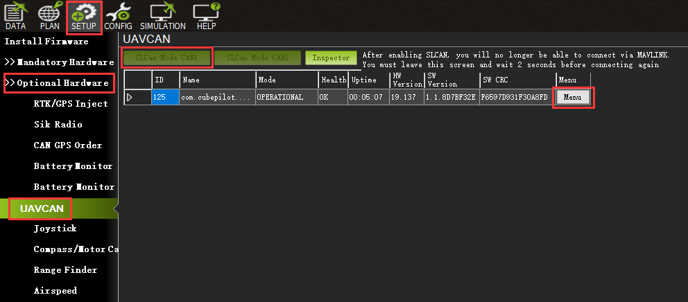

Modify parameters **“GPS\_TYPE = 1“，“GPS\_RTCMSOURCE = 10”，“SERIALPASS = 0“**. After that, click `write params` then `Commit Params` and disconnect the HerePro. Connect another HerePro and continue.

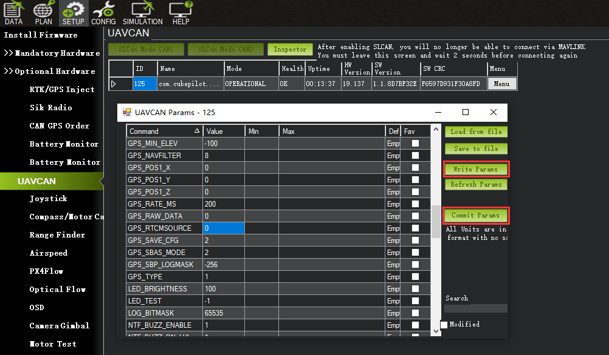

**HerePro Base parameter settings:**

Connect the 4pin CAN cable from left-hand-side CAN port on HerePro to CAN1 or CAN2 on autopilot. supply 6V - 40V to HerePro.

Connect the autopilot to Mission Planner via USB. Go to `Initial Settings > Optional Hardware > UAVCAN` page and click `SLCan Mode CAN1`. CAN device status will show up. Click `Menu > parameters` at the right-hand-side to modify the following parameters:

Modify parameters **“SERIALPASS = 1”**. After that, click `write params` then `Commit Params` and disconnect the HerePro.

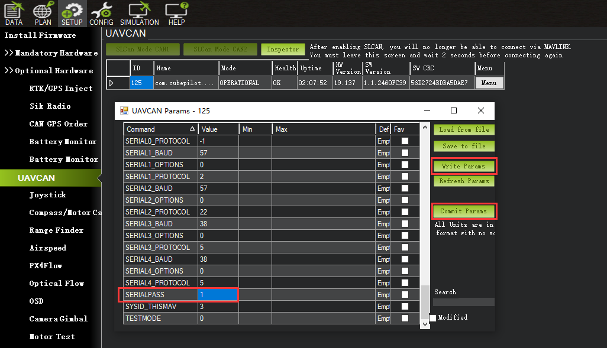

**Before using, please ensure that everything are correctly connected.:** 

**Base:** Power the HerePro base with 6V-40V. Connect its USB port to computer USB port. Connect a telemetry to another port on computer.

**Rover:** Power the HerePro with 6V-40V. Connect it to CAN1 port on autopilot. Connect a telemetry to TELEM1 port on autopilot.

**Antenna Placement**:

**RTK Antenna placement is very important for getting precise RTK positioning**

RTK requires much better environment to work. There are special requirements on placement of its antenna.

The best environment requires the base and rover antenna to have a clear view of the sky that is 20 degrees above the horizon. RTK antenna can be elevated but make sure that there are no obstacles around, such as buildings, trees, cars, and etc.

**Example of a bad environment:** indoors, crowded urban area, forest, near the ground.

**Example of a good environment:** Open spaces, peak of the mountains, roof of buildings.

Do not place the antenna near electronic devices, as high power electronic devices nearby may generate frequency noise which interfere GPS signal. Examples are mobile phone base stations, high voltage transformers, and etc.

Please place the base station in an outdoor environment with sufficient sky coverage to obtain good satellite signal. Place the base station on a stable and elevated platform such as a tripod.

**Base Module Setting using Mission Planner:**

Start with base module setup. During the base station setup, the rover and the UAV do not need to be turned on.

Open Mission Planner ground station software on computer and go to the "initial setup → Optional Hardware → RTK/GPS Inject". You will see the following page:

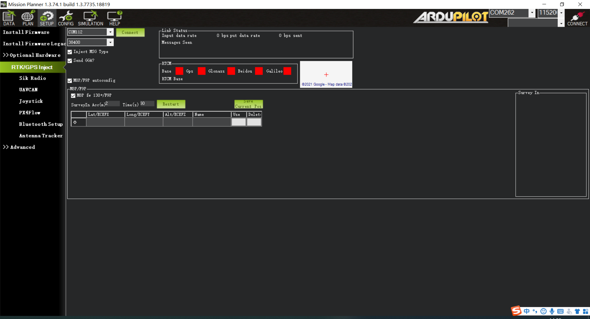

Select the correct base module COM port \(There are 2 COM port for HerePro. Eg: COM13 and COM14. Select the bottom one.\) at the top-left corner. Select baud rate **38400**. Uncheck **Send GGA**. Check “**M8P/F9P autoconfig**” and “**M8P fw 130+/F9P**”. Then click `connect`. In the `SurveyIn Acc` section, enter the expected absolute geographic accuracy. In the Time column, enter the expected minimum survey time. Click `Restart`. The ground station will now transfer the data you have entered to the HerePro base, the base module will start surveying. You will see the following screen:

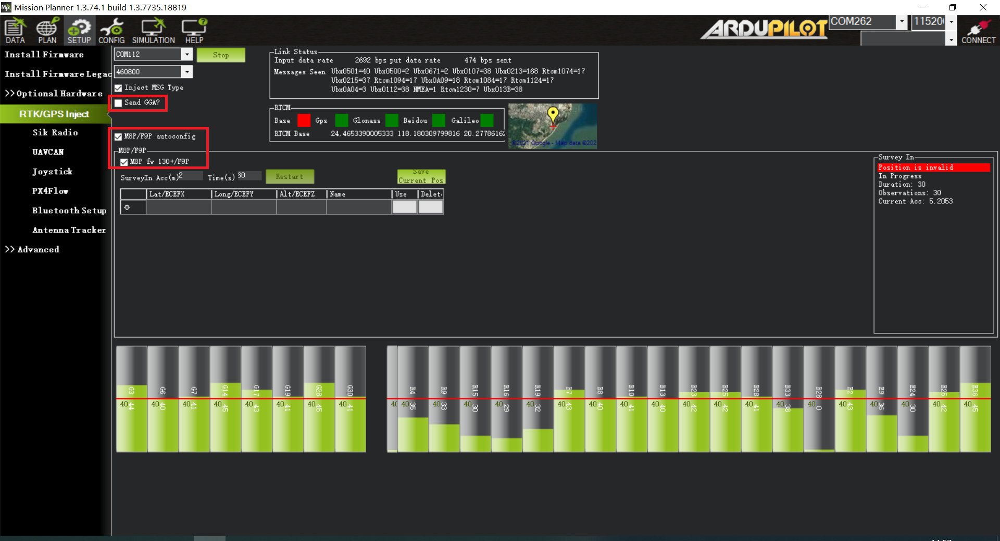

During the survey process, the right box will show the current survey status:

**Position is invalid:** The base station has not acquire a valid position yet;

**In Progress:** The survey is still in progress;

**Duration:** The number of seconds from when the current surveying task started;

**Observation:** The number of observations acquired;

**Current Acc:** Absolute geographic accuracy that the current base station can achieve;

**The Green bar** at the lower part of the Mission Planner page shows the satellites being detected and the signal strength corresponds to each satellite. Ensure at least eight or more satellite signals are higher than the red line \(The satellite is counted into effective number of satellites only if its signal exceeds the red line\).

Please noted that the absolute geographic accuracy of the base station here will affect the absolute geographic accuracy of the rover module, but the relative accuracy between the base station and rover is unaffected. If your application does not require UAV having high absolute geographic accuracy, you do not need to set the base station’s precision too high, which may results long surveying time.

Even if the accuracy of the base station is 1.5 to 2 m, the position accuracy of the rover module relative to the base station can still reach the centimeter level.

After the survey is complete, the Mission Planner will display the following page:

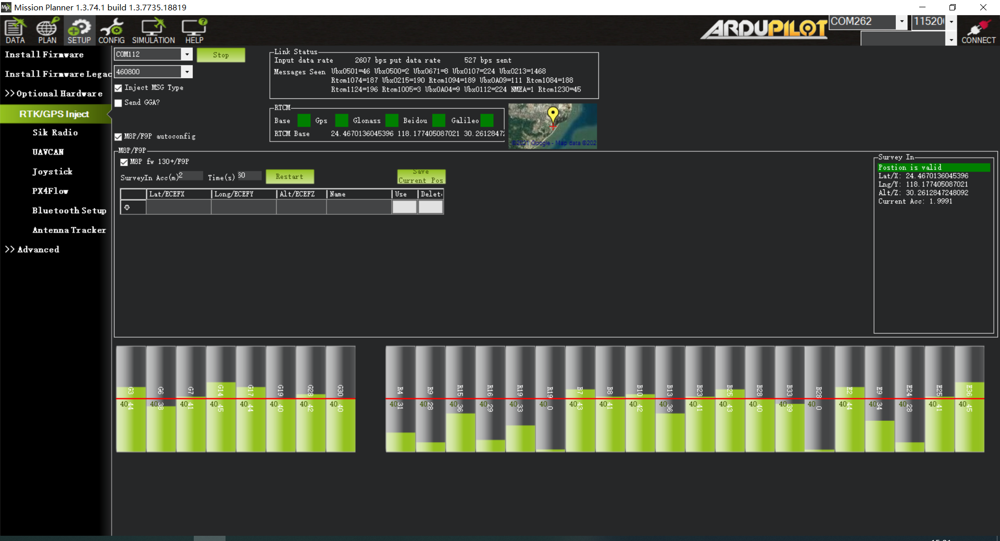

In the RTCM box, the base status indicator is green and indicators for different GNSS systems are also green. The box on the right shows `Position is valid`.

To store the current location in the Mission Planner: Click `Save Current Pos`, enter a name in the dialogue box, and click `OK`. As shown below, you can see your saved location in the list. Click the `Use` button for the location you saved, the status will show `Using FixedLLA`. If you set the base station in the same location later, you do not need to survey again. You may click the `Use` button that corresponds to the location you have saved.

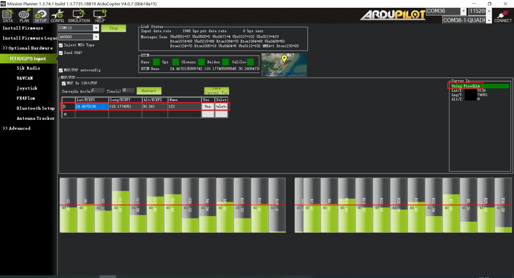

**Rover Module and Flight Controller Setup**

After the base station is set up, you can turn on the UAV. Using the same Mission Planner to connect the telemetry, the base station data will be transmitted through telemetry to the HerePro rover on UAV. In the Mission Planner main page, you will see the current GPS status showing as RTK Float / RTK Fixed / 3D RTK, indicating UAV positioning has entered RTK mode. RTK Float is a floating-point solution; RTK Fixed is a fixed solution. RTK Fixed mode has higher accuracy and requires better signal strength. 3D RTK is unified saying of RTK Float / RTK in the Mission Planner Chinese version.

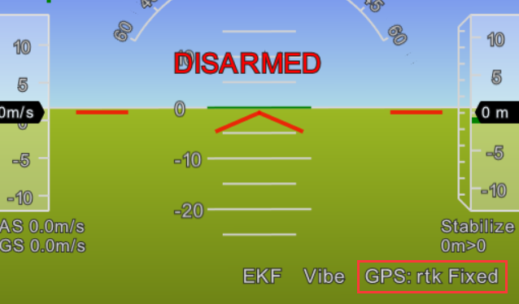

**Single Base to Multiple Rovers:**

There are 2 methods to do this:

* Using 1 telemetry to multiple telemetry broadcasting; or
* Using multiple 1 to 1 telemetry modules with the USB hub

Ground station configuration: connect all telemetry modules to the computer via USB hub. Open Mission Planner to locate the base then connect it with flight controllers. Select AUTO connecting as shown below. All recognized flight controllers on the ports will be connected. You may select the UAV from the dropdown list below:

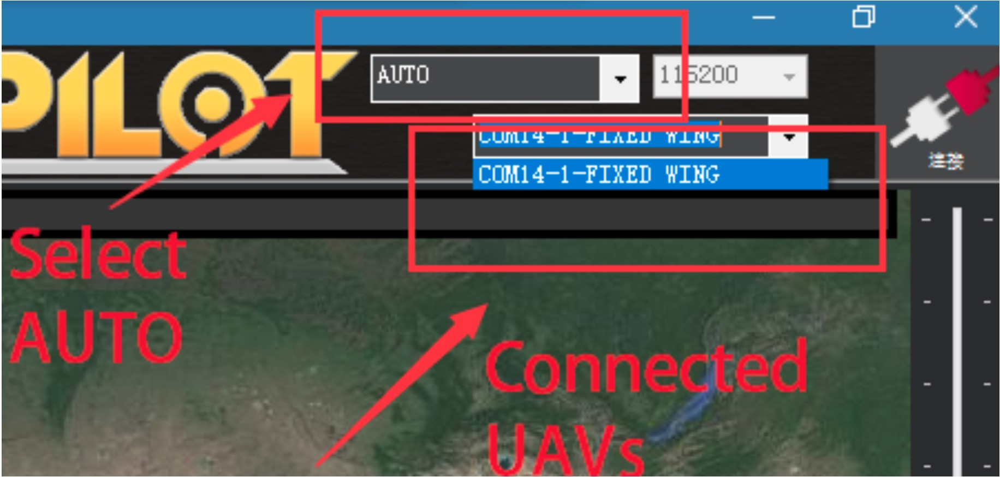

If you connected the UAVs with 1 telemetry module, they should share the same COM port:

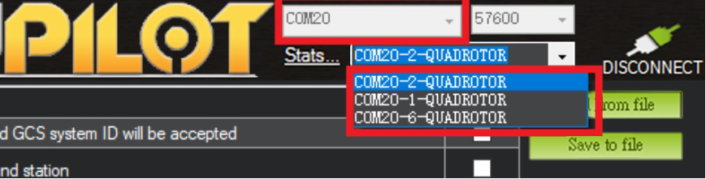

2021/5/12

