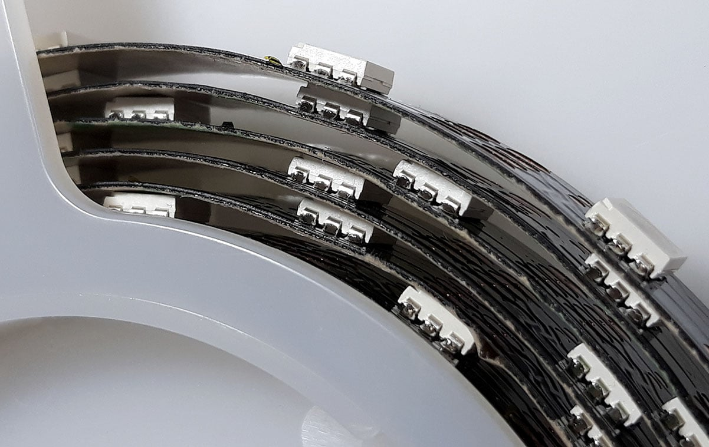

# ProfiLED

## Overview

ProfiLEDs are individually addressable RGB LED's that can be controlled directly by a Cube running ArduPilot. They can be set to match the notification colours of the HERE GPS units, allowing the state of the autopilot to be more visible. It is also possible to control ProfiLEDs directly from ArduPilot's onboard Lua scripting. This allows ProfiLED's to be used as navigation lights, custom notification lights or even displays. ArduPilot running on an Orange Cube is capable of driving more than 300 ProfiLED's at 50Hz. 


ProfiLED support is only in the latest/master ArduPilot branch, it is not yet in the stable release.


## Installation

ProfiLED are spaced at 20mm resulting in 50 LED's per meter. The strips can be cut at any point and extended or have a new header added and plugged into a second pair of output pins. ProfiLED's require both clock and data pins. As supplied the clock is the yellow wire and green is data. It is only possible to drive ProfiLED's from Cube's the AUX outputs, both pins must be in the same PWM group.  AUX pins 5 and 6 are a one group. AUX pins 1, 2, 3 and 4 are a second group. It is possible to share a clock pin over multiple strips in the same group. This allows three strips to share a single clock pin in the AUX 1, 2, 3 and 4 group. If you do not need to drive three strips it may be more convenient to setup two clock pins for that group. ProfiLED's require 5 volts from the servo bus, an external power supply such as a BEC must be connected, ProfiLED's can draw a significant amount of current if all turned on at once. ProfiLED's default to white until a valid signal is received.

## Settings

Any Cube servo output wired to the clock of the LED's should be set to function 132 for 'ProfiLED Clock'. The data input to the LED's should be set to 129 - 'ProfiLED 1', 130 - 'ProfiLED 2' or 131 - 'ProfiLED 3' for notify output or one of the scripting outputs 94 to 109 for use with Lua scripting. To enable ProfiLED notify output the NTF\_LED\_TYPES bitmask should include ProfiLED, this is bit 9. NTF\_LED\_LEN should be set to the length of the longest string that is connected. There are several other NTF\_ parameters that allow the brightness and colour patterns to be changed. Several Lua scripting LED control examples can be found in the [ArduPilot examples folder](https://github.com/ArduPilot/ardupilot/tree/master/libraries/AP_Scripting/examples).


ProfiLED's are a PWM output type, BRD_PWM_COUNT must be set to enable PWM output on the desired pins. You can check is they are assigned correctly by looking for the RCOut message in the messages tab. For example 'RCOut: PWM:1-8 ProfiLED:9-12 PWM:13-14'

