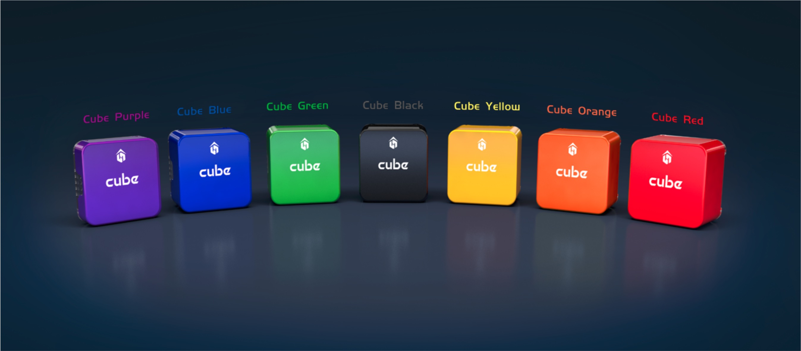

# CubeLAN 8 Port Switch

The CubeLAN 8-port switch is a miniature Ethernet switch that can connect up to eight Ethernet devices. It is compatible with the Cube Red and CubeNode. See below for its specifications.

<figure><figcaption></figcaption></figure>

## Recommended Operating Conditions

| Parameter                     | Min | Max | Unit |
| ----------------------------- | --- | --- | ---- |
| Vin                           | 4   | 5.5 | V    |
| Operating Ambient Temperature | 0   | 70  | ℃    |

## Electrical Specifications

| Dimensions                | 41.15 x 52.58 mm                          |
| ------------------------- | ----------------------------------------- |
| Speed                     | 10/100M                                   |
| Connector Type (Power)    | JST SM02B-GHS                             |
| Connector Type (Ethernet) | JST SM05B-GHS / TE Connectivity 2294415-1 |
| Auto MDI-MDIX Function    | Supported                                 |

## Mechanical Specifications

<figure><figcaption></figcaption></figure>

<figure><figcaption></figcaption></figure>

## Pinout Definition

<figure><figcaption></figcaption></figure>

| Pin Number | Definition   |
| ---------- | ------------ |
| 1          | Ethernet RX+ |
| 2          | Ethernet RX- |
| 3          | Ground       |
| 4          | Ethernet TX+ |
| 5          | Ethernet TX- |

<figure><figcaption></figcaption></figure>

| Pin Number | Definition         |
| ---------- | ------------------ |
| 1          | Ethernet RX+       |
| 2          | Ethernet RX-       |
| 3          | Ethernet TX+       |
| 4          | No connection (NC) |
| 5          | No connection (NC) |
| 6          | Ethernet TX-       |
| 7          | No connection (NC) |
| 8          | No connection (NC) |

<figure><figcaption></figcaption></figure>

| Pin Number | Definition    |
| ---------- | ------------- |
| 1          | Ground        |
| 2          | +5V VCC input |
